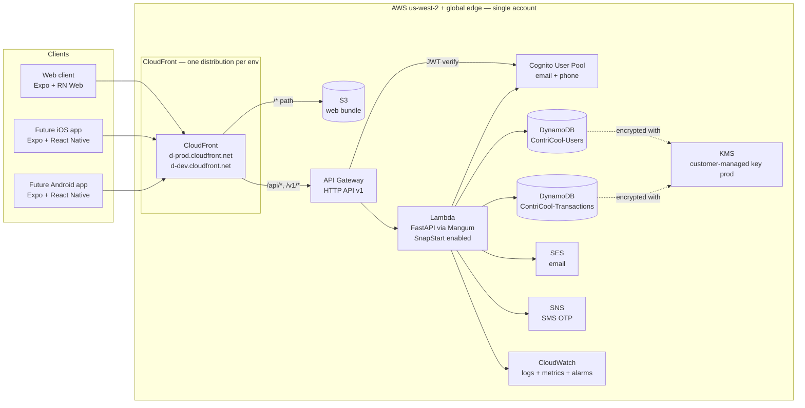
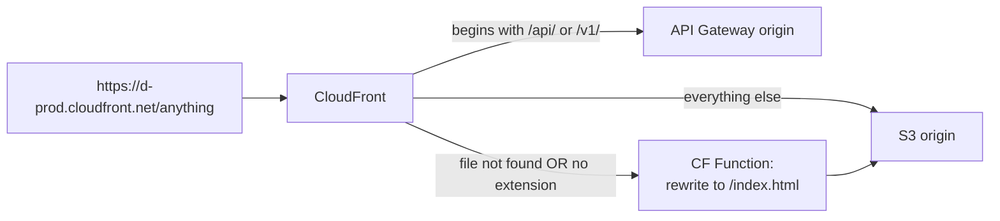
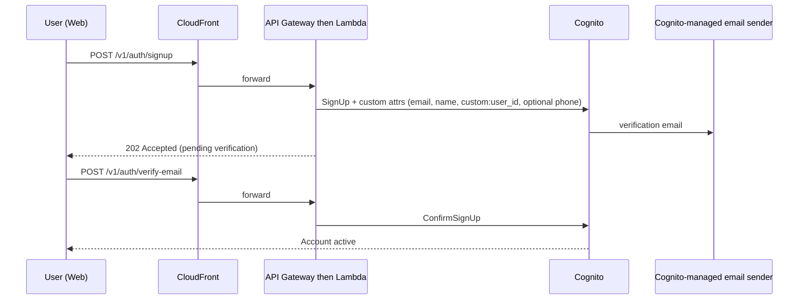
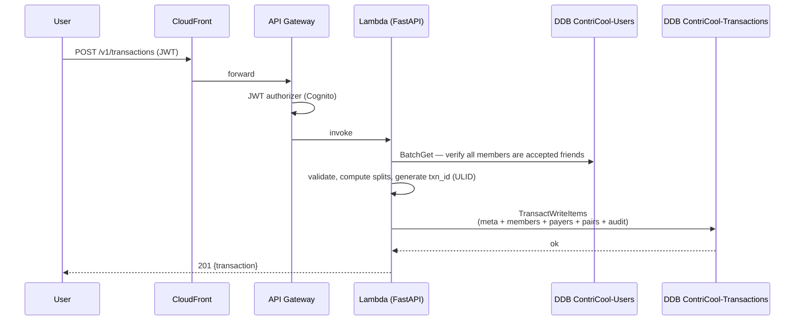
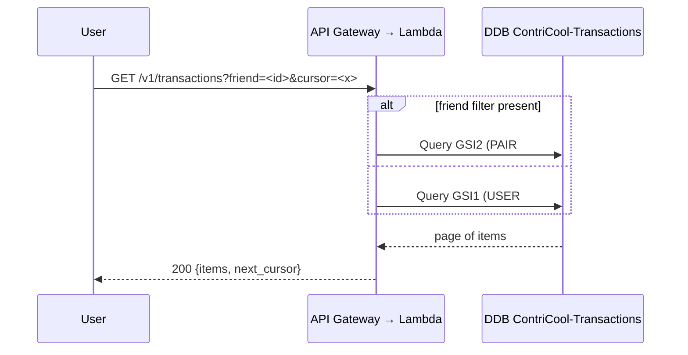
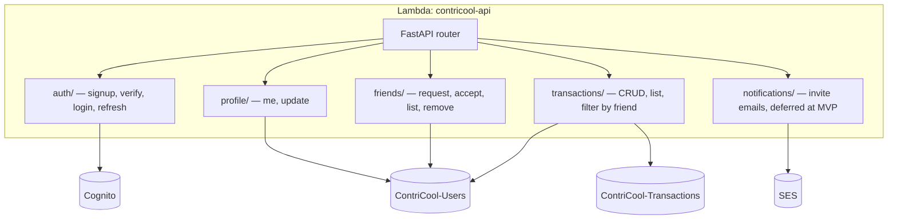

# ContriCool — High-Level Architecture Design

## Overview

ContriCool is a Splitwise-lite app for tracking shared transactions among friends. This design fixes the system shape — components, boundaries, and data flow — for a web-first launch on AWS that adds iOS/Android apps later **from the same codebase**. Design level: **HLD + System** (we lock the AWS topology because every downstream design depends on it). The chosen shape is a **React-Native-Web client (Expo) + JSON API + serverless backend**, all clients (web today, mobile tomorrow) talking to the **same versioned API**, served via **one CloudFront distribution** that fans out path-based to S3 (web bundle) and API Gateway (API). MVP runs on the **default CloudFront domain** (free) with a clean upgrade path to `contricool.com` later. Everything stays in **one AWS account** with strict resource-prefix and IAM-scoped separation between `dev` and `prod`.

## High Level Design

### Components

| # | Component | AWS service | Responsibility |
|---|---|---|---|
| 1 | Client (web today, mobile later) | Expo + React Native Web for browser; Expo + React Native for iOS/Android | Single codebase: components, business logic, routes; web variant served as static bundle. |
| 2 | Web bundle hosting | S3 (private) | Hosts the Expo web build. CloudFront serves it via OAC. |
| 3 | Single CloudFront distribution per env | CloudFront | Public entry point. Behaviors: `/api/*` and `/v1/*` → API Gateway origin; everything else → S3 origin. CloudFront Function on viewer-request rewrites SPA deep links (e.g. `/transactions/abc123`) to `/index.html`. |
| 4 | API edge | API Gateway HTTP API | JWT-authorizer-protected, fronted by CloudFront. |
| 5 | Identity | Cognito User Pool | Stores users, emails, phones, password hashes; issues JWTs; sends email/SMS verification via SES/SNS. |
| 6 | API runtime | Lambda (arm64, Python 3.12, container image) | Single function running FastAPI via Mangum. **Lambda SnapStart enabled** to reduce cold-start latency. |
| 7 | Identity / social-graph store | DynamoDB on-demand — `ContriCool-Users-<env>` | Users, friendships, invites, OTP rate-limits, email/phone lookup hashes. |
| 8 | Financial ledger store | DynamoDB on-demand — `ContriCool-Transactions-<env>` | Transaction meta (with payers embedded), members, audit, idempotency records. |
| 9 | Email | SES | Transactional emails (post-domain). At MVP, Cognito's managed sender handles verification — no SES sending until custom domain arrives. |
| 10 | SMS | SNS (transactional) | OTP delivery during signup. Cognito sends SMS via SNS. |
| 11 | Encryption | KMS (one CMK in prod, AWS-managed in dev) | Encrypts both DDB tables, SNS alarm topic, CloudWatch log groups, SSM SecureString PII salt. |
| 12 | Observability | CloudWatch Logs / Metrics / Alarms | Lambda + API Gateway built-ins; alarms → SNS → email/SMS. X-Ray and RUM deferred. |
| 13 | IaC | AWS CDK (Python) | Single CDK app with two environments (`dev`, `prod`) deployed as separate stack sets in the same account. |

### Routing through one CloudFront distribution

The single-distribution choice is load-bearing for two reasons:

1. **Cookie scoping**: the refresh-token cookie (`rt`, HttpOnly, Secure, SameSite=Strict) lives on the CloudFront domain. With web and API on the same domain (just different paths), the cookie auto-attaches to API calls — no CORS-with-credentials gymnastics. This makes the web/API origin same-origin.
2. **Free domain works**: `cloudfront.net` is on the public-suffix list, so cookies *cannot* be set across two different `*.cloudfront.net` distributions. Single distribution sidesteps that limitation entirely.

When `contricool.com` is registered later, we attach it as an alternate domain name (CNAME) on the same distribution and add an ACM cert — no behavior changes.

### End-to-end Data Flows

**Sign-up (email-only verification at MVP; phone optional + unverified)**

**Add transaction**

**List my transactions / list with friend X**

## System Design

### Topology

- **Single AWS region: us-west-2.** ACM certs for CloudFront must originate here, lowest service prices, broadest service availability, lowest latency to US users; India users hit nearby CloudFront edge POPs (Mumbai, Chennai, Hyderabad) for static assets. API requests still cross to us-west-2 (~250–300ms RTT from India) — acceptable for <1k DAU MVP. Re-evaluate at >5k DAU India.
- **No VPC.** Lambda runs outside VPC (DDB, Cognito, SES, SNS are all AWS public endpoints over IAM). Avoids NAT Gateway (~$32/mo) and ENI-attach cold-start penalty.
- **Single AWS account** containing both `dev` and `prod` resources, separated by:
  - CDK stack-name prefix (`Contricool-Dev-*` vs `Contricool-Prod-*`).
  - Resource-name prefix on every resource (`ContriCool-Users-Dev` vs `ContriCool-Users-Prod`, `contricool-api-dev` vs `contricool-api-prod`, etc.).
  - IAM execution roles scoped to env-specific resource ARNs (the `Contricool-Lambda-Dev` role can reach only `*-Dev` resources; same for prod).
  - GitHub Actions OIDC roles split (`Contricool-CI-Dev-Deploy` vs `Contricool-CI-Prod-Deploy`).
  - AWS Budgets per stack via cost-allocation tags (`env=dev`, `env=prod`).
- **One CDK app**, parameterized by environment.

Trade-offs accepted vs separate accounts: an IAM mistake could in theory cross envs (mitigated by strict CDK conventions and code review), no per-env billing isolation by default (mitigated by tags), root-account compromise hits both environments.

### Compute Choice (the API)

- **Lambda (arm64, Python 3.12, container image, 512 MB, 10s timeout)**, one function per env (`contricool-api-dev`, `contricool-api-prod`).
- **Cold-start mitigation strategy** (cheapest first):
  1. **Lambda SnapStart for Python** — free; reduces cold start ~700ms → ~200ms by snapshotting the initialized runtime. CDK config: `snap_start=lambda_.SnapStartConf.ON_PUBLISHED_VERSIONS`. Requires invoking via a published version + alias (which we already do).
  2. **Lean container image** — keep ~50MB; arm64; lazy-import heavy deps inside handlers, not at module top.
  3. **Provisioned concurrency**: defer until measured pain — costs ~$4–5/mo per always-warm instance and only helps non-bursty traffic.

With SnapStart + lean imports, expected p99 cold-start lands ~200–300ms — acceptable.

### Data Stores

- **`ContriCool-Users-<env>`** — DynamoDB on-demand, single table, encrypted with project KMS CMK in prod. Holds: user profiles, friendships, pending invites, OTP rate-limit rows, email/phone lookup-hash items.
- **`ContriCool-Transactions-<env>`** — DynamoDB on-demand, single table, encrypted with project KMS CMK in prod. Holds: transaction meta (with payers embedded as an attribute), members, audit history, idempotency records.

Cross-table atomicity for "create transaction" (which needs to verify friendships in Users table and write transaction items in Transactions table) is preserved via **TransactWriteItems**, which supports up to 100 items spanning multiple tables atomically.

PITR enabled in prod for both tables; AWS-managed encryption in dev.

### Scale Targets (v1)

| Metric | Launch | Month 12 |
|---|---|---|
| DAU | < 100 | < 1,000 |
| Peak RPS | < 5 | < 50 |
| Transactions/day | < 1,000 | < 10,000 |
| Lambda concurrency peak | < 10 | < 50 |
| DDB peak WCU (each table) | < 10 | < 100 |
| DDB peak RCU (each table) | < 25 | < 250 |

All comfortably inside Lambda + DDB free tier (1M req + 25 RCU/WCU/mo per table).

### Failure Modes (v1 acceptable behavior)

| Failure | Impact | Mitigation |
|---|---|---|
| Lambda cold start | +200–400ms first request after idle (with SnapStart) | Accept. Provisioned concurrency adds cost; revisit at >1k DAU. |
| DDB throttle | 5xx briefly | On-demand auto-scales; Lambda retries with exponential backoff. |
| SES sandbox limit | Cognito-managed sender unaffected; outbound app emails (friend invites) deferred until custom domain. | Defer SES production access until domain. |
| SNS SMS spend overrun | Bill shock | SNS account-level monthly spend cap = $5 at MVP. Alarm at 80% ($4). |
| Single-region outage | Site down | Accept for MVP. |
| Bad deploy | Site broken | CFN auto-rollback; CDK redeploy with previous image tag if needed. |

### Reliability / Availability Targets (v1)

- API availability: **99.5%** (~3.6h/mo downtime allowed).
- p95 API latency: **< 600ms** warm.
- p99 API latency: **< 2s** cold tolerated.
- RPO: 5 min (DDB PITR on both tables).
- RTO: 1 h (CDK redeploy + DDB PITR restore).

## Component Design

### Backend Service Boundaries (logical, single Lambda physically)

The backend is a **modular monolith** packaged as one Lambda function. Modules organize as feature folders (`app/features/<name>/`). We do **not** split into per-feature Lambdas at MVP — extra deploy units cost ops time and provide no benefit at this scale.

### Where Future Mobile Plugs In

- iOS/Android apps are built from the **same Expo codebase** as the web client (see Design 2). When mobile ships, the same components/screens compile to native via Metro/Expo; the only platform-specific changes are token storage (Keychain/EncryptedSharedPreferences instead of HttpOnly cookie) and OS-specific affordances.
- All clients call the **same `/v1/*` REST API** with the same Cognito JWTs.
- Cognito User Pool app clients: one per platform (web, iOS, Android) for distinct refresh-token lifetimes and OAuth secrets, all writing to the same user pool — accounts are shared seamlessly.
- Push notifications (mobile only) are added later via SNS Mobile Push or Pinpoint; the existing `notifications/` module gets a new channel without API contract changes.

### Cross-Cutting

- **Logging**: structured JSON via `aws-lambda-powertools` (Logger). Fields: `request_id`, `user_id`, `route`, `latency_ms`. CloudWatch Logs with 14-day retention in prod, 7-day in dev.
- **Metrics**: CloudWatch EMF via Powertools Metrics — namespace `ContriCool/<env>` with dimensions `Route`, `StatusCode`. Alarms on 5xx rate >1% over 5 min.
- **Tracing**: X-Ray sampling at 10%. Powertools Tracer integration.
- **Config**: SSM Parameter Store for non-secret config (region, table names, user-pool ID); Lambda env vars hold service IDs. Secrets Manager only used when rotated secrets appear (none at MVP).

## Hosting Design

See [Design 3 — Hosting & Infrastructure](../03-hosting-infrastructure/design.md) for the full pros/cons. Summary:

- **Compute**: AWS Lambda (arm64, Python 3.12, 512 MB, container image, **SnapStart enabled**). One function per env.
- **Frontend**: S3 (private bucket via OAC) holding the Expo web build, served via the same CloudFront distribution as the API.
- **API edge**: API Gateway HTTP API, fronted by CloudFront on `/api/*` and `/v1/*` behaviors.
- **No VPC** for v1.
- **IaC**: AWS CDK in Python.
- **Environments**: `dev` and `prod` as separate CDK stacks in the **same AWS account**, isolated by resource-name prefix and IAM scope.

## Endpoint Design

See [Design 9 — Endpoint & Edge](../09-endpoint-edge/design.md) for the full design. Summary:

- **Single CloudFront distribution per env** at the AWS-default `https://d-<id>.cloudfront.net` domain (free at MVP). Path-based behaviors:
  - `/api/*`, `/v1/*` → API Gateway HTTP API origin (no caching).
  - `/assets/*` → S3 origin, aggressively cached (`max-age=31536000, immutable`).
  - `/*` → S3 origin, with CloudFront Function rewriting SPA deep links to `/index.html`.
- **API Gateway HTTP API** (not REST API): cheaper ($1/M vs $3.50/M), faster, built-in JWT authorizer for Cognito.
- **CORS** is moot — web and API are same-origin via the single distribution.
- **WAF deferred** at MVP; CDK pre-wires the attachment as a feature flag.
- **API Gateway throttling**: per-route burst 50/s, sustained 20/s.

When `contricool.com` is registered, we attach it as an alternate domain name + ACM cert; no behavior changes.

## Security Considerations

- **TLS everywhere**: CloudFront default cert (free) at MVP; ACM-issued cert when custom domain added. TLSv1.2_2021 minimum; HTTP redirects to HTTPS.
- **JWT validation at the edge**: API Gateway HTTP API JWT authorizer verifies Cognito tokens before invoking Lambda.
- **PII at rest**: both DDB tables encrypted with the project KMS CMK in prod (rotated annually). Cognito user pool uses Cognito-managed encryption.
- **Logs**: CloudWatch log groups encrypted with the same CMK; PII (email, phone, password, codes) never logged in cleartext — Powertools Logger denylist.
- **Least privilege IAM**: Lambda execution role gets only the specific table ARNs (Users + Transactions), Cognito admin actions on the one user pool, and SES/SNS publish to specific identities/topics. Per-env roles can only reach `*-<env>` resources.
- **No public DDB / S3**: web S3 bucket is private, served via CloudFront OAC only.
- **Account-level guardrails**: AWS Budget alerts at $20 (warn) and $30 (critical) on account total; SNS SMS spend cap $5 at MVP; CloudTrail enabled in all regions.
- **Single-account isolation discipline**: every resource carries `env=dev|prod` tag; CDK conventions and code review enforce that no execution role can touch resources outside its env.

## Open Questions

1. **Custom domain timing** — at what user count or revenue point do we register `contricool.com`? Email deliverability for friend invites is the practical trigger. Revisit once we want to send app-originated email beyond Cognito's verification flow.
2. **Cognito hosted UI vs custom forms** — both supported on the default CloudFront domain. Defer to Auth design.
3. **Cross-env IAM accident risk** — single-account is the user's choice; we mitigate via prefix conventions + tag-scoped policies. Periodic IAM Access Analyzer review (monthly) recommended.
4. **CloudFront in front of API** at MVP keeps web/API same-origin and pre-wires WAF; small fixed CloudFront cost (effectively $0 in free tier). Confirmed direction.

## Summary

- **Modular monolith on Lambda + two DynamoDB tables** (`ContriCool-Users-*`, `ContriCool-Transactions-*`) behind API Gateway HTTP API, with **SnapStart** for cheap cold-start mitigation; same API for web today and mobile tomorrow.
- **Single CloudFront distribution per env** routes path-based to S3 (web) and API Gateway (API), giving same-origin cookie scoping and unblocking MVP launch on the **free default `cloudfront.net` domain** until `contricool.com` is registered.
- **Single AWS account** with strict resource-prefix + IAM scoping isolating `dev` from `prod`; one CDK app deploys both.
- **Cognito User Pool** owns identity (email required + verified at MVP; phone optional + unverified, never used for search/auth); web/iOS/Android each get their own app client but share users.
- **us-west-2 only, no VPC, free-tier-first** — every choice optimized to stay under $30/mo at <1k DAU; cost projection $3–8/mo through month 12.
