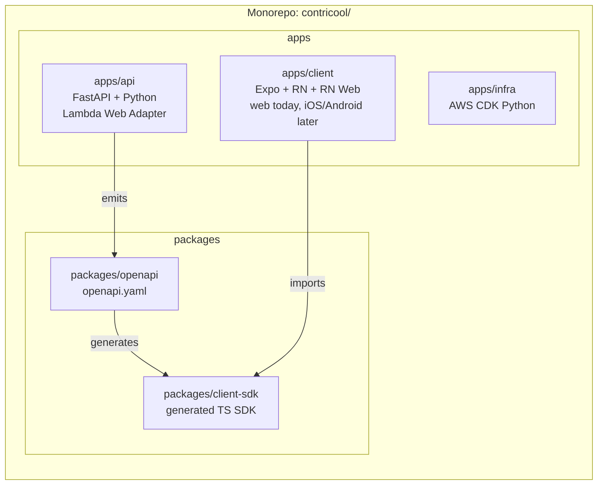
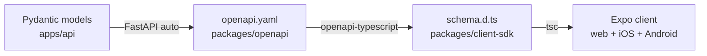

# ContriCool — Tech Stack Design

## Overview

This design picks the languages, frameworks, libraries, and shared-code strategy ContriCool will be built on. The selection optimizes for: solo-dev velocity, AWS Lambda fit, free-tier cost, and **maximum code reuse from web today to iOS/Android tomorrow**. Design level: **HLD with concrete library picks** (just-enough LLD where the choice is load-bearing, e.g., API contract sharing). Headlines: **Python 3.12 + FastAPI on Lambda via AWS Lambda Web Adapter** (with SnapStart enabled), **Expo SDK 52 + React Native Web + Expo Router + NativeWind 4** as a single client codebase that ships to web today and iOS/Android tomorrow, **REST + JSON** API with **OpenAPI 3.1 codegen** as the cross-platform contract, **monorepo with pnpm workspaces** containing `apps/{api,client,infra}` and `packages/{openapi,client-sdk}`.

## High Level Design



## Backend: Python 3.12 + FastAPI on Lambda via AWS Lambda Web Adapter

### Framework

| Option | Pros | Cons |
|---|---|---|
| **Python + FastAPI** | Async-native; OpenAPI 3.1 emitted automatically; Pydantic v2 for runtime validation + types from one definition; matches the user's Python convention. | Cold start ~300–700ms with deps (mitigated by SnapStart). |
| Python + Flask | Matches the user's stated default; mature; simple. | No native async, no native OpenAPI, no built-in DI. Worse Lambda fit for I/O-bound work. |
| Node.js + Hono / Fastify | Best raw cold start (<150ms); unified language with frontend. | Requires the user to context-switch from Python. |
| Go + chi | Tiny binary, sub-100ms cold start. | Steeper curve; small AWS-Go ecosystem. |

**Decision: FastAPI.** The user's global CLAUDE.md says "Python backends use Flask"; we deviate for ContriCool with a documented reason — **OpenAPI emission** is foundational to the cross-platform contract, **Pydantic v2** gives us runtime validation + static types from one definition, and **async I/O** fits Lambda's I/O-bound profile (DDB, Cognito, SES, SNS). The deviation is recorded in the project's local `CLAUDE.md` at scaffolding time.

### Lambda runtime adapter — AWS Lambda Web Adapter (LWA)

We use the **AWS-maintained Lambda Web Adapter** (a Lambda extension binary), not Mangum. With LWA, the local `uvicorn` invocation is identical to how the app runs in Lambda — no Lambda-only adapter layer to test around. AWS owns the project and maintains it actively; supports SnapStart and Lambda response streaming; container packaging stays the same; future migration off Lambda (e.g., to ECS Fargate) is a deploy-config change with zero code change.

Trade-off accepted: ~5MB binary added to the container image and one more concept ("an HTTP server runs inside Lambda"). Both are small prices.

### Lambda packaging

- **Container image** built from `public.ecr.aws/lambda/python:3.12-arm64`, with the `aws-lambda-adapter` extension layered in via multi-stage Docker copy.
- Final image ~50MB; arm64.
- **SnapStart enabled** on published versions (`SnapStartConf.ON_PUBLISHED_VERSIONS` in CDK) — first invocation post-deploy snapshots the initialized runtime, including uvicorn; subsequent cold starts restore from snapshot in ~150–250ms.
- One Lambda function per env: `contricool-api-dev`, `contricool-api-prod`. Each runs the same image; CDK deploys to per-env aliases (`live`).

### Backend dependencies

| Package | Purpose | Notes |
|---|---|---|
| `fastapi` ^0.115 | Web framework + OpenAPI emission | |
| `pydantic` ^2.9 | Models + validation | v2 perf is ~5x v1 |
| `uvicorn` ^0.32 | ASGI server | listens on 0.0.0.0:8080; LWA forwards traffic to it |
| `boto3` ^1.35 | AWS SDK | provided by Lambda runtime — exclude from deployment package |
| `aws-lambda-powertools[parser,tracer]` ^3.x | Structured logging, metrics, tracing, idempotency | |
| `python-jose[cryptography]` ^3.3 | JWT decode (defensive — primary verification at API Gateway authorizer) | |
| `email-validator` ^2.2 | Email format validation for Pydantic | |
| `phonenumbers` ^8.13 | E.164 normalization (US +1 / India +91) | |
| `pytest`, `pytest-cov`, `moto`, `httpx` | Tests; moto for AWS mocking | |

**No** Mangum dependency.

Lint/format/types: **ruff** (replaces black + flake8 + isort) + **mypy --strict**. Documented in local CLAUDE.md as a deviation explained.

## Client: Expo + React Native + React Native Web

A **single Expo codebase** ships to web today (via Expo's web target → static bundle deployed to S3+CloudFront) and to iOS/Android tomorrow (via Expo Application Services / EAS Build). Components, screens, business logic, API client, and routing are written once and run on all three targets.

### Why Expo + RN-Web (not plain React + Vite)

| Option | Pros | Cons |
|---|---|---|
| **Expo + RN + RN-Web (chosen)** | Single codebase across web + iOS + Android. Expo Router does file-based routing for all platforms. NativeWind makes Tailwind work everywhere. EAS Build/Submit for native distribution. | Web bundle ~80KB heavier than plain React; some web-specific UX (CSS animations, fancy auto-complete) needs extra work. |
| Plain React + Vite (was previous Design 10) | Smallest web bundle; full HTML/CSS power. | Mobile requires re-implementing all components in RN. ~3–4 weeks of duplicated work when mobile arrives. |
| react-native-web on a non-Expo setup (Vite + Webpack juggling) | Customizable. | Significant build-tooling complexity; loses Expo Router and EAS conveniences. |
| Hybrid: Capacitor / Ionic | One codebase, web tech everywhere. | UX feels web-y on native; community momentum has shifted to Expo+RN-Web. |
| Flutter | Excellent UX. | Rewrites everything in Dart; can't reuse the React/JS ecosystem; doesn't fit the brief. |

**Decision: Expo SDK 52 + React Native + React Native Web** with TypeScript. We accept the web-bundle penalty (still well under mobile-LTE-tolerable size) for full cross-platform reuse.

### Client stack

| Concern | Pick |
|---|---|
| Framework | Expo SDK 52 + React 19 + React Native + React Native Web |
| Routing | **Expo Router 4** — file-based routing for web (`/login`, `/transactions/:id`) and native; auto-handles deep linking on mobile. |
| Styling | **NativeWind 4** (Tailwind v4 for RN; renders to RN `StyleSheet` on native and CSS on web) |
| Component primitives | **react-native-reusables** — shadcn-style copy-paste primitives that work on RN+Web; built atop RN core + NativeWind |
| Server state | **TanStack Query 5** (works unchanged in RN) |
| UI/local state | **Zustand 5** (works unchanged in RN) |
| Forms | **React Hook Form** + **Zod** (work unchanged in RN) |
| Auth client | **AWS Amplify Auth v6** (Cognito; uses platform secure storage automatically — Keychain on iOS, EncryptedSharedPreferences on Android, in-memory + cookie-via-server on web) |
| HTTP client | **`openapi-fetch`** wrapping `fetch` (works on RN and web), driven by generated types from `packages/client-sdk` |
| Icons | **lucide-react-native** (renders on both web and native) |
| Date/currency formatting | **`date-fns`**, **`Intl.NumberFormat`** (RN's Hermes engine supports `Intl` since SDK 51) |
| Build (web) | Expo's web bundler (Metro for web in SDK 50+, or static export via `expo export -p web`) |
| Build (native) | EAS Build (cloud builds for iOS/Android) — invoked when mobile ships, not at MVP |
| Lint/format | **biome** |
| Tests | **vitest** for unit/component (Jest-compatible RN testing via `@testing-library/react-native`); **Maestro** for e2e on native (post-MVP); **Playwright** for web e2e (nightly) |

### Why react-native-reusables (vs Tamagui or Gluestack)

- **react-native-reusables** is the cleanest shadcn-equivalent for RN: components live in your repo, you own the code, no runtime library bloat. NativeWind handles styling; primitives use RN core + RN Aria for accessibility. Fits a copy-and-modify philosophy.
- **Tamagui** is more performant (compile-time CSS extraction, optimized animation primitives) but has steeper build configuration and learning curve. Overkill for MVP scale.
- **Gluestack-UI v2** is simpler than Tamagui but pulls in a runtime library; less customizable than copy-paste primitives.

Decision: **react-native-reusables + NativeWind**. We can switch to Tamagui post-MVP if perf becomes a concern.

### Client dependencies (top-level)

| Package | Purpose |
|---|---|
| `expo` ^52 | Expo SDK |
| `react` ^19, `react-native` ^0.76, `react-native-web` ^0.19 | Core |
| `expo-router` ^4 | File-based routing |
| `nativewind` ^4 + `tailwindcss` ^4 | Styling |
| `react-native-reusables` (copied components into `apps/client/components/ui`) | Primitives |
| `@tanstack/react-query` ^5 | Server state |
| `zustand` ^5 | UI state |
| `react-hook-form`, `zod`, `@hookform/resolvers` | Forms |
| `aws-amplify` ^6 (Auth submodule only) | Cognito client |
| `@contricool/client-sdk` (workspace) | Generated typed API client |
| `lucide-react-native` | Icons |
| `expo-secure-store` | Native secure storage (iOS Keychain / Android EncryptedSharedPreferences); on web, falls back to throwing — refresh tokens on web go via the cookie path described in Design 4. |

### Client packaging targets

| Target | Build command | Output | Distribution |
|---|---|---|---|
| Web | `pnpm exec expo export -p web` | static bundle in `apps/client/dist/` | uploaded to S3, served by the single CloudFront distribution |
| iOS (post-MVP) | `eas build --platform ios` | `.ipa` | App Store via `eas submit` |
| Android (post-MVP) | `eas build --platform android` | `.aab` | Play Store via `eas submit` |

The web output **is the SPA bundle** referenced in Design 1. CloudFront's path-based behaviors route everything except `/api/*` and `/v1/*` to S3, with the CloudFront Function rewriting unknown paths to `/index.html` so Expo Router's deep links work.

### Refresh-token storage per platform

| Platform | Mechanism |
|---|---|
| Web | Refresh token never reaches the client; `/v1/auth/refresh` proxy reads the HttpOnly cookie scoped to the CloudFront domain. Amplify storage adapter throws on refresh-token writes. |
| iOS | Keychain via `expo-secure-store`; Amplify Auth uses it transparently. |
| Android | EncryptedSharedPreferences via `expo-secure-store`; same. |

## API Contract Sharing

### Approach: OpenAPI 3.1 + `openapi-typescript` + `openapi-fetch`

- FastAPI emits `/openapi.json` automatically. We export it to `packages/openapi/openapi.yaml` on every backend build.
- `openapi-typescript` generates `packages/client-sdk/src/schema.d.ts` (pure types, ~0 runtime).
- `openapi-fetch` (~3KB runtime, RN-compatible) gives a typed `client.GET("/v1/transactions", { params })` — autocomplete and type-checking on every endpoint.
- The Expo client imports `@contricool/client-sdk` directly. When mobile builds run, the same package is consumed by the same import path.
- **CI gate**: PRs that change the API must regenerate the OpenAPI spec and the TS types — a mismatch fails the build.



### Alternatives considered

| Option | Why not |
|---|---|
| GraphQL via AppSync | Higher per-query cost on AppSync; rich schema unnecessary for simple CRUD; loses Pydantic-as-source-of-truth. |
| tRPC | Locks API to TS; FastAPI is Python — incompatible end-to-end typing. |
| Hand-written types | Drift between client and server is inevitable. |

## Build, Packaging, Repo Layout

### Monorepo Structure

```
contricool/
  apps/
    api/                  # FastAPI Lambda
      app/
        features/
          auth/
          profile/
          friends/
          transactions/
        core/             # config, ddb client, cognito client
        main.py           # FastAPI app (uvicorn entry point)
      tests/
      pyproject.toml
      Dockerfile          # base + Lambda Web Adapter layer
    client/               # Expo app (web today, iOS/Android later)
      app/                # Expo Router file-based routes
      components/
        ui/               # react-native-reusables primitives, copied
      features/           # auth, friends, transactions screens & hooks
      lib/                # api client, query client, utils
      hooks/
      assets/
      app.json            # Expo config
      package.json
      tsconfig.json
      tailwind.config.ts
      metro.config.js
    infra/                # AWS CDK
      stacks/
      app.py
      cdk.json
  packages/
    openapi/
      openapi.yaml        # generated artifact (committed)
    client-sdk/
      src/
        schema.d.ts       # generated
        client.ts         # openapi-fetch wrapper
      package.json
  specs/                  # design docs
  .github/workflows/      # CI
  pnpm-workspace.yaml
  package.json            # root
  README.md
  CLAUDE.md
```

Note: there is no separate `packages/ui` package. With Expo + RN-Web, the client UI primitives live inside `apps/client/components/ui` (the react-native-reusables copy-paste pattern). If we ever build a second client app, we promote shared primitives to `packages/ui` then.

### Tooling

- **Package manager**: pnpm 9 with workspaces.
- **Python**: project-shared venv at `/home/oshogupta/workspace/master-venv` per global CLAUDE.md.
- **Task runner**: pnpm scripts at the root + a `Makefile` for cross-language commands (`make api-test`, `make client-web-build`, `make infra-diff`, `make openapi`).
- **Code generators**: `make openapi` runs `apps/api` to dump `openapi.yaml`, then `openapi-typescript` to refresh `client-sdk/src/schema.d.ts`.
- **Type checking**: Python via `mypy --strict`; TS via `tsc --noEmit`.
- **Tests**:
  - Backend: `pytest --cov=apps/api/app --cov-fail-under=99`, moto for AWS mocking, `httpx` ASGI client.
  - Client unit/component: `vitest` + `@testing-library/react-native` (works for both web and native components since they're the same components).
  - Web e2e: Playwright on dev environment (nightly, not per-PR).
  - Native e2e (post-MVP): Maestro on EAS-built test artifacts.
- **Pre-commit**: `lefthook` running ruff/mypy/biome/tsc on staged files; `make openapi` if API changed.

## Why Monorepo

- Single PR for full-stack changes (Pydantic model + API tests + OpenAPI + TS types + client form).
- One CI pipeline.
- Generated artifacts (`openapi.yaml`, `client-sdk`) live next to consumers.
- Solo dev → no team-boundary cost from a monorepo.
- When mobile lands, the iOS/Android variants live inside `apps/client` automatically — no second repo, no version skew between web and mobile.

## Dependencies

| Layer | Package(s) | AWS service / role | Why |
|---|---|---|---|
| Backend framework | FastAPI | runs on Lambda arm64 | OpenAPI emission, async, Pydantic |
| Lambda adapter | **AWS Lambda Web Adapter** (extension layer) | AWS Lambda | language-agnostic, AWS-maintained, dev/prod parity |
| ASGI server | uvicorn | inside Lambda container | listens on port 8080, LWA forwards |
| AWS SDK | boto3 | DynamoDB, Cognito, SES, SNS | provided by Lambda runtime |
| Observability | aws-lambda-powertools | CloudWatch Logs/Metrics/X-Ray | structured logs + EMF + tracer |
| Client framework | Expo SDK 52 + React 19 + React Native + RN Web | S3+CloudFront (web) / EAS Build (native) | one codebase across all targets |
| Routing | Expo Router 4 | n/a | file-based, deep-linkable, web + native |
| Styling | NativeWind 4 + Tailwind v4 | n/a | Tailwind for RN+Web |
| Primitives | react-native-reusables (copy-paste) | n/a | shadcn-style, fully owned |
| Auth client | aws-amplify Auth | Cognito | manages SRP + refresh; secure store on native |
| API client | openapi-fetch + generated types | API Gateway | end-to-end types, RN-compatible |
| IaC | AWS CDK (Python) | CloudFormation | matches backend language |

## Open Questions

1. **Tamagui later?** If web bundle size becomes a problem (mobile first-load p75 LCP > 2s on India 4G), switch primitives from react-native-reusables to Tamagui — it has compile-time style extraction. Defer until measured.
2. **Hermes for web?** Hermes is React Native's JS engine on native; web runs on the browser engine. Hermes-only features (Intl, Promise.allSettled, etc.) are universally available now; no special handling needed.
3. **Expo SDK upgrade cadence**: Expo releases major SDKs every ~3 months. Plan to upgrade once a quarter; CI runs on the pinned SDK version.

## Summary

- **Backend**: Python 3.12 + FastAPI on Lambda (arm64 container image) via the **AWS Lambda Web Adapter** (not Mangum), with **SnapStart enabled**; Pydantic v2 models drive OpenAPI 3.1.
- **Client**: **Expo SDK 52 + React Native + React Native Web + Expo Router + NativeWind 4 + react-native-reusables** — a single codebase that ships to web today and iOS/Android tomorrow with no rewrite.
- **Cross-platform contract**: OpenAPI 3.1 emitted by FastAPI → `openapi-typescript` codegen → typed `openapi-fetch` SDK consumed by web + future native builds with one import path.
- **Monorepo** (pnpm workspaces) with `apps/{api,client,infra}` and `packages/{openapi,client-sdk}`; one CI; `make openapi` enforces contract sync.
- **CDK in Python** for IaC keeps the stack single-language end-to-end.
