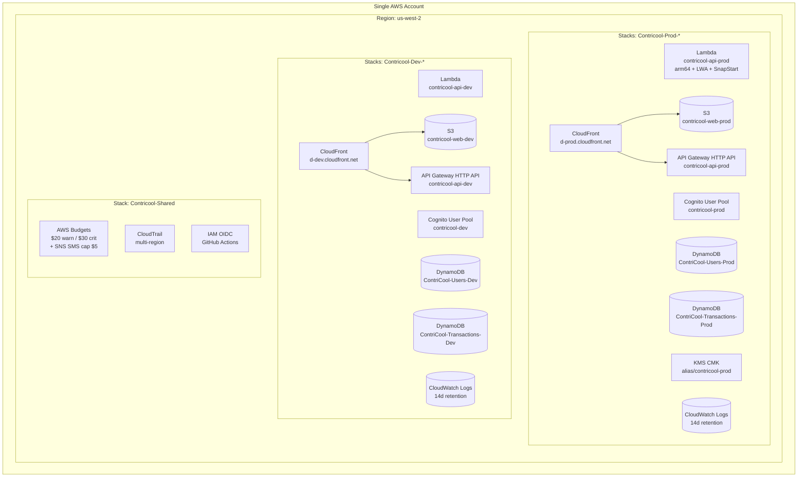

# ContriCool — Hosting & Infrastructure Design

## Overview

This design pins down where every piece of ContriCool runs in AWS, the IaC layout, environment topology, capacity assumptions, and a 12-month cost projection. Design level: **System** (deployment topology, scale targets, failure modes, cost). Headlines: **single AWS account, primary region us-west-2, no VPC, two CDK-managed environments (`dev`, `prod`)** isolated by resource-name prefix and IAM scope; **Lambda + API Gateway HTTP API + two DynamoDB tables + S3 + one CloudFront distribution per env**; **AWS-default `cloudfront.net` domain at MVP** with a clean upgrade path to `contricool.com`; **CloudWatch logs and metrics enabled in both envs** so local-feeling fast debugging is the default. The only resource that lives outside us-west-2 is the post-domain ACM cert for CloudFront, which AWS requires to be in us-east-1 (a hard service constraint, not a design choice). Total projected spend: **~$1–4/mo for first 6 months, $4–20/mo through month 12**, well under the $30 ceiling.

## System Design

### Topology



**Account model** — one AWS account contains both envs. Isolation via:

- **CDK stack-name prefix**: `Contricool-Dev-*`, `Contricool-Prod-*`, `Contricool-Shared`.
- **Resource-name prefix on every resource** (`ContriCool-Users-Dev` / `ContriCool-Users-Prod`, `contricool-api-dev` / `contricool-api-prod`, etc.).
- **Per-env IAM execution roles** scoped to env-specific resource ARNs:
  - `Contricool-Lambda-Dev` can reach only `*-Dev` DDB tables, the `contricool-dev` user pool, dev SES identity, dev CMK or AWS-managed key, the dev SNS alarm topic.
  - `Contricool-Lambda-Prod` likewise scoped to `*-Prod` resources.
- **Per-env GitHub Actions OIDC roles**: `Contricool-CI-Dev-Deploy`, `Contricool-CI-Prod-Deploy`.
- **Cost-allocation tags** on every resource: `env=dev|prod`, `app=contricool`. AWS Budgets filtered by tag for per-env spend visibility.

Trade-offs accepted vs separate accounts: an IAM mistake could cross envs (mitigated by strict CDK conventions, code review, and quarterly IAM Access Analyzer review); root-account compromise hits both; per-env billing requires tag-filtered reports rather than account-level totals.

**Primary region** — **us-west-2** (Oregon). All operational resources (Lambda, DynamoDB, API Gateway, Cognito, S3, SES, SNS, CloudWatch, KMS) live here. India users hit nearby CloudFront edge POPs (Mumbai, Chennai, Hyderabad) for static assets; API requests still cross to us-west-2 (~280–330ms RTT from India, ~70–90ms RTT from US West Coast, ~80–100ms from US East Coast) — acceptable for <1k DAU MVP.

**Special exception — us-east-1 for CloudFront ACM certs**: AWS requires every CloudFront-attached ACM certificate to be issued in us-east-1, no exceptions. When we register `contricool.com` (Phase 7), we'll bootstrap CDK in us-east-1 as well and add a thin "edge-cert" stack there that issues the cert and exports its ARN; the main edge stack in us-west-2 references that ARN by SSM cross-region parameter. Until the custom domain is registered, no us-east-1 resource exists at all — MVP is purely us-west-2.

**No VPC at MVP.** Lambda runs outside a VPC and talks to AWS service endpoints over IAM. Avoids NAT Gateway (~$32/mo each) and ENI-attach cold-start penalty.

### Environments

| Env | Purpose | Domain at MVP | DDB PITR | KMS | Log retention | Alarms |
|---|---|---|---|---|---|---|
| `dev` | day-to-day development, integration tests, smoke tests | AWS-default `d-<id>.cloudfront.net` | off | AWS-managed key (free) | 14 days | minimal (errors only) |
| `prod` | live | AWS-default `d-<id>.cloudfront.net` (until custom domain) | on | customer-managed CMK (`alias/contricool-prod`) | 14 days | full set per Design 11 |

Both envs run **the same code, the same architecture, the same observability** — dev simply has cheaper data-protection and fewer noisy alarms.

### Compute (the API)

| Option | Pros | Cons | Free-tier fit |
|---|---|---|---|
| **Lambda (chosen)** | Pay-per-request; scales to zero; native APIGW integration; SnapStart for Python free; 1M req + 400k GB-sec free/mo. | Cold start ~150–250ms with SnapStart; 15-min execution cap (irrelevant). | Inside free tier through month 12. |
| ECS Fargate | No cold starts, easier WebSockets/long-running. | Always-on cost (~$10–15/mo idle); ALB needed (~$16/mo). | Over budget. |
| App Runner | Simple container deploy, scale to zero. | Min instance still costs ~$5–10/mo idle on tiniest tier. | Marginal. |
| EC2 (t4g.nano) | Cheapest always-on (~$3/mo). | Manual ops; not serverless. | Cheap but ops-heavy. |

**Decision: Lambda.** Configuration:

- arm64 (faster + cheaper than x86).
- Container image (~50MB) built from `public.ecr.aws/lambda/python:3.12-arm64`.
- **AWS Lambda Web Adapter** (extension binary) so the in-container `uvicorn` is the same one that runs locally — see Design 2 for rationale.
- 512 MB memory, 10s timeout.
- **SnapStart enabled** on published versions (`SnapStartConf.ON_PUBLISHED_VERSIONS`) — first invocation post-deploy snapshots the initialized runtime; subsequent cold starts restore in ~150–250ms.
- One function per env: `contricool-api-dev`, `contricool-api-prod`. CDK aliases (`live`) point to the latest published version; rollbacks shift the alias.

### Frontend Hosting

| Option | Pros | Cons | Free-tier fit |
|---|---|---|---|
| **S3 + CloudFront (chosen)** | Free baseline; pay per request/byte; CloudFront 1 TB egress + 10M req/mo free for first 12 months; SPA-perfect (origin is static). | Initial setup is more steps than Amplify Hosting. | Effectively free at MVP. |
| Amplify Hosting | One-command deploy; Git-push integration; branch previews. | $0.15/build-min + $0.15/GB egress; vendor-lock-in beyond CloudFront-style controls. | More expensive year 2. |
| Vercel/Netlify | Best DX. | **Non-AWS** — violates AWS Ecosystem Mandate. |

**Decision: S3 + CloudFront with OAC**, but with the additional choice from Design 1: **a single CloudFront distribution per env serves both the web bundle and the API**. Path-based behaviors:

| Path | Origin | Cache |
|---|---|---|
| `/api/*`, `/v1/*` | API Gateway HTTP API | none (all viewer headers/cookies forwarded) |
| `/assets/*` (Expo's hashed bundle assets) | S3 | aggressive: `max-age=31536000, immutable` |
| `/*` (everything else) | S3 → falls back to `/index.html` via a CloudFront Function on viewer-request | `index.html` is `no-cache`; non-asset routes serve `index.html` so Expo Router deep links work |

The single-distribution model is load-bearing: web and API are same-origin (the CloudFront default domain), so the refresh-token cookie scoped to that domain auto-attaches to API calls without CORS-with-credentials gymnastics. `cloudfront.net` is on the public-suffix list, so cookies cannot be set across two different `*.cloudfront.net` distributions — single distribution is the only way to use the free domain and keep the cookie strategy.

### Data Store

Two DynamoDB tables per env, both on-demand:

| Table | Holds | PITR (prod) | Encryption (prod) |
|---|---|---|---|
| `ContriCool-Users-<env>` | user profiles, friendships, pending invites, OTP rate-limit rows, email/phone lookup hashes | enabled | KMS CMK |
| `ContriCool-Transactions-<env>` | transaction meta (with payers embedded), members, audit history, idempotency records | enabled | KMS CMK |

Cross-table atomicity for "create transaction" (verify friendship in Users + write items in Transactions) preserved via `TransactWriteItems` (up to 100 items spanning multiple tables atomically).

| Option | Pros | Cons | Free-tier cost |
|---|---|---|---|
| **DynamoDB on-demand, two tables (chosen)** | True serverless ($0 idle); single-digit-ms reads; PITR; 25 GB + 25 RCU/WCU/mo free *forever* per table (50/50 across both); cleaner mental separation between social graph and ledger. | Cross-table reads add ~10–20ms vs single-table. | $0 at MVP scale. |
| DynamoDB single-table | Lowest theoretical latency for hot patterns. | Steeper learning curve; one PK/SK design must satisfy all entities. | Free at MVP. |
| Aurora Serverless v2 Postgres | Familiar SQL, joins. | Min ACU = 0.5 → ~$43/mo idle; needs VPC + RDS Proxy. | Over budget. |
| RDS t4g.micro Postgres | Cheap (~$13/mo year 2). | Always-on; needs VPC. | Free first year only. |

### Auth, Edge, Email/SMS

- **Cognito User Pool** (one per env). Free tier: 50,000 MAU forever — far above MVP.
- **API Gateway HTTP API**. Free tier: 1M req/mo for first 12 months; thereafter $1/M.
- **Single CloudFront distribution per env** at the AWS-default `d-<id>.cloudfront.net` domain. Free TLS via the AWS-default cert. Free tier: 1 TB egress + 10M req/mo for first 12 months. PriceClass_100 (US, Canada, Europe) at MVP — India users still hit nearby edges via the global fabric.
- **No Route 53 hosted zone, no ACM cert, no domain registration at MVP** — saves ~$0.50/mo + ~$12/yr until `contricool.com` arrives.
- **SES** — production access deferred until custom domain. At MVP, Cognito's managed sender (`no-reply@verificationemail.com`) handles email verification. App-originated emails (friend invites) deferred until domain.
- **SNS SMS** for OTP (Cognito → SNS): NOT free. ~$0.00645/SMS in US, ~$0.04/SMS in India. With <1k DAU and OTP-on-signup-only, expect <$2/mo. Account-level monthly spend cap = **$5** at MVP (raise via Service Quotas once volume justifies).
- **KMS**: $1/CMK/mo + tiny request fees. **One CMK in prod**, AWS-managed key in dev.
- **CloudWatch Logs**: 5 GB/mo ingest free always; thereafter $0.50/GB ingest + $0.03/GB-mo storage. Both envs use 14-day retention so the dev can query recent dev/prod logs side-by-side during debugging.

### CloudWatch Logs in dev — first-class for debugging

Per the user's emphasis on fast development and debugging, **dev has full observability**:

| What | Dev | Prod |
|---|---|---|
| Lambda log group `/aws/lambda/contricool-api-dev` | enabled, 14d, AWS-managed encryption, INFO baseline + DEBUG via header for admin users | enabled, 14d, KMS CMK |
| API Gateway access log group `/aws/apigateway/contricool-api-dev` | enabled, 14d, AWS-managed | enabled, 14d, KMS CMK |
| Frontend telemetry log group `/contricool-frontend-errors-dev` | enabled, 14d | enabled, 14d |
| EMF metrics namespace | `ContriCool/dev` | `ContriCool/prod` |
| X-Ray tracing | enabled, 100% sampling (cheap at dev volume) | enabled, 10% sampling |
| Saved Logs Insights queries | yes (same set as prod) | yes |
| CloudWatch Dashboard | none — query Logs Insights directly (saves $3/mo) | one prod dashboard |
| Alarms → SNS → email | only `Errors > 0` (signal) for dev; rest off | full set per Design 11 |

X-Ray at 100% sampling in dev is a deliberate choice — it gives the dev a complete trace of every request during testing at near-zero cost (X-Ray free tier covers 100k traces/mo; dev volume sits well under). Powertools logger is enabled with the same JSON format and PII denylist in both envs so log shapes match.

Cost of dev observability: ~$0.50–1/mo (CloudWatch Logs ingest + a handful of metrics + traces) — trivial.

### Capacity Assumptions

| Resource | Launch (prod) | Month 12 (prod) | Cap |
|---|---|---|---|
| Lambda req/mo | ~1M | ~10M | Free 1M; over: $0.20/M |
| Lambda GB-sec/mo | ~50k | ~500k | Free 400k; over: $0.0000133/GB-sec |
| DDB Users storage | <100 MB | <500 MB | Free 25 GB |
| DDB Transactions storage | <1 GB | <5 GB | Free 25 GB |
| DDB on-demand req (combined) | ~300k/mo | ~3M/mo | Free up to 25 RCU/WCU equivalent per table |
| S3 storage | <100 MB | <500 MB | Free 5 GB (12 mo) |
| CloudFront egress | <5 GB/mo | <50 GB/mo | Free 1 TB (12 mo) |
| API Gateway req/mo | ~1M | ~10M | Free 1M (12 mo) |
| Cognito MAU | <100 | <1000 | Free 50k |
| SES emails/mo (post-domain) | n/a at MVP | <5k | Free 62k from Lambda |
| SNS SMS/mo | <100 | <1000 | Not free; budget $5/mo |
| CloudWatch Logs ingest | <2 GB/mo combined | <10 GB/mo combined | Free 5 GB |
| X-Ray traces | <100k/mo | <1M/mo | Free 100k |

### Cost Projection

| Window | Major drivers | Estimate |
|---|---|---|
| Months 1–6 (free-tier window) | KMS CMK $1, SNS SMS ~$1, CW ingest <$1, dev observability <$1 | **~$2–4/mo** |
| Months 7–12 | Same + tail of free-tier consumption | **~$4–8/mo** |
| Months 13+ (post-free-tier) | + CloudFront egress + APIGW + Lambda cents + CW Logs | **~$10–20/mo** at <1k DAU |

Hard guardrails:
- AWS Budget alert at $20 (warn) and $30 (critical) per month, filtered by `app=contricool` tag.
- Per-env Budget alarms via tag filter (`env=dev` and `env=prod`).
- SNS SMS account spend limit: $5/mo at MVP.
- CloudWatch Logs: 14-day retention enforced via CDK.

### Failure Modes & Recovery

| Failure | Detection | Recovery |
|---|---|---|
| Lambda function bad deploy | CW alarm: 5xx > 1% for 5 min (prod); manual smoke (dev) | CFN auto-rollback or `gh workflow run rollback.yml -f tag=<previous>` |
| Stack drift / resource deleted | CDK diff before deploy; quarterly drift detection | redeploy from CDK |
| DDB data corruption | manual / app alarm | PITR restore to a new table; flip the table-name SSM parameter; redeploy |
| Region outage | StatusPage / no events in CW | accept (single-region MVP); RTO ~hours |
| Account compromise | CloudTrail events | root-account hardware MFA, IAM Identity Center for daily access |
| Cross-env IAM bug | quarterly IAM Access Analyzer review | tighten policy, redeploy |

### Reliability Targets

- API availability: **99.5%** (composition of API Gateway, Lambda, DDB single-region SLAs).
- p95 latency: **< 600ms** warm.
- RPO: 5 min (DDB PITR on both prod tables).
- RTO: 1h (CDK redeploy + DDB PITR restore).

## Hosting Design

### IaC — AWS CDK in Python

Single CDK app in `apps/infra/` with multiple stacks per env:

```
apps/infra/
  app.py
  cdk.json
  stacks/
    shared_stack.py       # CloudTrail, AWS Budgets, GitHub Actions OIDC IAM
    data_stack.py         # DynamoDB Users + Transactions tables, KMS CMK (prod)
    auth_stack.py         # Cognito User Pool + App Clients
    api_stack.py          # Lambda function (with SnapStart), API Gateway HTTP API, JWT authorizer
    web_stack.py          # S3 bucket for Expo web bundle
    edge_stack.py         # Single CloudFront distribution with path-based behaviors, CF Function for SPA fallback
    monitoring_stack.py   # CloudWatch Alarms, dashboard (prod), SNS alerts topic
```

Two environment configs in `app.py`:

```python
DEV = {
  "env_name": "dev",
  "pitr": False,
  "kms": "aws-managed",
  "lambda_log_retention": Duration.days(14),
  "apigw_log_retention": Duration.days(14),
  "xray_sampling": 1.0,
  "alarms_email_only": True,
  "snapstart": True,
}
PROD = {
  "env_name": "prod",
  "pitr": True,
  "kms": "customer-managed",
  "lambda_log_retention": Duration.days(14),
  "apigw_log_retention": Duration.days(14),
  "xray_sampling": 0.1,
  "alarms_email_only": False,
  "snapstart": True,
}
```

### Naming Conventions

- **Stacks**: `Contricool-<Env>-<Layer>` — e.g., `Contricool-Prod-Api`, `Contricool-Dev-Data`, `Contricool-Shared`.
- **Resources within stacks**: lowercase prefix `cc-<env>-` for human-readable AWS console, with explicit env suffix for any name that risks collision (DDB tables especially).
- **DDB tables**: `ContriCool-Users-<Env>`, `ContriCool-Transactions-<Env>`.
- **Cognito user pool**: `contricool-<env>`.
- **Lambda function**: `contricool-api-<env>`.
- **S3 bucket (web)**: `contricool-web-<env>-<account-id>` (suffix avoids global collisions).
- **CloudFront distribution**: tagged `env=<env>` (no name field).
- **KMS alias**: `alias/contricool-<env>` (prod only; dev uses `aws/dynamodb` etc.).
- **All resources** carry tags `app=contricool`, `env=<env>`.

### Deploy Strategy

- **Dev**: CDK deploy on every push to `main` after CI passes.
- **Prod**: CDK deploy gated on (a) PR merged to `main`, (b) dev deploy + smoke succeed, (c) manual approval in GitHub Actions environment `prod`.
- **Rollback**:
  - CloudFormation auto-rollback on stack failure (`--rollback=true`).
  - Lambda version + alias allows function-only rollback by re-pointing the alias to a previous version (or pushing a previous container image tag).
  - DDB PITR for data-corruption recovery.
- **Drift**: weekly scheduled CDK diff in CI; alert on drift via SNS.

## Endpoint Design

### Public-facing surface (MVP)

| Surface | Endpoint | Backed by | Notes |
|---|---|---|---|
| Web (prod) | `https://d-<id>.cloudfront.net/...` | CloudFront → S3 (web-prod) | AWS-default domain |
| API (prod) | `https://d-<id>.cloudfront.net/v1/*` | CloudFront → API Gateway HTTP API (prod) | same domain as web |
| Web (dev) | `https://d-<id>.cloudfront.net/...` (different distribution) | CloudFront → S3 (web-dev) | |
| API (dev) | `https://d-<id>.cloudfront.net/v1/*` (different distribution) | CloudFront → API Gateway HTTP API (dev) | |

### Future state (after `contricool.com` registered)

- Add Route 53 hosted zone (~$0.50/mo).
- Issue ACM cert for `contricool.com` + `*.contricool.com` in **us-east-1** (mandatory for CloudFront; free). All other resources stay in us-west-2.
- Attach `contricool.com` and `www.contricool.com` as alternate domain names on the prod CloudFront distribution.
- Attach `dev.contricool.com` on the dev distribution.
- App config flips `VITE_API_URL` (or rather, since web and API are same-origin, no app change needed at all).
- Cognito hosted-UI custom domain (`auth.contricool.com`) added when federation lands.

Detailed CORS, WAF, throttling in [Design 9 — Endpoint & Edge].

## Security Considerations

- **Single-account discipline**: every resource carries `env` and `app` tags; CDK aspect enforces tag presence; per-env IAM execution roles are scoped to env-specific ARNs; quarterly IAM Access Analyzer review.
- **CMK in prod** with annual rotation enabled.
- **All S3 buckets** `BlockPublicAccess.BLOCK_ALL`; web bucket served exclusively via CloudFront OAC.
- **Least-privilege IAM**: Lambda execution roles get only specific resource ARNs; no `*` actions.
- **CloudTrail** enabled in management/shared stack with logs to a dedicated audit bucket; 90-day retention.
- **AWS Budgets** at $20 / $30 (account total); tag-filtered per-env breakdown.
- **SNS SMS spend limit**: $5/mo at MVP.
- **Root account**: hardware MFA, no programmatic keys, no day-to-day use; IAM Identity Center (free) for normal admin.
- **Default CloudFront cert** (TLSv1.2_2021 minimum, HTTP redirects to HTTPS) at MVP; ACM cert when domain arrives.

## Open Questions

1. **GuardDuty** — $4/mo for the basic detector. Recommended once paying users exist; defer at MVP.
2. **CloudFront custom domain timing** — register `contricool.com` when (a) we want to send app-originated emails (friend invites via SES), or (b) brand presence matters. Until then, default domain is fine.
3. **AWS Config** — drift + compliance recording. Adds cost; defer at MVP.

## Summary

- **Single AWS account, primary region us-west-2 (with us-east-1 used only for CloudFront ACM certs once a custom domain lands), no VPC**, two CDK stack-sets (`Contricool-Dev-*`, `Contricool-Prod-*`) plus `Contricool-Shared`; isolation by resource-name prefix + IAM scope + cost-allocation tags.
- **Lambda (arm64, container image, AWS Lambda Web Adapter, SnapStart) + API Gateway HTTP API + two DynamoDB tables (`Users`, `Transactions`, on-demand) + S3 + one CloudFront distribution per env** at the AWS-default `cloudfront.net` domain; everything scales to zero or has a generous free tier.
- **CloudWatch Logs + Metrics + X-Ray enabled in both envs** (dev at 100% trace sampling for fast debugging, 14-day retention everywhere) — observability isn't a prod-only luxury.
- **Projected cost: $2–8/mo for first 12 months**, $10–20/mo afterward at <1k DAU; AWS Budgets enforce $20/$30 alerts (account total), SNS SMS hard-capped at $5/mo at MVP.
- **AWS CDK in Python** is the IaC, organized into shared/data/auth/api/web/edge/monitoring stacks per environment.
