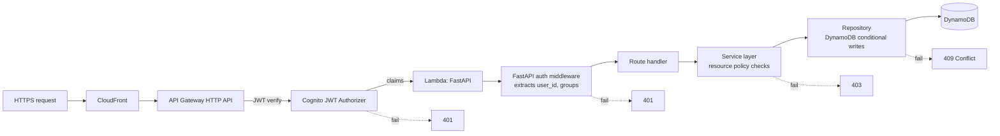
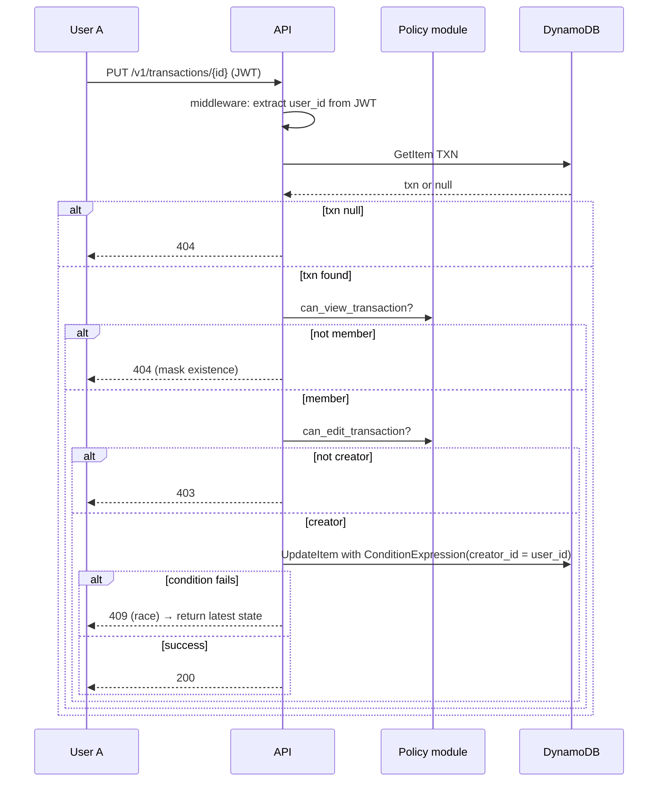

# ContriCool — Authorization Design

## Overview

This design defines who can do what in ContriCool: who can read whose data, who can edit/delete which transactions, and where each check is enforced. Design level: **HLD + LLD**. Headlines: an **app-level RBAC/ABAC hybrid** enforced in the FastAPI service, **two-tier defense** (API Gateway JWT authorizer for authentication, application code for resource-level checks), and **DynamoDB conditional writes** for atomically enforcing creator-only edit/delete. **Cognito groups** carry coarse roles (`user`, `admin`); fine-grained access is per-resource. **No Verified Permissions / Cedar** at MVP — overkill for the simple ownership model.

## Authorization Design

### Permission model

Three roles + resource ownership:

| Role | Cognito group | Granted to |
|---|---|---|
| `user` | `user` (default) | every signed-up user |
| `admin` | `admin` | manually assigned operator users (post-MVP) |
| (resource-owner) | n/a | dynamic — derived from data (e.g. `transaction.creator_id == requester.user_id`) |

**Core rules** (apply per request, after JWT auth):

| Resource | Action | Allowed when |
|---|---|---|
| `User profile (self)` | read | requester is the user |
| `User profile (self)` | update (name) | requester is the user |
| `User profile (other)` | read public fields (display_name) | requester and target are friends |
| `User profile (other)` | read email/phone | **never** (PII not exposed across users) |
| `Friendship` | add (auto-bilateral) | requester signed-in; **email** identifier matches an existing user (phone is not a search key at MVP); not already friends; target is not the requester |
| `Friendship` | remove | either party of an existing friendship (drops the row from both sides) |
| `Transaction` | create | requester is in `members[]`; all other `members[]` are current friends of requester |
| `Transaction` | read | requester is in `members[]` |
| `Transaction` | update / delete | requester is the **creator** (`creator_id == user_id`) |
| `Transaction` | list mine | always (scoped to `members` containing self) |
| `Transaction` | list with friend X | requester is a current friend of X (returns transactions where both parties are members; includes historical transactions even if the friendship was once removed) |

Notes on the rules:
- **Members can read; only creator can write.** Some apps in this space let any member edit — we choose creator-only for MVP simplicity and audit clarity.
- **Friendship gates transactions.** Transactions can only be created among current friends to prevent random-stranger debt-spam. The add-transaction UI suggests only the requester's current friends.
- **No accept/decline at MVP.** When user A enters user B's **email** and B is on the platform, the friendship is created **bilaterally and immediately** — no pending state, no inbox, no approval. Both users instantly see each other in their friend list. The only abuse mitigation is that A must already know B's exact email (no fuzzy search, no enumeration of suggestions). **Phone is not a friend-add identifier at MVP** — see Design 4 / CONSTRAINTS.md.
- **No blocking at MVP.** Either party can `remove` a friendship at any time, which drops the row and stops new transactions involving the pair (existing transactions remain visible). Block/unblock is deferred.
- **No invites for non-users at MVP.** If the supplied email/phone doesn't match any existing user, the API returns 404 `USER_NOT_FOUND`. The user-invite-flow (where A invites a not-yet-signed-up Bob via email) is deferred until `contricool.com` is registered and SES is in use.

### Where AuthZ is enforced (defense in depth)



| Layer | Check |
|---|---|
| API Gateway JWT authorizer | Token validity (signature, expiry, audience, issuer). 401 if fails. |
| FastAPI auth middleware | Extract `user_id` from JWT claims (`custom:user_id`) and `groups` from `cognito:groups`; populate `request.state.principal`. 401 if claims missing. |
| Service layer | Resource policy: ownership, friendship, membership. Friendship lookups read from `ContriCool-Users-<env>`; transaction reads from `ContriCool-Transactions-<env>`. Returns 403 if denied. |
| Repository (DynamoDB) | **Conditional writes** to enforce ownership atomically on `ContriCool-Transactions-<env>`: e.g. `UpdateItem` with `ConditionExpression: creator_id = :requester_id`. Returns 409 if condition fails (race with concurrent delete or someone bypassing service). |

This gives defense in depth: even if a service-layer bug skips a check, the DDB conditional write still prevents privilege escalation. The repository never trusts the service layer's claim about who's calling.

### Why app-level RBAC/ABAC, not Verified Permissions / Cedar / IAM-per-user

| Option | Pros | Cons |
|---|---|---|
| **App-level checks (chosen)** | Simple; lives next to business logic; easy to test; no extra service. | Logic drift if not centralized — we mitigate by a single `policy.py` module. |
| AWS Verified Permissions (Cedar) | Declarative policies; auditable; great for complex rules. | Overkill for ~6 rules; per-eval cost; another service to learn/operate. |
| Cognito Identity Pools + IAM-per-user | Native AWS, fine-grained DDB row policies via `${cognito-identity.amazonaws.com:sub}`. | Hard to express "members of this transaction" — would require denormalizing user_id into row keys for every member, which our DDB model doesn't naturally do. Brittle. |
| Lambda authorizer | Centralized custom logic. | Cold start adds latency; HTTP API JWT authorizer is cheaper and sufficient for AuthN; adding a Lambda authorizer just for AuthZ duplicates the FastAPI middleware. |

**Decision: app-level checks, centralized in `app/core/policy.py`**, with DDB conditional writes as the last-line backstop. Cedar/Verified Permissions revisited if/when the rule set grows past ~15 rules.

### Service-layer enforcement pattern

```python
# app/core/policy.py
from app.core.principal import Principal

def can_edit_transaction(principal: Principal, txn: Transaction) -> bool:
    return txn.creator_id == principal.user_id

def can_view_transaction(principal: Principal, txn: Transaction) -> bool:
    return principal.user_id in {m.user_id for m in txn.members}

def can_create_transaction(
    principal: Principal,
    members: list[UserId],
    existing_friendships: set[UserId],   # set of user_ids that are current friends of principal
) -> bool:
    if principal.user_id not in members:
        return False
    others = {m for m in members if m != principal.user_id}
    return others.issubset(existing_friendships)
```

Routes wrap the service call in a `require()` helper that raises `HTTPException(status_code=403)` on `False`. The pattern is: **read the resource → check policy → mutate** (with conditional write).

### DynamoDB conditional-write pattern (the backstop)

For `PUT /v1/transactions/{id}`:
```python
transactions_table.update_item(
    Key={"PK": f"TXN#{txn_id}", "SK": "META"},
    UpdateExpression="SET ... ",
    ConditionExpression="creator_id = :creator AND attribute_exists(PK)",
    ExpressionAttributeValues={":creator": principal.user_id, ...},
)
```

For atomic create-transaction (which must verify friendship in the Users table and write transaction items in the Transactions table), we use **`TransactWriteItems` spanning both tables** — DDB supports up to 100 items across multiple tables in one transaction. The friendship check is expressed as a `ConditionCheck` item against `ContriCool-Users-<env>`; the writes go to `ContriCool-Transactions-<env>`. If any condition fails, the entire transaction aborts.
If the condition fails — either the txn doesn't exist or the requester isn't the creator — DDB raises `ConditionalCheckFailedException`, which the repository maps to a 404 (not-found takes precedence over 403 to avoid leaking existence).

Same pattern for `DELETE`. Soft-delete sets `deleted_at` with the same ConditionExpression.

### Service-to-service AuthZ

- **Frontend → API**: Cognito JWT (already covered).
- **Lambda → DynamoDB / SES / SNS / Cognito**: per-env IAM execution role (`Contricool-Lambda-Dev`, `Contricool-Lambda-Prod`) attached to the Lambda function, scoped tightly to env-specific resource ARNs:
  - `dynamodb:GetItem`, `Query`, `UpdateItem`, `BatchWriteItem`, `TransactWriteItems` on **both** `ContriCool-Users-<env>` and `ContriCool-Transactions-<env>` table ARNs (and their GSI ARNs); no `Scan`.
  - `cognito-idp:AdminGetUser`, `AdminCreateUser`, `AdminConfirmSignUp`, `InitiateAuth`, `RespondToAuthChallenge`, `ForgotPassword`, `ConfirmForgotPassword`, `AdminUpdateUserAttributes`, `AdminListGroupsForUser`, `AdminAddUserToGroup` on the env-specific user pool ARN only.
  - `ses:SendEmail` only with the configured `From` identity (post-domain).
  - `sns:Publish` to the env-specific OTP topic only.
  - `kms:Encrypt`, `Decrypt`, `GenerateDataKey` on the env-specific CMK (prod) or AWS-managed key (dev).
  - `logs:CreateLogStream`, `PutLogEvents` on the function's env-specific log group only.
- The single-account discipline (Design 3) means cross-env IAM mistakes are caught only by code review and IAM Access Analyzer; CDK enforces the env-name suffix on every ARN in the policy via a custom Aspect.
- **Future internal jobs** (e.g., scheduled cleanup): each Lambda gets its own role with the minimum needed, scoped to env-specific resources.

### Future admin / support access

- **Admin role** assigned via `cognito:groups = ["admin"]` for designated user(s). Admin endpoints prefixed `/v1/admin/*` with route-level `require_group("admin")` in middleware.
- Admin actions (deleting an account, looking up a user by email) go through the same service layer with **policy bypass markers** explicitly logged. Nothing reads PII without producing an audit log entry.
- For MVP, **no admin endpoints are built**. Operator interventions go through CDK/console with CloudTrail audit. Admin features are a post-MVP design.

### Decision matrix for non-obvious flows

| Scenario | Allowed? | Why |
|---|---|---|
| User A adds B by B's email; B exists on platform | Yes — bilateral friendship created immediately | no accept/decline at MVP; lookup-by-exact-email is the only abuse gate |
| User A adds B by email; B does not exist on platform | No (404 `USER_NOT_FOUND`) | invites for non-users deferred to post-domain |
| User A tries to add B by phone | No (400 `INVALID_IDENTIFIER`) | phone is not a search key at MVP |
| User A creates a transaction including B; A and B are friends | Yes | both are members; A is creator |
| User A creates a transaction including B and C; A&B friends, A&C not | No (403) | C is not a current friend of A |
| User B (member, not creator) tries to edit | No (403) | only creator can edit |
| User B tries to delete | No (403) | only creator can delete |
| User C (not a member) tries to read | No (404) | not a member; we 404 not 403 to avoid leaking existence |
| User A removes B; existing transactions remain | Reads still allowed; new transactions blocked | preserves history |
| Friend list endpoint shows phone/email of friend | No | only display name (and avatar post-MVP) |
| Add by email/phone reveals user existence | Yes, by design | accepted MVP trade-off; mitigated by "must know exact email or phone" |



## Component / Low-Level Design

### `app/core/policy.py`

Single source of truth for authorization rules. Pure functions, deterministic, no I/O. 100% test coverage required (this is the security module).

### `app/core/principal.py`

```python
@dataclass(frozen=True)
class Principal:
    user_id: str            # ULID, from custom:user_id
    email: str              # for logs only — never echoed in API responses
    groups: frozenset[str]  # cognito:groups
```
Built from JWT claims by middleware once per request and stashed at `request.state.principal`.

### Middleware ordering (FastAPI)

1. CORS
2. Request ID injection
3. Logger context (with redaction)
4. **Auth middleware** — populates `request.state.principal`
5. Route handler — calls service which calls policy

### Logging authorization decisions

- Every **denial** logs: `decision="DENY"`, `principal_user_id`, `resource_type`, `resource_id`, `action`, `reason` (e.g. `"not_creator"`).
- Allows are logged at INFO with same fields.
- This is the audit trail; CloudWatch Insights queries can answer "did anyone fail authz on transaction X?"

## Security Considerations

- **Never trust client-provided `user_id`.** Identity always comes from JWT claims, period.
- **Mask not-found vs forbidden** when leakage matters (transaction existence). Friend-request flow uses careful messaging too.
- **CORS** locked to our web origin (`https://contricool.com`), no wildcards.
- **Rate limit on lookups** (`POST /v1/friends/request`) at 30/hour to prevent enumeration.
- **Audit log immutability**: CloudWatch Logs is append-only by default. Optionally ship audit events to S3 with Object Lock for deeper compliance, post-MVP.
- **Group changes require admin**: `cognito-idp:AdminAddUserToGroup` is *not* in the Lambda execution role for the regular API; it's reserved for an out-of-band admin tool.

## Open Questions

1. **Should non-creator members be allowed to edit transactions?** Some apps in this space allow it. MVP says no for simplicity. Revisit with users.
2. **Should we surface "user X exists on ContriCool" before friend-request?** Privacy-preserving alternative: always say "request sent" regardless of whether the target exists; if they don't, store as a pending-invite and email/SMS them an invite. Decision deferred to Domain Design (06).
3. **AWS Verified Permissions** — re-evaluate in 6 months. If rules grow past ~15 distinct policies, migrate `policy.py` to Cedar.

## Summary

- **App-level RBAC + ABAC** centralized in `app/core/policy.py`, enforced in the service layer of each feature.
- **Two-tier defense**: API Gateway JWT authorizer handles AuthN; FastAPI middleware + service policy + DynamoDB conditional writes layer AuthZ.
- **Creator-only edit/delete on transactions** enforced atomically via DDB `ConditionExpression`; not-found masks forbidden where existence is sensitive.
- **Cognito groups (`user`, `admin`)** carry coarse role; resource ownership is dynamic via data (`creator_id`, friendship state).
- **No Verified Permissions / Cedar at MVP** — re-evaluate when rule count grows; simple model fits app code today.
