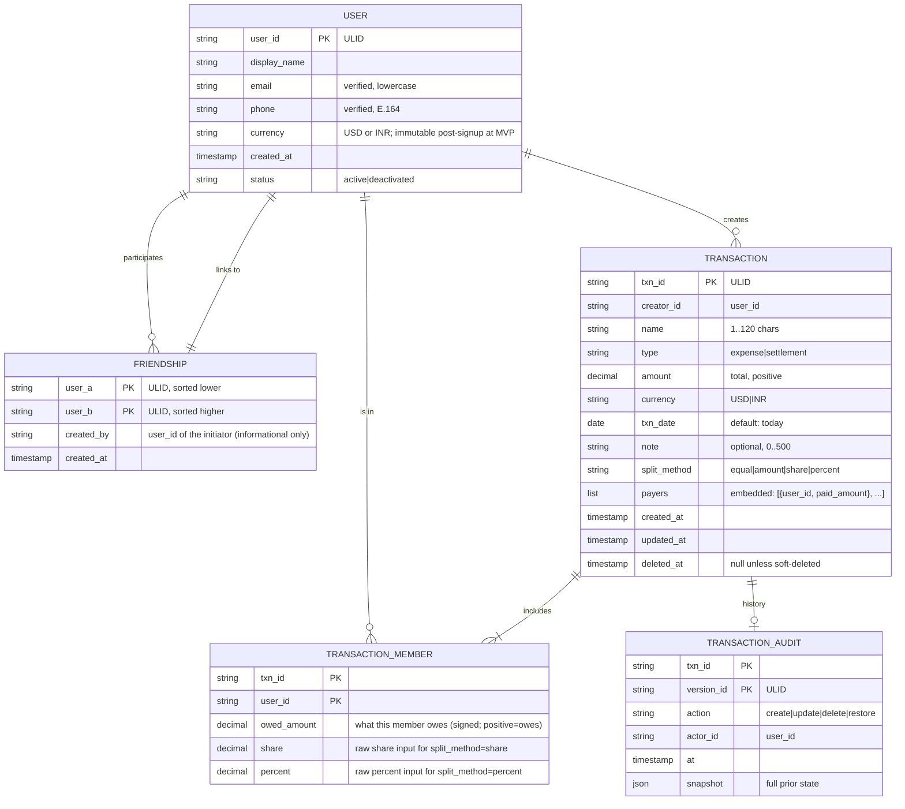
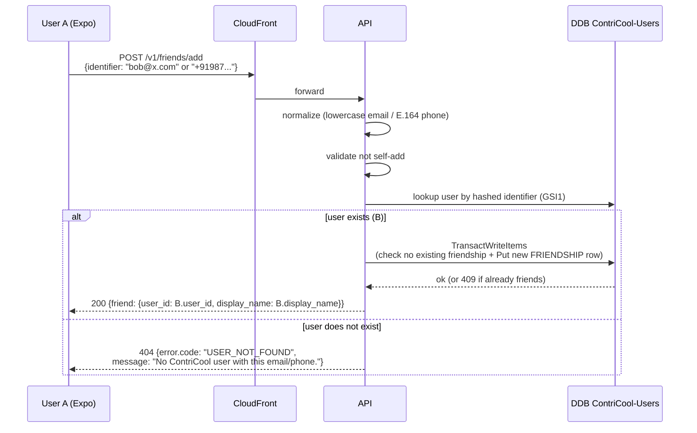

# ContriCool — Transaction Domain Design

## Overview

This design pins down the core domain semantics: what a transaction is, how splits work, how friendships relate to transactions, and the rules around create/edit/delete and balance computation. Design level: **HLD + LLD** (the domain shape directly drives the data model in Design 7). Headlines: **per-user single currency** (locked at signup, fixed for MVP), **two transaction types — `expense` and `settlement`**, **four split methods — `equal`, `amount`, `share`, `percent`**, **one or more payers**, **friendship is undirected with a state machine**, **transactions soft-delete with immutable audit history**, **balances computed on read** (not stored aggregates) for MVP.

**Storage mapping (per Designs 1 & 7)**: User profiles and friendships live in **`ContriCool-Users-<env>`**; transactions (with payers embedded on META), members, and audit history live in **`ContriCool-Transactions-<env>`**. Cross-table writes (e.g. create-transaction with friendship verification) use `TransactWriteItems` spanning both tables.

## Domain entities



## Field-level specs

### `Transaction`

| Field | Type | Constraints | Notes |
|---|---|---|---|
| `txn_id` | string (ULID) | server-generated | sorts by time |
| `creator_id` | user_id | required, immutable | the only user who can edit/delete |
| `name` | string | 1..120 unicode chars | trimmed; required |
| `type` | enum | `expense` \| `settlement` | see "Types" below |
| `amount` | decimal(12,2) | > 0 | total transaction amount |
| `currency` | enum | `USD` \| `INR` | must match all members' currency at MVP |
| `txn_date` | date (ISO) | defaults to today (UTC date in user's TZ → server-stored as UTC date) | up to ~10 years past, no future > 1 day |
| `note` | string | 0..500 chars | optional |
| `split_method` | enum | `equal` \| `amount` \| `share` \| `percent` | how `owed_amount` is derived |
| `created_at` | timestamp | server-set | UTC |
| `updated_at` | timestamp | server-set | UTC |
| `deleted_at` | timestamp \| null | server-set on delete | soft-delete |

### `TransactionMember`

| Field | Constraints |
|---|---|
| `user_id` | required; must reference an existing user |
| `owed_amount` | decimal(12,2); sum across members must equal `transaction.amount` (within ±0.01 rounding tolerance) |
| `share` | required if `split_method == share`, else null |
| `percent` | required if `split_method == percent`, else null; sum of percents must equal 100.00 (within ±0.01) |

### Payers (embedded on `Transaction`, not a separate row)

`Transaction.payers` is a list of `{user_id, paid_amount}` entries embedded directly on the META row in DDB (Design 7). Constraints:

| Field | Constraints |
|---|---|
| `user_id` | required; must be in `members` |
| `paid_amount` | > 0; sum across payers must equal `transaction.amount` |

Storing payers inline on META rather than as separate rows saves M writes per transaction (typically 1, max 10) and makes "who paid what" available with a single `GetItem` on META — same data, same constraints, fewer rows to manage atomically.

## Member & payer rules

- **Min members**: 2 (creator + at least one other). A "transaction" with only yourself is meaningless; redirect to `note` or a personal-expense feature later.
- **Max members at MVP**: 10. Sufficient for dinners, trips, and house expenses — the common use cases. The schema is technically capable of more (the TransactWriteItems limit doesn't bite until ~45 members after Design 7's simplification), but 10 keeps MVP scope tight; raising the cap post-MVP is a one-line change.
- **Creator must be in `members`**: enforced server-side. Splitwise allows recording transactions you're not part of; we don't, to keep mental model simple.
- **All non-creator members must be current friends of creator** (existence of the canonical FRIENDSHIP row in `ContriCool-Users-<env>`).
- **Payers must be a subset of members.** A non-member cannot have paid.
- **Single payer is the common case** (`paid_by_creator: true` → one payer = creator); UI defaults to this. Multiple payers supported in the data model from day one.

## Split methods (LLD)

`amount = transaction.amount`, `m = members`.

| Method | Input | Computation |
|---|---|---|
| `equal` | none | `owed_amount[i] = round(amount / len(m), 2)`; the last member absorbs the ±0.01 rounding remainder. |
| `amount` | per member explicit `owed_amount` | validate `sum == amount` (±0.01); store as-is. |
| `share` | per member `share` (positive number) | `owed_amount[i] = round(amount * share[i] / sum(share), 2)`; last member absorbs rounding. |
| `percent` | per member `percent` (sum 100.00) | `owed_amount[i] = round(amount * percent[i] / 100, 2)`; last member absorbs rounding. |

Server is the source of truth: client sends raw inputs (method + per-member shares/percents/amounts), server computes `owed_amount` and persists. UI may show a preview but server recalculates.

## Transaction types

### `expense`
- Someone paid for something on behalf of the group; members owe their share.
- `owed_amount[i]` represents what member `i` owes for this transaction.
- Net effect on member's balance vs each payer is computed at read time:
  - `member_owes_payer = (member.owed_amount * payer.paid_amount / total_paid)` — proportional allocation when multiple payers.

### `settlement`
- A direct payment between two members to clear existing debt.
- Constraints: exactly 2 members, exactly 1 payer, `split_method = amount`, `members[non_payer].owed_amount = amount`, `members[payer].owed_amount = 0`.
- Does not enforce that the payee is actually owed money — users may pre-pay; UI warns but doesn't block.

(Other types — group reimbursement, recurring expense — deferred.)

## Edit & delete semantics

### Edit
- **Only the creator** can edit (per AuthZ design).
- Edit produces a new audit version; the prior `Transaction` snapshot is written to `TRANSACTION_AUDIT` before the row is mutated.
- All fields except `txn_id`, `creator_id`, `created_at` are mutable.
- Editing `amount`, `split_method`, members, payers triggers full re-validation; balances change for all members on next read.
- **Stale-edit protection**: client sends `If-Match: <updated_at>` header; server uses DDB ConditionExpression `updated_at = :stale` to reject overlapping edits with 409.

### Delete (soft)
- Creator-only.
- Sets `deleted_at = now`. Row is excluded from default queries; balance computation skips deleted rows.
- A creator can **restore** a soft-deleted transaction within 30 days; after 30 days, a scheduled job hard-deletes it. The audit history is retained for 90 days post-hard-delete (see Design 13).
- Hard-delete is **never** user-initiated for individual transactions; only via account deletion or the cleanup job.

### Audit
- Every `create`, `update`, `delete`, `restore` writes a row to `TRANSACTION_AUDIT` with the prior snapshot.
- Audit reads (post-MVP UI feature) require creator or admin; not exposed in MVP UI but available via support/console.

## Friendship

### Model (MVP)

- **Friendship is undirected and binary**: it either exists or it doesn't. No `pending`, no `blocked` at MVP.
- **Adding is bilateral and immediate**: when A adds B (where B exists on the platform), both A and B's friend lists immediately include each other — no inbox, no approval, no notification gating.
- **The only access gate is exact-identifier lookup**: A must already know B's email or phone (E.164). No fuzzy search, no suggestions, no enumeration helpers.
- **Removing is one-sided and immediate**: either party can remove the friendship; the row goes away from both sides. Historical transactions remain visible (preserves financial history) but no new transactions can be created with the removed party until friendship is re-added.

### Storage shape

- One row per friendship in `ContriCool-Users-<env>`, with the two user_ids stored sorted (`user_a < user_b` lexicographically) — one canonical row regardless of who initiated.
- `created_by` records who initiated (informational only; doesn't affect access).
- `created_at` timestamp.
- No `state` field (existence = friends).

### Add-friend flow



The response is **honest about existence** — that's a deliberate MVP trade-off the user accepted. The mitigation is that the only way to probe is by knowing the exact identifier (no enumeration helpers anywhere in the API or UI).

### Remove-friend flow

`DELETE /v1/friends/{friend_user_id}` — either party can call. Atomic delete of the canonical row from `ContriCool-Users-<env>`. Existing transactions stay; new ones with the removed party are blocked until the user adds them again.

### Future evolution (post-MVP)

When the product is stickier and abuse becomes a real concern, we can layer on:
- **Pending-accept flow**: a setting per-user ("require my approval before someone adds me as a friend"). Default off; opt-in.
- **Block list**: explicit `BLOCKED#<other_user_id>` rows preventing re-adds.
- **Invite-by-email-when-not-on-platform**: stash an `INVITE#<hash>` row in `ContriCool-Users-<env>` and email the invitee when SES (post-domain) is wired.

These are pure additions — the MVP rows and API surface are forward-compatible.

## Currency rules at MVP

- **Each user has a single `currency`** chosen at signup (USD or INR). Stored only in DynamoDB on `ContriCool-Users-<env>` `USER#<id>#META` — never in Cognito (see Design 4 for rationale). Validation against `currency` reads from DDB, batched alongside other reads in the same request.
- **Each transaction has a single `currency`**, set on creation.
- **All members of a transaction must share the same currency** (== transaction currency == every member's user.currency). This is the simplest correctness invariant for MVP.
- A user with friends in a different currency:
  - Cannot create transactions including those friends. UI shows a clear "this friend uses INR; you use USD; you can be friends but cannot share transactions in MVP."
  - Friendship is allowed cross-currency (it's a social graph).
- **Currency is immutable post-signup at MVP** to avoid messy data migration. Post-MVP we can allow change with full balance reset/conversion.

This rule will be revisited when multi-currency lands. The schema already carries `currency` per transaction (forward-compatible).

## Balance computation

### Approach: compute on read (no stored aggregates at MVP)

For each pair (A, B):
```
net_balance(A, B) = sum over transactions T where both A and B are members:
    contribution(T, A, B)
where contribution(T, A, B) =
    + (B owes A in T)        # A paid for part of B's owed_amount
    - (A owes B in T)        # B paid for part of A's owed_amount
```

Concretely, for each transaction T:
- For each payer P in T with `paid_amount[P]`:
  - For each non-payer member M with `owed_amount[M]`:
    - The portion of P's payment that covers M is `paid_amount[P] / total_paid * owed_amount[M]`.
  - Sum over all P × M pairs that include A and B (in either role).

Settlements directly adjust: if A paid B in a settlement of $X, B owes A $X less (= A owes B –$X = balance shifts by +X toward A).

### Why compute on read

| Approach | Pros | Cons |
|---|---|---|
| **Compute on read (chosen)** | Always correct; no aggregate-drift bugs; trivial to implement; cache layer can be added later. | O(N) per balance query where N = transactions involving the pair. At <10k transactions/user, fine. |
| Stored running balance per pair | O(1) read. | Aggregate maintenance under edits/deletes is a nightmare; race conditions; off-by-one bugs are painful. |
| Materialized view via DDB Streams + Lambda | Decouples compute from read. | Complexity overkill for MVP scale. |

**Decision: compute on read.** Re-evaluate at >5k transactions/active user (we're nowhere close).

For "list with friend X" (the only query that actually needs balances at MVP), we paginate transactions by date desc and compute the running balance lazily. Top-of-screen "you owe X $Y" comes from a single full pair scan executed on the page load.

### Caching

- No persistent cache at MVP. The Lambda compiles balances per request.
- If a user has many friends and the home dashboard slows, add a per-user balance cache row in DDB updated by DDB Stream + Lambda — post-MVP.

## Domain operations API surface (preview; full contract in Design 8)

| Op | Validation focus |
|---|---|
| Create transaction | members all friends, sums equal, currency match |
| Update transaction | creator-only; If-Match header for stale-edit |
| Delete transaction | creator-only; soft delete |
| Restore transaction | creator-only within 30 days |
| List my transactions | filter by date range, type, deleted=false; cursor pagination |
| List with friend X | both members; filter by date; running balance returned |
| Friend request / accept / decline / remove / block / unblock | state-machine validation |
| Compute balance with friend X | derived |

## Component / Low-Level Design

### `app/features/transactions/`

```
transactions/
  routes.py       # FastAPI router
  service.py      # business operations
  policy.py       # transaction-specific authz helpers
  splits.py       # equal/amount/share/percent algorithms
  balance.py      # pair-balance compute
  models.py       # Pydantic
  repository.py   # DDB single-table reads/writes
  README.md
```

### `app/features/friends/`

```
friends/
  routes.py
  service.py
  models.py
  repository.py     # FRIENDSHIP rows in ContriCool-Users-<env>; canonical-pair keying
  README.md
```

No state machine, no invites module at MVP — both deferred.

### `splits.py`

Pure functions; 100% test coverage. Property-based tests with Hypothesis to ensure `sum(owed_amount) == amount` for all inputs.

### `balance.py`

Pure function over a list of transactions involving the pair. Decimal math throughout — no floats.

## Security Considerations

- **Decimal everywhere**, never float. `decimal.Decimal` in Python; `string` over the wire to avoid JS float issues; Pydantic validates as `Decimal`.
- **Server recomputes splits**; never trusts client-supplied `owed_amount` for `equal`/`share`/`percent` methods.
- **Currency mismatch is a hard reject**, not a coercion.
- **Audit trail** preserves history; deletes are recoverable for 30d.
- Soft-deleted rows are filtered out of all default queries to avoid accidental balance inclusion.

## Open Questions

1. **Soft-delete grace period: 30 days?** Reasonable default; user-feedback to tune.
3. **Maximum members: 10** (matches Design 7). Deliberate MVP scope choice; technical headroom exists to raise later without redesign.
4. **Should settlement transactions be a different resource type?** Not at MVP — same resource, `type=settlement` differentiates. May change if settlement-specific UX diverges significantly.
5. **Expense categories / tags?** Not at MVP. Defer.
6. **Recurring expenses?** Not at MVP. Defer.
7. **Receipt attachments?** Not at MVP. Defer (would need S3 image upload, virus scanning, thumbnails — out of scope).

## Summary

- **Transaction = `{name, type, amount, currency, date, members, payers, split_method, owed_amount per member}`**, soft-deletable, audit-logged, creator-only writable; min 2 members; all non-creator members must be accepted friends.
- **Two types** (`expense`, `settlement`); **four split methods** (`equal`, `amount`, `share`, `percent`); **multi-payer supported** but single-payer is the common path.
- **Friendship is undirected and binary** at MVP — no accept/decline, no blocking, no pending state; adding by exact email/phone creates the canonical row immediately and bilaterally; either party can remove. Pending-accept, blocking, and not-yet-user invites are all forward-compatible additions deferred to post-MVP.
- **Balances are computed on read** (no stored aggregates), Decimal arithmetic throughout, currency-mismatch rejected — simple and correct for MVP scale.
- **MVP is single-currency-per-user**, locked at signup; schema already carries `currency` on transactions for forward-compatible multi-currency.
