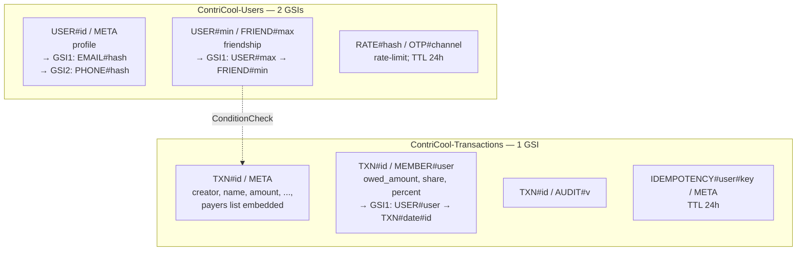

# ContriCool — Database & Data Model Design

## Overview

This design picks the data store and the concrete schema. Design level: **System + LLD** (the access patterns drive the keys; the keys drive the access patterns — both must be specified). Headlines: **DynamoDB on-demand, two tables** — `ContriCool-Users-<env>` for the social graph + identity ops and `ContriCool-Transactions-<env>` for the financial ledger; both encrypted with the project KMS CMK in prod, PITR enabled in prod. **Three GSIs total** (2 on Users, 1 on Transactions) cover all access patterns. Email/phone lookups use **deterministic salted hashes** projected directly from the user `META` row so raw PII is never indexed and no row is duplicated. Cross-table atomicity preserved via `TransactWriteItems` (up to 100 items spanning multiple tables).

## Data Store Choice

| Option | Pros | Cons | Free-tier cost |
|---|---|---|---|
| **DynamoDB on-demand, two tables (chosen)** | True serverless ($0 idle); single-digit-ms reads; PITR; 25 GB + 25 RCU/WCU/mo free per table; clean separation between social graph and ledger; smaller per-table key designs (one PK/SK doesn't have to satisfy every entity). | Cross-table reads add ~10–20ms over single-table; one extra table to operate. | $0 at MVP scale. |
| DynamoDB single-table | Lowest theoretical latency for hot patterns; one PK/SK design. | Steeper learning curve; everything piles on one table. | Free at MVP. |
| Aurora Serverless v2 Postgres | Familiar SQL, joins. | Min ACU = 0.5 → ~$43/mo idle; needs VPC + RDS Proxy. | Over budget. |
| RDS t4g.micro Postgres | Cheap year 1. | Always-on; needs VPC. | Free first year only. |

**Decision: DynamoDB on-demand with two tables** — `ContriCool-Users-<env>` (social graph) and `ContriCool-Transactions-<env>` (financial ledger). The mental boundary tracks the domain split in Design 6 (friendships are graph data; transactions are ledger data). Cross-table consistency, the only worry, is fully solved by `TransactWriteItems` spanning multiple tables.

## Access Patterns (the source of truth for keys)

Numbered for reference. Each lists the table + index that serves it.

| # | Pattern | Table | Index |
|---|---|---|---|
| 1 | Get user profile by user_id | Users | base (PK = `USER#<id>`) |
| 2 | Look up user by email | Users | GSI1 |
| 3 | Look up user by phone | Users | GSI2 (dedicated phone-lookup index) |
| 4 | Get friendship between (A, B) | Users | base (PK = `USER#<min>`) |
| 5 | List all friendships for user | Users | base + GSI1 (union of "user is min" and "user is max") |
| 6 | Get OTP rate-limit row | Users | base (PK = `RATE#<hash>`) |
| 7 | Get transaction by txn_id | Transactions | base (PK = `TXN#<id>`) |
| 8 | List transactions where user is a member, by date desc | Transactions | GSI1 |
| 9 | List transactions where users A and B are both members, by date desc | Transactions | GSI1 (same as #8) → batch-get METAs → in-Lambda filter on `members` array |
| 10 | List soft-deleted transactions for user (last 30d) | Transactions | filter on #8 |
| 11 | Append audit row | Transactions | base (PK = `TXN#<id>`) |
| 12 | Get idempotency record | Transactions | base (PK = `IDEMPOTENCY#<user>#<key>`) |

Patterns previously assumed (pending friend requests, friend invites for non-users) are out of scope at MVP per Design 6.

## Table 1: `ContriCool-Users-<env>`

**Keys**: `PK` / `SK` (string/string). **GSIs**: two — `GSI1` (email lookup + friend "user-is-max" view) and `GSI2` (phone lookup).

### Items

| Entity | PK | SK | GSI1PK | GSI1SK | GSI2PK | GSI2SK | Attributes |
|---|---|---|---|---|---|---|---|
| **User** | `USER#<user_id>` | `META` | `EMAIL#<sha256(salt+lower(email))>` | `USER` | `PHONE#<sha256(salt+e164)>` | `USER` | display_name, currency, status, created_at, updated_at, deactivated_at? |
| **Friendship** | `USER#<min(a,b)>` | `FRIEND#<max(a,b)>` | `USER#<max(a,b)>` | `FRIEND#<min(a,b)>` | — | — | created_by, created_at |
| **OTP rate-limit** | `RATE#<sha256(salt+lower(identity))>` | `OTP#<channel>` | — | — | — | — | attempts_hour, hour_window_started_at, attempts_day, day_window_started_at, ttl |

### Indexes — what each one carries

**GSI1** (still polymorphic across two shapes, distinguished by prefix on `GSI1PK`):

| `GSI1PK` shape | Projecting item | Used for |
|---|---|---|
| `EMAIL#<hash>` | User `META` row | Pattern #2 — look up user by email |
| `USER#<max>` | Friendship row | Pattern #5 — list friendships where the requester is the larger-id of the canonical pair |

**GSI2** (single shape, single purpose):

| `GSI2PK` shape | Projecting item | Used for |
|---|---|---|
| `PHONE#<hash>` | User `META` row | Pattern #3 — look up user by phone |

The User `META` row therefore projects into **both** GSIs simultaneously — `GSI1PK=EMAIL#<hash>` and `GSI2PK=PHONE#<hash>` — without needing a duplicate row. This keeps each user's identity-lookup data in one place: a single source of truth, no cross-row sync, no race condition between email-hash and phone-hash writes.

### Friendship storage shape

- One row per friendship, with the two user_ids stored sorted (`user_a < user_b` lexicographically) — canonical form regardless of who initiated.
- `created_by` records who initiated (informational only; doesn't affect access).
- **No `state` field at MVP** — existence of the row means "friends." Pending/blocked states are forward-compatible additions when needed (just add a `state` attribute and update reads to filter).

## Table 2: `ContriCool-Transactions-<env>`

**Keys**: `PK` / `SK` (string/string). **GSIs**: one — `GSI1` (user→txns).

### Items

| Entity | PK | SK | GSI1PK | GSI1SK | Attributes |
|---|---|---|---|---|---|
| **Transaction (meta)** | `TXN#<txn_id>` | `META` | — | — | creator_id, name, type, amount, currency, txn_date, split_method, note, created_at, updated_at, deleted_at, **`payers: [{user_id, paid_amount}, ...]`** |
| **Transaction member** | `TXN#<txn_id>` | `MEMBER#<user_id>` | `USER#<user_id>` | `TXN#<sortable_date>#<txn_id>` | owed_amount, share, percent |
| **Transaction audit** | `TXN#<txn_id>` | `AUDIT#<version_ulid>` | — | — | action, actor_id, at, snapshot (JSON of meta + members) |
| **Idempotency record** | `IDEMPOTENCY#<user_id>#<key>` | `META` | — | — | response, status_code, expires_at (ttl 24h) |

`<sortable_date>` = `YYYY-MM-DD`; `<txn_id>` appended to keep SK unique.

### What's no longer here, and why

- **PAYER rows have been folded into META** as a `payers: [{user_id, paid_amount}, ...]` attribute. Single payer is the common case (most transactions have one payer); even multi-payer is bounded by the member cap. DDB items can hold up to 400 KB; 10 payers + 10 members of metadata is well under 2 KB. Saves M writes per transaction (typically 1, max 10) and removes a class of cross-row-update edge cases when editing.
- **PAIR-pivot rows are gone**. They were O(N²) per transaction (45 rows for a 10-member transaction). Their only purpose was Pattern #9 ("list transactions involving both A and B"). We now answer that pattern by reading the user's transactions via GSI1, batch-getting METAs, and **filtering in Lambda** on the `members` attribute embedded in MEMBER rows (or computed from META). At MVP scale this costs single-digit extra RCUs per query — negligible. If we ever cross thousands of transactions per user we can reintroduce pair pivots as a DDB-Streams materialized view; non-breaking.

### Pattern #8 ("my transactions")

```
Query Transactions GSI1 where GSI1PK = "USER#<me>"
  begins_with(GSI1SK, "TXN#")
  ScanIndexForward = false   # newest first
```

Returns all MEMBER rows for the user (one per transaction they're in); we then `BatchGetItem` the corresponding `TXN#<id>#META` rows for the page.

### Pattern #9 ("transactions with friend X")

```
1. Query GSI1 PK=USER#<me>, SK begins_with TXN#, scan reverse → page of MEMBER rows.
2. BatchGetItem META rows for that page.
3. In Lambda: filter to METAs where any MEMBER row has user_id == X
   (i.e., transactions that included X as a member).
4. Return the filtered page.
```

To know whether X is in each transaction, we need either the member list per transaction or X's MEMBER rows. Two equivalent implementations:

- **(a) Filter via MEMBER rows**: also `Query GSI1 PK=USER#<X>` for the same date range; intersect the txn_ids; batch-get only those METAs. Two GSI queries; precise; small extra cost.
- **(b) Filter via embedded list**: store a redundant `member_ids: [u1, u2, ...]` on META; one GSI query, batch-get METAs for me, filter in Lambda by `X in member_ids`. One GSI query but reads METAs that may be filtered out.

We'll go with **(a)** — two cheap GSI queries with intersection — because it scales gracefully if any user accumulates many transactions. Both are workable; (a) avoids the over-fetch concern.

### Pattern #11 (audit append) and edits

When a transaction is edited, the existing META is updated in place and a new AUDIT row is appended (`SK=AUDIT#<version_ulid>`). The full prior snapshot of META + all MEMBER rows is captured in the audit row's JSON attribute. Since payers are inside META, restoring an old version means rewriting META; member rows are written/deleted/updated as part of the same `TransactWriteItems`.

## Cross-table operations

### Create transaction (Pattern: verify friendship in Users + write txn items in Transactions)

A single `TransactWriteItems` call spans both tables:

```python
client.transact_write_items(TransactItems=[
    # 1. ConditionCheck on Users: every other-member is currently a friend
    #    (existence of the canonical friendship row = "friends"; see Design 6)
    {"ConditionCheck": {
        "TableName": "ContriCool-Users-<env>",
        "Key": {"PK": f"USER#{min(creator,m)}", "SK": f"FRIEND#{max(creator,m)}"},
        "ConditionExpression": "attribute_exists(PK)",
    }} for m in members_other_than_creator,

    # 2. Put on Transactions: META (with payers embedded) + MEMBER rows + AUDIT
    {"Put": {"TableName": "ContriCool-Transactions-<env>", "Item": meta_item}},
    *[{"Put": {"TableName": "ContriCool-Transactions-<env>", "Item": m}} for m in member_items],
    {"Put": {"TableName": "ContriCool-Transactions-<env>", "Item": audit_item}},
])
```

`meta_item` includes the `payers` list as an embedded attribute — no separate PAYER rows.

DDB supports up to 100 items per `TransactWriteItems` across multiple tables.

| Members | Friendship checks (Users) | Transactions writes (META + MEMBERs + AUDIT) | **Total items** |
|---|---|---|---|
| 2 | 1 | 1 + 2 + 1 = 4 | 5 |
| 5 | 4 | 1 + 5 + 1 = 7 | 11 |
| 10 | 9 | 1 + 10 + 1 = 12 | 21 |

**Member cap stays at 10 for MVP.** The 100-item TransactWriteItems limit gives us ample headroom (21 items used at the cap, 79 free) — but Splitwise-comparable group sizes aren't a stated MVP requirement, and 10-person groups cover dinners, trips, and house expenses. Raising the cap is a one-line change post-MVP if real demand for larger groups emerges.

Atomicity is preserved end-to-end: any failed friendship check or item write aborts the whole transaction.

### Edit transaction

Single-table operation on Transactions; uses `ConditionExpression: creator_id = :requester_id` for the `META` row, with `If-Match: <updated_at>` for stale-edit protection.

### Delete (soft) transaction

Single-table on Transactions: `UpdateItem` setting `deleted_at = now`, with the same creator-only condition.

### Friendship CRUD

Single-table on Users; state-machine transitions enforced via `ConditionExpression` on prior state.

## Email & phone lookups (privacy)

- **No raw email or phone anywhere in DDB** — neither in attributes, nor in any index. Cognito is the sole store of the raw values.
- **HMAC-SHA-256 with a project-wide salt** stored in SSM Parameter Store as `SecureString` encrypted with the project CMK; salt is **never rotated** (rotation breaks lookups).
- `lookup_hash(email) = HMAC-SHA256(salt, lower(trim(email)))`
- `lookup_hash(phone_e164) = HMAC-SHA256(salt, e164(phone))`
- The hashes project to `GSI1PK=EMAIL#<hex>` and `GSI2PK=PHONE#<hex>` from the user `META` row. The META row's regular attributes (`display_name, currency, status, created_at, updated_at, deactivated_at`) carry no PII.

This protects against accidental disclosure (anyone glancing at any DDB index, attribute, or backup sees only opaque hashes; raw PII isn't there to leak). It does *not* protect against a determined attacker with the salt; that's why salt access is gated by KMS Decrypt + SSM `GetParameter`.

## Consistency

- **Strong consistency**: not used by default. Reads are eventually consistent (cheaper, faster). For the post-write read after `TransactWriteItems` (e.g., return the freshly-created transaction), we use strongly-consistent reads on the Transactions base table.
- **Cross-table reads** (e.g., resolving member display names for a transaction) are eventually consistent; acceptable since member identity is static once the transaction is written.

## Member cap

- **10 members per transaction** at MVP. Sufficient for the common cases — dinners, trips, house expenses, weekend outings. Group sizes beyond 10 are rare in the target use case.
- The TransactWriteItems 100-item limit is no longer the binding constraint after the simplification (21 items used at the cap, 79 free); the cap is a deliberate UX/scope choice, not a technical one.
- Post-MVP: raising the cap to 25 or beyond is a one-line config change — no schema or write-path changes required.

## Mermaid: relationships at a glance



## Data growth & cost projection

| Metric | Launch (100 DAU) | Month 12 (1k DAU) |
|---|---|---|
| Users (cumulative) | ~500 | ~5,000 |
| Total transactions | ~5k | ~500k |
| `Users` table items | ~5k | ~25k |
| `Transactions` table items | ~30k (incl pivots) | ~3M |
| Storage Users | <50 MB | <500 MB |
| Storage Transactions | <500 MB | <5 GB |
| Read req/mo (combined) | ~300k | ~3M |
| Write req/mo (combined) | ~50k | ~500k |
| Cost | $0 (free tier covers both tables independently) | $0–3 |

PITR (~$0.20/GB/month) negligible at our size.

## PITR, backups, KMS

- **PITR** enabled on **both prod tables**, disabled in dev (cost-minimal, dev data ephemeral).
- **On-demand backups** weekly via EventBridge Scheduler → Lambda → `CreateBackup` for both prod tables; 30-day retention.
- **KMS encryption**:
  - **prod**: customer-managed CMK (`alias/contricool-prod`) on both tables; annual rotation.
  - **dev**: AWS-managed key (`alias/aws/dynamodb`) on both tables — free.

## Soft-delete & cleanup

A daily scheduled Lambda (EventBridge → Lambda) at 03:00 UTC operates on both tables:

- **Transactions**:
  - Hard-delete transactions where `deleted_at < now - 30d` (and their members/payers/pairs/audit).
  - Hard-delete audit rows older than 90d post-hard-delete.
- **Users**:
  - Hard-delete pending invites older than 90d.
  - `RATE#` rows auto-clean via DDB TTL.
- **Users hard-delete on account deletion** (Design 13) — separate flow.

## Optimistic concurrency

- **Transactions**: edit ops send `If-Match: <updated_at>` → `ConditionExpression: updated_at = :stale`. 412 on mismatch.
- **Friendships**: state-machine transitions use `ConditionExpression` on prior `state` value to avoid stale-state writes.

## Open Questions

1. **Member cap of 10** — deliberate scope choice for MVP, not a technical constraint. Raise post-MVP (one-line change) if real demand for larger groups appears.
2. **Salt rotation policy** — never rotate. Confirmed. Re-evaluate post-launch if salt compromise occurs (would require re-hashing every lookup row).
3. **DDB Streams** — enable on **both prod tables** from day one (free) for future async work (cache, notifications fan-out, balance materialized views). No consumer at MVP.
4. **Audit retention** — 90d post-hard-delete; revisit pre-launch with privacy lawyer review.

## Summary

- **Two DynamoDB tables on-demand**: `ContriCool-Users-<env>` (social graph + identity ops) with **2 GSIs**; `ContriCool-Transactions-<env>` (financial ledger) with **1 GSI** — 3 GSIs total. Both tables encrypted with KMS CMK in prod, PITR on, DDB Streams on.
- **Cross-table atomicity** via `TransactWriteItems` (up to 100 items spanning multiple tables); create-transaction at the 10-member cap is ~21 items — well under the limit.
- **GSI1 on Users** is polymorphic across two shapes (`EMAIL#` for email lookup on the user `META` row; `USER#` for friend "user-is-max" view on friendship rows). **GSI2 on Users** is dedicated to `PHONE#` lookup on the user `META` row. The user `META` row projects into both GSIs from a single source-of-truth item — no duplicate rows, no cross-row sync.
- **Email/phone lookups** via HMAC-SHA-256 of (salt + normalized identity); raw PII never lands in any index.
- **Transactions table writes are now ~1+N+1 per transaction** (META + N MEMBER rows + AUDIT). PAYER rows are folded into META as an embedded list; PAIR-pivot rows are dropped — Pattern #9 ("transactions with friend X") resolves via two cheap GSI1 queries + intersection. Member cap stays at **10** for MVP scope (the schema is technically capable of more; raising is a one-line change post-MVP).
- **Soft-deletes with 30-day grace; audit retained 90d post-hard-delete.**
