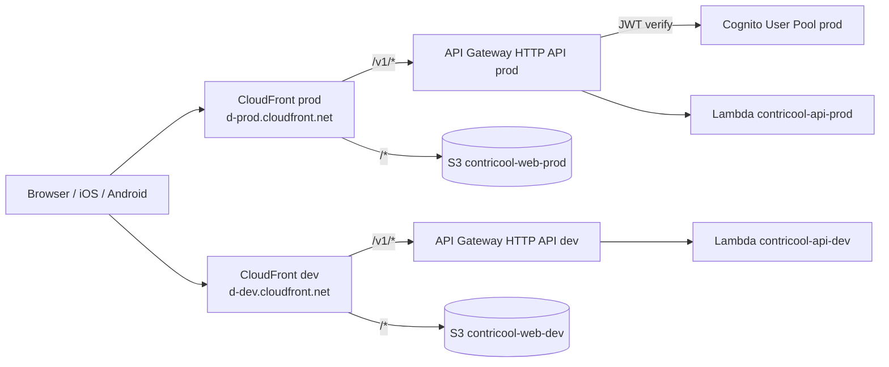

# ContriCool — Endpoint & Edge Design

## Overview

This design defines how public traffic enters AWS — DNS, edge, TLS, routing, CORS, throttling, and (eventually) WAF. Design level: **System** (network topology + cost trade-offs). Headlines: **one CloudFront distribution per env** at the **AWS-default `cloudfront.net` domain** (free) with path-based behaviors fanning out to S3 (web bundle) and API Gateway HTTP API (API). Web and API are **same-origin**, which keeps the refresh-token cookie strategy simple and CORS effectively a no-op. **No Route 53, no ACM cert, no domain registration at MVP** — all of that gets attached as alternate domain names on the same distribution when `contricool.com` is registered later. **WAF deferred** but the CDK construct is feature-flagged for one-flag enable.

## Endpoint Design

### Topology (MVP)



| Public name (MVP) | Backed by | Purpose |
|---|---|---|
| `https://d-<id>.cloudfront.net` (prod distribution) | CloudFront → S3 + API Gateway via path-based behaviors | the entire prod app surface |
| `https://d-<id>.cloudfront.net` (dev distribution) | CloudFront → S3 + API Gateway via path-based behaviors | the entire dev app surface |

### Topology (post-`contricool.com`)

| Public name | Backed by |
|---|---|
| `contricool.com` (apex) | Route 53 alias → prod CloudFront (alternate domain name) |
| `www.contricool.com` | Route 53 alias → prod CloudFront (alt name); CF Function 301 to apex |
| `dev.contricool.com` | Route 53 alias → dev CloudFront |

The same prod CloudFront distribution serves both the default `cloudfront.net` domain and the new alternate domain names — **no behavior changes**, no re-architecture, no app code change. Just attach an ACM cert covering `contricool.com` + `*.contricool.com` (issued in **us-east-1** because CloudFront requires it; this is the only resource we'll have outside our primary us-west-2 region) and add Route 53 records.

### Why one CloudFront distribution per env (instead of two — web + API)

| Option | Pros | Cons |
|---|---|---|
| **Single distribution, path-based behaviors (chosen)** | Web + API are same-origin → refresh cookie auto-attaches; CORS is effectively a no-op; **works on free `cloudfront.net` domain** because cookie scoping doesn't span across `*.cloudfront.net` distributions (public-suffix-list rule). | Slightly more behavior config in CDK; CF cache headers must differentiate web vs API paths. |
| Two distributions (web + API) | Cleaner separation of concerns; per-distribution metrics. | **Cookie strategy fails on default domains** — can't share a cookie across two `*.cloudfront.net` hosts; would force CORS-with-credentials and either localStorage-stored refresh tokens (XSS risk) or eager move to a custom domain. |
| API Gateway directly (no CloudFront) | One fewer hop, slightly faster cold path. | TLS at APIGW only; can't add WAF cheaply later; can't unify under the cookie strategy without a custom domain. |

**Decision: single distribution, path-based behaviors** — the only design that lets MVP run on the free domain while keeping the HttpOnly-cookie refresh strategy.

### CloudFront distribution behaviors (per env)

| Path pattern | Origin | Cache | Headers / Cookies forwarded |
|---|---|---|---|
| `/v1/*`, `/api/*` | API Gateway HTTP API origin | `MinTTL=0, MaxTTL=0, DefaultTTL=0` (effectively disabled) | All viewer headers, query strings, all cookies (origin request policy `AllViewerExceptHostHeader`) |
| `/assets/*` | S3 origin (Expo's hashed bundle assets) | `Cache-Control: public, max-age=31536000, immutable` | none forwarded |
| `/*` (default) | S3 origin | `Cache-Control: no-cache` for `index.html`; CloudFront Function on viewer-request rewrites unknown paths (no extension, no trailing file) to `/index.html` so Expo Router deep links work | none forwarded |

The `/v1/*` behavior gets a stricter origin request policy (`AllViewerExceptHostHeader`) so the `Host` header is rewritten to the API Gateway hostname while everything else (including cookies and query strings) passes through.

### CloudFront response-headers policy (web behaviors)

Applied to S3-origin behaviors (`/assets/*` and `/*`):

- `Strict-Transport-Security: max-age=31536000; includeSubDomains; preload`
- `Content-Security-Policy: default-src 'self'; img-src 'self' data:; script-src 'self'; style-src 'self' 'unsafe-inline'; connect-src 'self'; frame-ancestors 'none'`
  - Note `connect-src 'self'` is sufficient because API calls are same-origin; once `contricool.com` is added we add it to the directive.
- `X-Content-Type-Options: nosniff`
- `Referrer-Policy: strict-origin-when-cross-origin`
- `Permissions-Policy: camera=(), microphone=(), geolocation=()`

API behaviors don't need these (the API never serves HTML); they get forwarded as-is from the API.

### CloudFront other settings (per env)

- **TLS**: AWS-default `*.cloudfront.net` cert at MVP (free; TLSv1.2_2021 minimum). When custom domain attaches, an ACM cert in **us-east-1** (mandatory for CloudFront) covering `contricool.com` + `*.contricool.com` replaces it (also free).
- **Compression**: gzip + brotli enabled.
- **HTTP/2 + HTTP/3**: enabled.
- **Price class**: PriceClass_100 (US, Canada, Europe). India users still hit nearby edges via the global fabric; PriceClass_All move when India latency metrics warrant.
- **Logging**: standard CloudFront logs to S3, retained 30 days. Real-time logs deferred (cost).

### API Gateway HTTP API configuration

- **One API per env**: `contricool-api-prod`, `contricool-api-dev`.
- **No custom domain on API Gateway** — CloudFront is the public hostname; the `<api-id>.execute-api.us-west-2.amazonaws.com` URL is private to our CloudFront origin.
- **Stage**: single `$default` (HTTP API auto-deploys).
- **Routes**: catch-all `ANY /v1/{proxy+}` → Lambda. FastAPI routes inside.
- **Authorizer**: Cognito JWT authorizer applied at the API level; specific public routes (`/v1/auth/signup`, `/v1/auth/login`, `/v1/health`, etc.) marked `authorizationType: NONE`.
- **CORS**: configured defensively even though MVP is same-origin (Design 8). Allowed origins include the env's `cloudfront.net` domain; when `contricool.com` is added, we add those origins too.
- **Throttling**: per-route burst/rate per Design 8.
- **Access logging**: JSON to CloudWatch Logs (`/aws/apigateway/contricool-api-<env>`), 14d retention, KMS-encrypted in prod.
- **Tracing**: X-Ray enabled (10% prod, 100% dev).

### Why API Gateway HTTP API, not REST API or ALB

| Option | Pros | Cons | Cost |
|---|---|---|---|
| **HTTP API (chosen)** | $1/M req; built-in JWT authorizer; lower latency; sufficient features. | Fewer features than REST API (no usage plans, no API keys, no request/response transforms). | Free tier 1M req/mo first 12 mo. |
| REST API | API keys, usage plans, request validation, transforms. | $3.50/M; ~30% slower. | More expensive. |
| ALB → Lambda | No per-request fee beyond ALB hours. | $16/mo ALB always-on; no JWT authorizer; over budget. | Over budget. |

API keys, usage plans, and request transformations aren't needed at MVP — the JWT authorizer + Cognito groups give us enough.

### DNS (when custom domain arrives)

- **Hosted zone**: `contricool.com` in Route 53 (one zone, ~$0.50/mo).
- **Records**:
  - `contricool.com` `A`/`AAAA` alias → prod CloudFront.
  - `www.contricool.com` `A`/`AAAA` alias → prod CloudFront (with CF Function 301-redirect to apex).
  - `dev.contricool.com` `A`/`AAAA` alias → dev CloudFront.
  - SES DNS records (DKIM CNAMEs, MAIL FROM MX/TXT, DMARC TXT) on `mail.contricool.com`.
  - `auth.contricool.com` for Cognito custom domain when federation lands.
- **DNSSEC**: enable in prod (Route 53 supports it free).
- **TTLs**: 300s for app records (alias records ignore TTL anyway).

### TLS (when custom domain arrives)

- **ACM cert in us-east-1** (mandatory for CloudFront — the rest of our infra is in us-west-2) covering `contricool.com` + `*.contricool.com`. DNS-validated; auto-renews.
- Same cert serves both prod and dev distributions (wildcard covers `dev.contricool.com`).

### CORS

Set at the API Gateway HTTP API level — defensive for MVP since web and API are same-origin:

```yaml
allowOrigins:
  - https://d-<prod-id>.cloudfront.net   # MVP prod
  - https://d-<dev-id>.cloudfront.net    # MVP dev (only on dev API)
  # post-domain:
  - https://contricool.com
  - https://www.contricool.com
  - https://dev.contricool.com
allowMethods: [GET, POST, PUT, PATCH, DELETE, OPTIONS]
allowHeaders: [authorization, content-type, idempotency-key, if-match, x-api-version]
allowCredentials: true
maxAge: 600
```

### Throttling & quotas

| Layer | Limit | Action on exceed |
|---|---|---|
| Account-level APIGW | 10,000 RPS | 429 + retry-after |
| HTTP API stage default | 5,000 RPS / 10,000 burst | 429 |
| Per-route hot routes (Design 8) | 5–10/s | 429 |
| App-level per-user OTP | 3/hour, 10/day | 429 + custom error |
| App-level per-user friend-request | 30/hour | 429 |
| Lambda concurrency | 100 (account default) | 429; APIGW retries within timeout |

### WAF

- **Deferred at MVP** to save ~$5–15/mo, but **CDK wires the AWS WAFv2 WebACL attachment as a feature flag** (`enable_waf=False` in env config). Flipping it on attaches:
  - `AWSManagedRulesCommonRuleSet` (CRS) — generic OWASP top-10.
  - `AWSManagedRulesAmazonIpReputationList` — known bad IPs.
  - `AWSManagedRulesKnownBadInputsRuleSet`.
  - Rate-based rule: 2,000 req / 5 min per IP → block 10 min.
- **Trigger to enable**: any of (a) abuse complaints, (b) sustained 4xx/5xx anomalies, (c) >$30/mo bill from request floods.
- WAF cost when enabled: $5/mo WebACL + $1/mo per managed rule group + traffic (~$8–12/mo total).

### CloudFront Functions

- **Viewer-request function on the default (S3) behavior** — rewrites SPA deep links to `/index.html` while leaving `/assets/*` alone. ~10 lines of JS. CF Functions are charged at $0.10 per 1M invocations — negligible.
- Lambda@Edge **not used** at MVP. CF Functions are sufficient for the URL/header rewrites we need.

### Public vs private exposure

- **All endpoints are public** at MVP.
- Internal admin tooling (post-MVP): a separate CloudFront distribution + APIGW with IP allowlist via WAF or a Cognito group `admin` JWT-authorizer check.

### Cost summary (per month, prod, MVP)

| Item | Free-tier (yr 1) | Post-free-tier |
|---|---|---|
| Route 53 hosted zone (post-domain) | $0.50 | $0.50 |
| ACM cert (post-domain) | $0 | $0 |
| CloudFront requests + egress (one distribution) | $0 (1 TB free yr 1) | $1–5 at MVP traffic |
| CloudFront Function invocations | $0 (2M free) | $0.10/M after |
| API Gateway HTTP API | $0 (1M free yr 1) | $1 per 1M req |
| WAF (if enabled) | n/a | $8–12 |
| **MVP total (no domain, no WAF)** | **<$1/mo** | **$2–6/mo** |
| **Post-domain, no WAF** | **<$2/mo** | **$3–8/mo** |
| **Post-domain, with WAF** | **n/a** | **$10–18/mo** |

## Security Considerations

- **TLS 1.2 minimum** at CloudFront (default), HTTPS-only with HTTP redirects to HTTPS.
- **HSTS preload** considered post-launch (`max-age=1y` already set; submit to hstspreload.org once stable on a custom domain).
- **No public S3**; all access via CloudFront OAC.
- **Bucket policy** on web S3 grants ONLY the CloudFront distribution (via OAC service principal + ARN match).
- **Cognito JWT authorizer** at API Gateway — invalid tokens never reach Lambda.
- **Geo-blocking** not at MVP. If abuse from non-target geos appears, add CloudFront geo-restriction (allowlist US, IN) cheaply.
- **CORS strict allowlist** prevents browser-based CSRF for state-changing ops (combined with SameSite=Strict on the refresh cookie).

## Open Questions

1. **Move to PriceClass_All** — slight cost bump for better India latency. Default: PriceClass_100; revisit on India launch metrics.
2. **Enable WAF at launch?** Recommendation: rate-based rule only at first ($5/mo) once any abuse appears; full managed sets when traffic justifies.
3. **Custom domain timing** — register `contricool.com` when (a) we want SES app-originated emails, or (b) brand presence matters. The same prod CloudFront distribution will accept the alternate domain name with no architectural changes.

## Summary

- **One CloudFront distribution per env** at the AWS-default `cloudfront.net` domain (free) with path-based behaviors: `/v1/*` → API Gateway HTTP API, `/assets/*` → S3 with long cache, `/*` → S3 with SPA fallback to `index.html` via CF Function.
- **Web and API are same-origin** at MVP — refresh-token cookie strategy works without CORS-with-credentials and without a custom domain.
- **API Gateway HTTP API** chosen over REST API ($1/M vs $3.50/M); built-in Cognito JWT authorizer.
- **WAF deferred** but feature-flagged in CDK; rate-based rule planned at first signs of abuse.
- **Custom domain (`contricool.com`)** attaches as alternate domain names on the same distribution later — no behavior changes, no app changes; just Route 53 + ACM cert.
