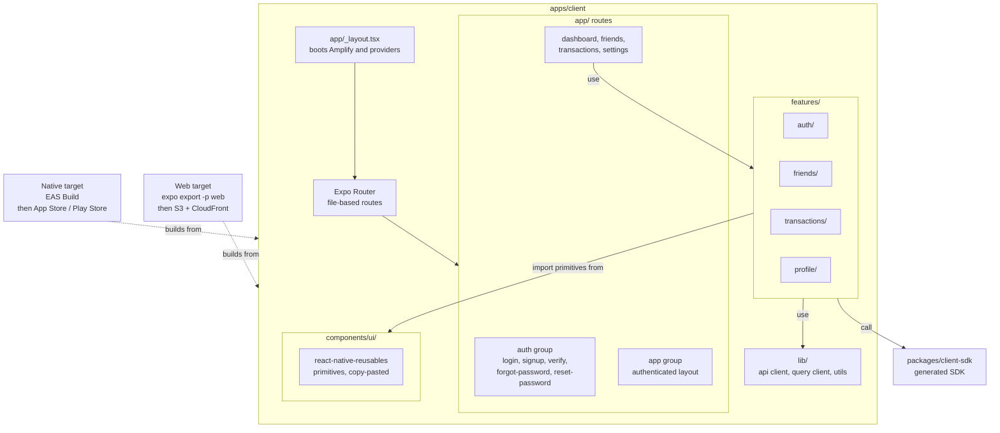
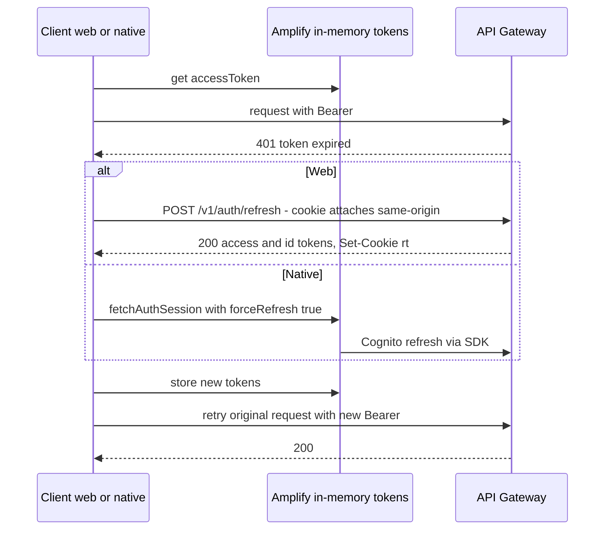
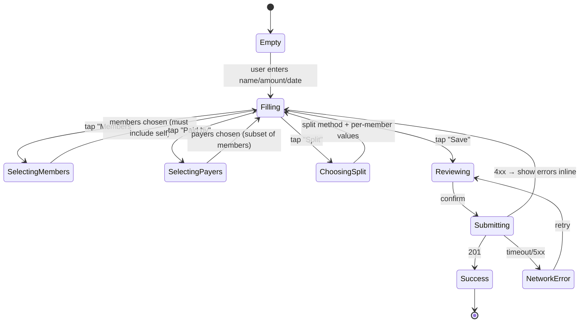

# ContriCool — Frontend / UI Design

## Overview

This design covers the client app: shell, routing, page inventory, design system, state management, auth integration, error/empty/loading UX, and the strategy that makes the **same codebase ship to web today and iOS/Android tomorrow**. Design level: **HLD + UI/UX-level LLD** (page list, key flows, component conventions). Headlines: **Expo SDK 52 + React Native + React Native Web + Expo Router 4 + NativeWind 4 + react-native-reusables**, **8 page routes** + nested layouts, **single client codebase** under `apps/client`, web build deployed to S3+CloudFront via `expo export -p web`, native distribution via EAS Build when iOS/Android lands.

## High Level Design



## Page inventory & routing (Expo Router 4 — file-based)

```
apps/client/app/
  _layout.tsx                       # global providers (QueryClient, Amplify init, Toaster)
  index.tsx                         # / — redirects: signed-in → /dashboard, else → /login
  (auth)/
    _layout.tsx                     # public route guard (redirects authed users to /dashboard)
    login.tsx                       # /login
    signup.tsx                      # /signup
    verify.tsx                      # /verify — both email + phone codes
    forgot-password.tsx             # /forgot-password
    reset-password.tsx              # /reset-password
  (app)/
    _layout.tsx                     # auth-required layout; redirects unauth → /login
    dashboard.tsx                   # /dashboard
    friends/
      index.tsx                     # /friends — list
      [userId].tsx                  # /friends/[userId] — friend detail
      requests.tsx                  # /friends/requests — incoming/outgoing
    transactions/
      index.tsx                     # /transactions — all of mine
      new.tsx                       # /transactions/new
      [txnId]/
        index.tsx                   # /transactions/[txnId]
        edit.tsx                    # /transactions/[txnId]/edit
    settings.tsx                    # /settings
  +not-found.tsx
```

Expo Router handles routing on web (via History API) and native (via React Navigation under the hood). Deep links work natively (universal links / app links) and on web (CloudFront Function rewrites unknown paths to `/index.html` per Design 9).

### Page list (named, with their job)

| Page | Route | Purpose |
|---|---|---|
| Login | `/login` | email + password; "forgot" link; "sign up" link |
| Signup | `/signup` | email + password + name + currency picker + **optional** phone field (with "(unverified)" hint); CTA → /verify |
| Verify | `/verify` | one input for the email verification code + resend button; redirect to /dashboard on confirmation. (Phone is captured at signup as optional unverified metadata only — see Design 4 / CONSTRAINTS.md.) |
| Forgot password | `/forgot-password` | email input → triggers reset code |
| Reset password | `/reset-password?token=...` | new password + code; redirect to /login |
| Dashboard | `/dashboard` | recent activity (last 10 tx), top owe-me / I-owe summaries, quick "Add expense" CTA |
| Friends | `/friends` | list of accepted friends with net balance per friend; CTA "Add friend" |
| Friend detail | `/friends/[userId]` | per-friend balance, paginated transactions involving both, "Settle up" CTA |
| Friend requests | `/friends/requests` | incoming requests (accept/decline) + outgoing (with cancel) |
| Transactions | `/transactions` | paginated list of mine, filters: friend, date range, type, include_deleted |
| New transaction | `/transactions/new` | add-transaction form |
| Transaction detail | `/transactions/[txnId]` | view + (if creator) edit/delete buttons |
| Edit transaction | `/transactions/[txnId]/edit` | full edit form, If-Match concurrency |
| Settings | `/settings` | profile (name editable; currency/email/phone read-only); change password; sign out; delete account (danger) |

### Authenticated layout

`(app)/_layout.tsx` checks for a valid Cognito session via Amplify; missing → redirects to `/login`. Renders:

- Top nav: ContriCool logo (→ /dashboard), nav links (Dashboard, Friends, Transactions), avatar menu (Settings, Sign out).
- On mobile (web ≤768px and native): bottom tab bar via Expo Router's tab support.
- Footer: minimal — version + privacy.

## Component library / design system

### Approach: **react-native-reusables + NativeWind 4** (shadcn-style for RN+Web)

react-native-reusables provides **copy-paste primitives** built on RN core (`<View>`, `<Pressable>`, `<TextInput>`) styled with NativeWind. Components live inside `apps/client/components/ui/` — fully owned, customizable, no runtime library. Same components render on web (via React Native Web → DOM) and native.

### Tokens (`apps/client/lib/tokens.ts`)

```typescript
export const colors = {
  primary: { 50:'#eff6ff', /* ... */ 600:'#2563eb', 900:'#1e3a8a' },
  neutral: { 50:'#f8fafc', /* ... */ 900:'#0f172a' },
  success: { 600:'#16a34a' },
  warning: { 600:'#d97706' },
  danger:  { 600:'#dc2626' },
  surface: '#ffffff',
  text: '#0f172a',
  muted: '#64748b',
};
export const radii = { sm:4, md:8, lg:12, full:9999 };
export const space = { 1:4, 2:8, 3:12, 4:16, 6:24, 8:32 };
export const typography = {
  fontFamily: { sans: 'Inter, system-ui' },
  size: { xs:12, sm:14, base:16, lg:18, xl:20, '2xl':24 },
  weight: { regular:'400', medium:'500', semibold:'600', bold:'700' },
};
```

NativeWind 4's `@theme` mechanism consumes these into Tailwind utility classes. The same tokens compile to RN `StyleSheet` on native and CSS on web.

### Primitives (in `apps/client/components/ui/`)

Wrappers around RN primitives with class-variance-authority for variants:

- `Button` (variants: primary, secondary, ghost, destructive; sizes: sm, md, lg)
- `Input`, `Textarea`, `Select`, `Switch`, `Checkbox`, `RadioGroup`
- `Card`, `Sheet` (mobile-friendly modal), `Dialog`, `Toast`
- `Avatar`, `Badge`, `Separator`, `Skeleton`
- `DropdownMenu`, `Tabs`, `Tooltip`
- `Form` wrappers around React Hook Form (label, input, error message)

Accessibility: react-native-reusables uses RN Aria under the hood for a11y semantics; NativeWind handles focus-ring styling on web.

### Theming

- Light mode at MVP. Dark-mode-ready via NativeWind's `dark:` variant; toggle deferred.

## State management

| Concern | Tool | Pattern |
|---|---|---|
| Server state (API data) | TanStack Query 5 | One `queryKey` per resource: `["transactions", filters]`, `["friends"]`, `["balance", friendId]`. `staleTime: 30s` for lists, `0` for detail pages. Mutations invalidate affected keys. |
| Auth state | Amplify Auth + small Zustand store wrapping it | `useAuthStore()` exposes `user`, `loading`, `signIn`, `signOut`, `signUp`, `verifyEmail`, `verifyPhone`, `refreshSession`. Hooks subscribe to Amplify Hub events. |
| UI state (modals, drawers, page-local) | `useState` + Zustand for cross-page UI state | Zustand only when state crosses route boundaries. |
| Forms | React Hook Form + Zod | Schemas mirror Pydantic; one schema per form. |

All four libraries work unchanged in React Native — no platform-specific code paths.

## Auth integration

- **AWS Amplify Auth v6** modular import: `import { signIn, signUp, confirmSignUp, ... } from 'aws-amplify/auth'`.
- Configured at boot in `app/_layout.tsx`:
  ```ts
  Amplify.configure({
    Auth: {
      Cognito: {
        userPoolId: process.env.EXPO_PUBLIC_USER_POOL_ID!,
        userPoolClientId: Platform.select({
          web: process.env.EXPO_PUBLIC_USER_POOL_CLIENT_ID_WEB!,
          ios: process.env.EXPO_PUBLIC_USER_POOL_CLIENT_ID_IOS!,
          android: process.env.EXPO_PUBLIC_USER_POOL_CLIENT_ID_ANDROID!,
        }),
        loginWith: { email: true },
      },
    },
  });
  ```
- **Refresh-token storage** per platform (Design 4):
  - **Web**: refresh token never reaches the client. Custom Amplify storage adapter throws on refresh-token writes; backend `/v1/auth/refresh` cookie path handles it transparently.
  - **Native (iOS/Android)**: `expo-secure-store` (Keychain / EncryptedSharedPreferences). Amplify auto-detects when the package is installed and uses it.
- API client (`packages/client-sdk`) intercepts:
  - Every request: attaches `Authorization: Bearer <accessToken>` from Amplify in-memory.
  - On 401:
    - Web: calls `/v1/auth/refresh`, stores returned tokens, retries the original request once.
    - Native: calls Amplify's `fetchAuthSession({ forceRefresh: true })`, retries.
  - On second 401: triggers Amplify sign-out and redirect to `/login`.



## UX patterns

### Loading / empty / error states (mandatory per page)

- **Skeleton placeholders** for list views (use `Skeleton` primitive) — show on first load.
- **Empty-state cards** with icon, heading, helper text, CTA. Examples:
  - Friends list (none): "No friends yet — add one to start tracking expenses." + "Add friend".
  - Transactions list (none): "Nothing to show — your first transaction starts here." + "Add expense".
- **Error states**: inline error component with retry (uses TanStack Query's `refetch`). Map stable `error.code`s from Design 8 to friendly messages; 5xx → generic "Something went wrong" + request-id for support.
- **Offline detection**: `useNetInfo` from `@react-native-community/netinfo` (works on web + native). Show a banner when offline; queue mutations only post-MVP.

### Forms

- React Hook Form + Zod resolver.
- Inline validation on blur; submit-time validation always.
- Loading state on submit button; disable during in-flight; toast on success.
- API errors mapped per field via `error.details[].field` (matches the Design 8 envelope).

### Toasts

- Single global `<Toaster />` (react-native-reusables `Toast`).
- Used for: action success, network error, optimistic-update rollback.

### Optimistic updates

- Used for: friend accept/decline, transaction delete (animates out, server confirms in background).
- TanStack Query's `onMutate` snapshots cache; `onError` rolls back.

### Currency formatting

- `Intl.NumberFormat(locale, { style: 'currency', currency: user.currency })` — `en-US` for USD users, `en-IN` for INR users.
- Hermes (RN's engine) supports `Intl` since SDK 51; no polyfill needed.

### Dates

- ISO from API; render with `date-fns` `formatDistanceToNow` for "2 hours ago" and `format` for explicit dates.

### Accessibility baseline

- WCAG AA color contrast.
- Keyboard navigation on web (Tab, Enter, Esc); focus management on native via RN Aria.
- Focus rings visible (NativeWind handles `focus-visible:` on web).
- ARIA labels on icon-only buttons.

## Build & dev

- **Dev server (web)**: `pnpm exec expo start --web` — Metro for web with HMR.
- **Dev server (native)**: `pnpm exec expo start` opens Expo Go or a dev build on device.
- **Web build**: `pnpm exec expo export -p web` → static bundle in `apps/client/dist/` → uploaded to S3 by CI.
- **Native build (post-MVP)**: `eas build --platform ios|android` → cloud build → `.ipa`/`.aab`.
- **Env vars**: `EXPO_PUBLIC_*` are inlined at build time. Per-env values via `.env.development` / `.env.production`.
- **Source maps**: enabled in dev only; skip prod web source maps (avoid leaking code) and rely on EAS's symbolication for native.
- **Bundle budget**: aim for <300KB gzip initial route (RN-Web adds ~80KB over plain React; still mobile-LTE-tolerable).

## Testing approach

- **Vitest** + `@testing-library/react-native` for unit/component tests (one set of tests covers both web and native rendering).
- **Playwright** for web e2e against the dev environment in CI nightly.
- **Maestro** for native e2e (post-MVP, on EAS-built test artifacts).
- **MSW (Mock Service Worker)** mocks the API in unit/component tests using OpenAPI types so contracts stay in sync.

## Component / Low-Level Design

### Add Transaction form (the highest-stakes UX)



UI structure (single screen, vertical sections):

1. **Name** (text input, required, 120 char counter)
2. **Amount** (currency input, masked decimal, required)
3. **Date** (date picker, default today)
4. **Members** (multi-select with friend search; "Me" pre-checked + locked; max 10 per Design 7)
5. **Paid by** (subset of members; default = "Me")
6. **Split method** (segmented control: Equal | Amount | Share | Percent) → renders matching per-member input rows
7. **Note** (textarea, optional)
8. **Save** (primary button) | **Cancel**

Real-time validation:

- Sum of `owed_amount` (for `amount` method) shown next to each row + total at bottom.
- Sum of `percent` shown red if not 100.
- Amount field flags `>9,999,999.99` as out of range.

### Friend detail page

- Top: friend avatar, name, "Net: you owe ₹X" / "X owes you ₹Y" (color-coded), "Settle up" button.
- Filter chips: All | Expenses | Settlements | Last 30 days | Last 90 days.
- Paginated list, infinite-scroll via TanStack Query's `useInfiniteQuery` + `FlatList` (works on web + native).
- Each row: date · name · type icon · amount · share badge ("you owed ₹X" / "X owed you ₹Y").
- Tap row → transaction detail.

## Open Questions

1. **Settle-up shortcut** — opens new-transaction prefilled with `type=settlement`, members={me, friend}, amount = abs(net), payer = whoever owed. Auto-submit or land in editable form? Recommendation: editable form, makes the action deliberate.
2. **Mobile-first responsive design tokens** — same components render on web at narrow widths (≤768px); RN-Web handles `useWindowDimensions` cleanly.
3. **PWA install prompt?** Out of scope at MVP. Expo's web export already includes a manifest; service worker via `expo-router`'s service-worker plugin post-launch for "Add to Home Screen".
4. **Internationalization (i18n)?** US + India both speak English in target audience; defer i18n.
5. **Analytics?** None at MVP (privacy-friendly default). Server-side event log post-MVP if needed; no third-party tracking.

## Summary

- **Single client codebase** under `apps/client` running on **Expo SDK 52 + React Native + React Native Web + Expo Router 4 + NativeWind 4 + react-native-reusables** — same source ships to web today and iOS/Android tomorrow with no rewrite.
- **8 page routes** under an authenticated `(app)` layout plus 5 public auth routes; mobile-friendly responsive layout on web; native bottom-tab navigation.
- **AWS Amplify Auth v6** for Cognito with platform-aware token storage: HttpOnly cookie via backend on web, `expo-secure-store` (Keychain/EncryptedSharedPreferences) on native.
- **react-native-reusables primitives + NativeWind tokens** — copy-paste ownership, no runtime library bloat, same components on every platform.
- **Loading/empty/error states are first-class**, optimistic updates standardized, OpenAPI-typed API client (`packages/client-sdk`) consumed by every screen.
