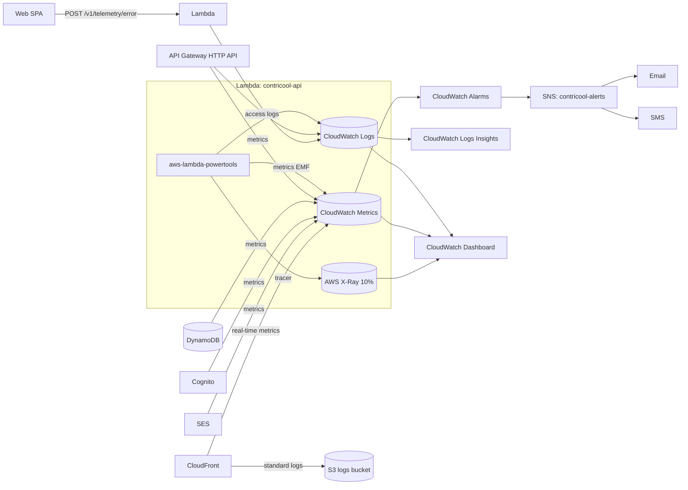

# ContriCool — Observability Design

## Overview

This design defines how we know what's happening in production from day one — within the $0–$30/mo budget. Design level: **System**. Headlines: **CloudWatch-native** (Logs + Metrics + Alarms + Dashboards), **AWS X-Ray** at 10% sampling for tracing, **structured JSON logs via Powertools**, **EMF metrics** for custom business signals, **frontend errors** logged via a small `/v1/telemetry/error` endpoint into CloudWatch Logs (CloudWatch RUM and Sentry both deferred for cost). Alarms fan out via a single SNS topic to the dev's email + SMS.

## High Level Design



## Logging

### Logger of choice: `aws-lambda-powertools` (Python)

- **Structured JSON output** — machine-queryable in Logs Insights.
- **Auto-captures**: `request_id`, `function_name`, `function_version`, `cold_start`, `memory_size`.
- **Custom keys**: `user_id`, `route`, `method`, `status_code`, `latency_ms`, `tenant=...` (future).
- **Denylist** keys to redact: `email`, `phone`, `password`, `code`, `otp`, `Authorization`, `Cookie`, `set-cookie`, `secret`, `token`, `refresh_token`. Powertools `Logger.thread_safe` mode + custom JSON formatter that removes denylisted fields.
- **Sampling**: `LOG_LEVEL=INFO` baseline. `DEBUG` enabled per-request via `?debug=1` (gated by `cognito:groups=admin`); not exposed publicly.

### Log groups

| Group | Retention | Encryption |
|---|---|---|
| `/aws/lambda/contricool-api-prod` | 14 days | KMS CMK |
| `/aws/lambda/contricool-api-dev` | 14 days | AWS-managed |
| `/aws/apigateway/contricool-api-prod` (access logs) | 14 days | KMS CMK |
| `/aws/apigateway/contricool-api-dev` (access logs) | 14 days | AWS-managed |
| `/contricool-frontend-errors-prod` | 14 days | KMS CMK |
| `/contricool-frontend-errors-dev` | 14 days | AWS-managed |
| `/aws/cloudfront/contricool-prod` (real-time logs, optional) | 7 days | AWS-managed |

Both envs use 14-day retention so the dev can query recent dev/prod logs side-by-side during debugging (Design 3). Retention is the single most important cost control on Logs ($0.50/GB ingested + $0.03/GB-mo storage); at <100 DAU, ingest stays well within free tier.

### Standard log fields (every line)

```json
{
  "timestamp": "2026-04-27T10:30:00.123Z",
  "level": "INFO",
  "request_id": "01J...",
  "user_id": "01J...",
  "route": "POST /v1/transactions",
  "method": "POST",
  "status_code": 201,
  "latency_ms": 87,
  "cold_start": false,
  "function_name": "contricool-api-prod",
  "message": "Transaction created",
  "txn_id": "01J..."
}
```

### What we log

| Event | Level | Fields |
|---|---|---|
| API request start | INFO | route, method, user_id (if authed) |
| API request end | INFO | route, method, status_code, latency_ms |
| AuthZ denial | WARN | route, decision=DENY, principal_user_id, resource_id, reason |
| Validation error (400) | INFO | route, error.code, fields |
| Throttle (429) | INFO | route, user_id |
| Conflict (409/412) | INFO | route, txn_id, reason |
| 5xx | ERROR | route, error message + stack |
| External call failure (DDB/SES/SNS/Cognito) | ERROR | service, op, retry_attempt, latency_ms |
| Cold start | INFO | tagged via Powertools auto |
| Boot config (once per cold start) | INFO | env, region, table, user_pool_id (sans secrets) |

### CloudWatch Logs Insights queries (saved)

Saved per-environment in CDK as `cwInsightsQueries`:

| Name | Query |
|---|---|
| 5xx in last hour | `fields @timestamp, request_id, route, message \| filter level="ERROR" and status_code >= 500 \| sort @timestamp desc \| limit 100` |
| Slow requests p95 | `fields route, latency_ms \| stats pct(latency_ms, 95) by route \| sort latency_ms desc` |
| Cold-start frequency | `fields @timestamp, cold_start \| stats sum(cold_start) by bin(1h)` |
| AuthZ denials by user | `filter decision="DENY" \| stats count() by principal_user_id, route` |
| Idempotency replays | `filter message="Idempotent replay returned cached response" \| stats count() by route` |
| Top 4xx error codes | `filter status_code >= 400 and status_code < 500 \| stats count() by error.code` |

## Metrics

### Provider: CloudWatch Metrics (via EMF — Embedded Metric Format)

Powertools `Metrics` emits EMF in log lines; CloudWatch auto-extracts metrics with **no extra cost beyond the log line**. This is the cheapest way to get custom metrics on AWS.

### Namespace: `ContriCool`

Dimensions: `env` (`prod`|`dev`), `route` (e.g. `POST /v1/transactions`), `status_code_class` (`2xx`|`4xx`|`5xx`).

### Metrics emitted

| Metric | Unit | Dimensions | Use |
|---|---|---|---|
| `RequestCount` | Count | env, route, status_code_class | rate / volume |
| `Latency` | Milliseconds | env, route | p50/p95/p99 |
| `ColdStartCount` | Count | env | cold-start visibility |
| `AuthZDenials` | Count | env, route, reason | abuse detection |
| `OTPSent` | Count | env, channel (email/sms) | cost control |
| `SignupsCompleted` | Count | env | product growth |
| `TransactionsCreated` | Count | env | product growth |
| `IdempotencyReplays` | Count | env, route | client retry behavior |
| `DdbThrottles` | Count | env | capacity health |
| `ExternalCallFailures` | Count | env, service | dependency health |

### AWS-provided metrics (free, no instrumentation)

- API Gateway: `Count`, `4XXError`, `5XXError`, `Latency`, `IntegrationLatency`.
- Lambda: `Invocations`, `Errors`, `Duration`, `Throttles`, `ConcurrentExecutions`.
- **DynamoDB (per table — `ContriCool-Users-<env>` and `ContriCool-Transactions-<env>`)**: `ConsumedReadCapacityUnits`, `ConsumedWriteCapacityUnits`, `ThrottledRequests`, `SuccessfulRequestLatency`. Each table emits independently — alarms scope to whichever table is throttled.
- Cognito: `SignUpSuccesses`, `SignInSuccesses`, etc.
- CloudFront: `Requests`, `BytesDownloaded`, `4xxErrorRate`, `5xxErrorRate`.
- SES: `Send`, `Bounce`, `Complaint`, `Reject` (post-domain).
- SNS: `NumberOfMessagesPublished`, `SMSMonthToDateSpentUSD` (the spend-cap signal).

## Tracing — AWS X-Ray

- **Enabled at**: Lambda (Powertools `Tracer`), API Gateway HTTP API.
- **Sampling**:
  - **prod: 10%** (cost control).
  - **dev: 100%** (per Design 3 — give the dev a complete trace of every request during testing). At dev volume (<100 DAU equivalent during build-time), full sampling stays well inside the X-Ray free tier (100k traces/mo).
- **Subsegments**: Powertools auto-instruments boto3 calls (DDB Users + Transactions tables, Cognito, SES, SNS) with subsegments — both tables visible as separate edges in the service map.
- **Service map** in X-Ray console: client → CloudFront → APIGW → Lambda → {DDB Users, DDB Transactions, Cognito, SES, SNS}, with latency and error % per edge.
- Cost: 100k traces/mo free; 1M traces ~ $5. At our scale stays free across both envs.

## Frontend observability

### Error logging (lightweight at MVP)

- Web SPA's global error boundary catches React errors; uncaught promise rejections handled by `window.addEventListener('unhandledrejection')`.
- Errors POST to `/v1/telemetry/error` with `{ message, stack, route, user_id (if any), build_commit, user_agent, level }`.
- Endpoint:
  - Public (no auth required for unauth pages); rate-limited at API Gateway (10/min/IP).
  - Lambda just logs to CloudWatch Logs in a dedicated log group `/contricool-frontend-errors-<env>`.
- This gives basic error visibility without paying for Sentry or CloudWatch RUM.

### Performance metrics (deferred)

- CloudWatch RUM (~$1/100k events) and Sentry (free tier limited) both deferred.
- Web Vitals (LCP, FID, CLS) measured client-side via `web-vitals` lib and POSTed to the same `/v1/telemetry/error` endpoint with `level=metric` — extracted as a CloudWatch metric via metric filter on the log group. Ad-hoc; not as polished as RUM but free.

## Alarms

### Strategy

- **Single SNS topic** `contricool-alerts-<env>` subscribed to by:
  - Email (the dev's address).
  - SMS (the dev's phone) for `prod` only — gated by SNS spend cap, ~5 SMS/month expected.
- **Alarm severity** encoded in the alarm name and SNS message subject (`P1`/`P2`/`P3`).

### Alarms (prod)

| Alarm | Metric | Threshold | Window | Severity |
|---|---|---|---|---|
| API 5xx rate | API Gateway `5XXError` / `Count` | > 1% | 5 min, 2 datapoints | **P1** |
| API 4xx surge | `4XXError` / `Count` | > 20% | 15 min | P3 |
| Latency p95 | API Gateway `Latency` p95 | > 1500 ms | 10 min | P2 |
| Lambda error rate | Lambda `Errors` / `Invocations` | > 1% | 5 min | **P1** |
| Lambda throttles | Lambda `Throttles` | > 0 | 5 min | P2 |
| Lambda concurrent execs | `ConcurrentExecutions` | > 80 (out of 100) | 5 min | P2 |
| DDB throttles (Users table) | `ThrottledRequests` on `ContriCool-Users-<env>` | > 0 | 5 min | **P1** |
| DDB throttles (Transactions table) | `ThrottledRequests` on `ContriCool-Transactions-<env>` | > 0 | 5 min | **P1** |
| DDB read latency p99 | `SuccessfulRequestLatency` p99 | > 100ms | 10 min | P3 |
| Cognito signup failures | (custom metric `SignupsCompleted`/attempts ratio) | < 50% | 30 min | P3 |
| SES bounce rate | `Bounce` / `Send` | > 5% | 1 day | P2 |
| SES complaint rate | `Complaint` / `Send` | > 0.1% | 1 day | **P1** (deliverability risk) |
| SNS SMS spend MTD | `SMSMonthToDateSpentUSD` | > $15 | 1 datapoint | P2 |
| AWS Budget (account total) | Budget alarm | $20 (warn), $30 (critical) | monthly | P2 / **P1** |
| SNS SMS MTD spend | `SMSMonthToDateSpentUSD` | > $4 (80% of $5 cap) | 1 datapoint | **P1** (one-step shy of being shut off) |
| CloudFront 5xx | CF `5xxErrorRate` | > 1% | 10 min | P2 |

P1 alarms ring SMS + email. P2/P3 email only.

### Composite alarm

- A "site is down" composite alarm = `API 5xx rate > 5%` OR `Lambda error rate > 5%` OR `DDB throttles > 0` for 5 min — fires P1, dedicated SNS topic to avoid alarm fatigue.

## Dashboards

### CloudWatch Dashboard `ContriCool-Prod-Health` (prod only)

Per Design 3, **only prod has a dashboard** ($3/mo). Dev relies on Logs Insights queries directly.

Single dashboard, 6 rows:

1. **Service health**: API Gateway 4xx/5xx %, Lambda error %, DDB throttles (Users + Transactions), CloudFront 5xx %.
2. **Latency**: API Gateway p50/p95/p99 by route (top-10 routes).
3. **Throughput**: requests/sec, signups/day, transactions/day.
4. **Cost-sensitive**: SNS SMS MTD spend, Lambda invocations, DDB read/write capacity per table.
5. **External**: SES sends/bounces/complaints (post-domain), Cognito signups/sign-ins.
6. **Frontend**: error count by route + LCP p75 (when web-vitals shipping).

Embedded queries:
- "Recent 5xx" (Logs Insights query embedded as widget).
- "Top routes by latency" (auto-refresh).

Cost: $3/mo (prod only).

## Frontend → Backend trace correlation

- SPA generates a `request_id` (ULID) and sends as `X-Client-Request-Id` header.
- Lambda echoes it in logs; `error.request_id` in API responses uses it.
- Support flow: user shares request-id (visible on error screen) → dev queries Logs Insights by that ID → full trace.

## SLOs (targets we'll enforce post-launch via alarms)

| SLO | Target | Window | Source metric |
|---|---|---|---|
| Availability | ≥ 99.5% | 30 days | non-5xx / total responses |
| Latency p95 | ≤ 600 ms | 30 days | API Gateway `Latency` |
| Latency p99 | ≤ 2000 ms | 30 days | API Gateway `Latency` |
| Email deliverability | ≥ 98% | 30 days | (Send − Bounce) / Send |
| OTP delivery (eventual via DLT) | ≥ 95% | 30 days | (anecdotal at MVP) |

SLOs reviewed monthly. Burn-rate alerts via composite alarms post-MVP.

## Cost summary

| Component | Cost |
|---|---|
| CloudWatch Logs (5 GB free) | $0; over: $0.50/GB ingested + $0.03/GB-mo |
| CloudWatch Metrics (10 free custom + EMF basic) | $0.30/metric beyond first 10 (we cap at 10 custom dimensions) |
| CloudWatch Alarms | $0.10/alarm/mo (~14 prod alarms ≈ $1.40/mo) |
| CloudWatch Dashboard | $3/mo (one prod) |
| AWS X-Ray | 100k traces free; over: $5/M |
| SNS topic + email | free |
| SNS SMS for alerts | ~$0.10/mo |
| **Total observability** | **~$5/mo at MVP**, scaling slowly |

## Implementation pointers

```python
# app/core/observability.py
from aws_lambda_powertools import Logger, Metrics, Tracer
from aws_lambda_powertools.metrics import MetricUnit

DENYLIST = {"email","phone","password","code","otp","Authorization","Cookie","set-cookie","secret","token","refresh_token"}

class RedactingLogger(Logger):
    def info(self, msg, **kwargs):
        super().info(msg, **{k:("***" if k in DENYLIST else v) for k,v in kwargs.items()})

logger = RedactingLogger(service="contricool-api")
metrics = Metrics(namespace="ContriCool", service="api")
tracer = Tracer(service="contricool-api")
```

Each FastAPI route uses a dependency that:
1. Extracts `request_id` (or generates ULID).
2. Logs request start.
3. Increments `RequestCount` with route + status_code dimensions in a finalizer.

## Open Questions

1. **CloudWatch RUM** ($1/100k events) for real user monitoring? Defer until we have paying users; lightweight `web-vitals` posting is enough at MVP.
2. **Sentry on a free tier** for richer FE error grouping? Recommendation: stick with CloudWatch only at MVP per AWS Mandate; revisit once errors start volume.
3. **Anomaly detection** on metrics (CloudWatch supports it) — adds cost. Defer.
4. **Long-term log retention**: ship important events (auth, admin actions) to S3 with Object Lock for compliance? Recommendation: post-MVP when we have admin auditing requirements.

## Summary

- **CloudWatch-native everything** — Logs, Metrics (via EMF), Alarms, Dashboards, X-Ray. Total observability cost ~$5/mo at MVP.
- **Powertools structured logger** with PII denylist; **EMF metrics** in `ContriCool` namespace; **X-Ray at 10%** sampling.
- **Frontend errors** posted to a public rate-limited `/v1/telemetry/error` endpoint into a dedicated log group — basic but free vs CloudWatch RUM/Sentry.
- **One SNS alerts topic** with ~14 alarms covering API 5xx, Lambda errors, DDB throttles, SES deliverability, SMS spend, and AWS Budget — P1 alarms SMS the dev, P2/P3 email-only.
- **One prod CloudWatch Dashboard** + saved Logs Insights queries; SLOs (99.5% availability, p95 600ms) enforced via burn-rate alarms post-launch.
