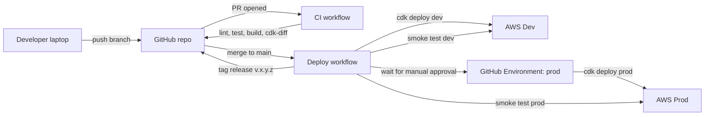
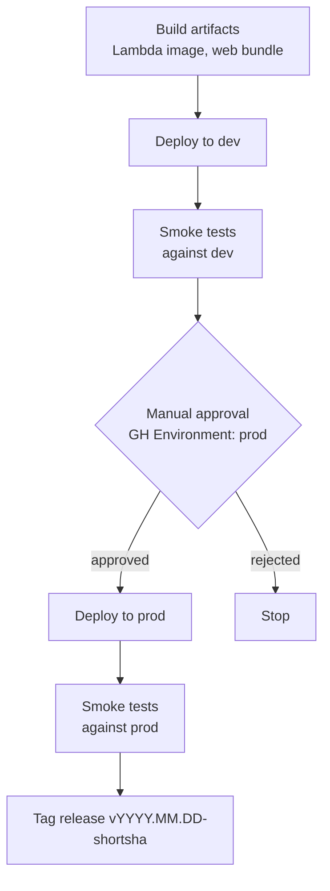

# ContriCool — CI/CD & Deployment Design

## Overview

This design defines how code moves from a developer's laptop to production, safely. Design level: **System + LLD** (concrete pipeline jobs, env separation, rollback path). Headlines: **GitHub + GitHub Actions** (no CodePipeline at MVP), **monorepo with path-filtered jobs**, **trunk-based with required PR review (self-merge OK for solo)**, **two environments (`dev`, `prod`) deployed via AWS CDK into a single AWS account** with separate IAM-scoped OIDC roles per env, **manual approval gate to prod**, **DDB has no migrations** (item-level versioning handles schema change across both Users and Transactions tables), **rollback via CloudFormation auto-rollback + Lambda image-tag re-deploy** if needed.

## High Level Design

## Repository

- **Single repo**, monorepo per Design 2: `apps/{api,web,infra}`, `packages/{openapi,client-ts,ui}`.
- **Default branch**: `main`. Trunk-based.
- **Branching**: short-lived feature branches → PR → merge.
- **Branch protection** on `main`:
  - Require PR (self-approve allowed for solo dev; flip to "require review" when team grows).
  - Require status checks to pass: `lint`, `test`, `build`, `cdk-diff`.
  - Require linear history (no merge commits). Squash-and-merge enabled.
  - No force pushes, no deletions.

## CI workflow (`.github/workflows/ci.yml`)

Runs on every PR and on every push to `main`.

### Jobs (parallel where possible, with path filters)

1. **`api-lint`** (when `apps/api/**` or `packages/openapi/**` changes):
   - Setup Python 3.12, pnpm 9, Node 22.
   - `ruff check apps/api`
   - `mypy --strict apps/api`
2. **`api-test`** (same trigger):
   - `pytest apps/api/tests --cov=apps/api/app --cov-fail-under=99`
   - moto + LocalStack docker for AWS-mocked integration tests.
3. **`api-openapi-check`** (same trigger):
   - Run `apps/api` once, dump `openapi.json` → compare with checked-in `packages/openapi/openapi.yaml`. Fail if drift.
   - Run `openapi-typescript` → diff against `packages/client-ts/src/schema.d.ts`. Fail if drift.
4. **`web-lint`** (when `apps/web/**` or `packages/{ui,client-ts,openapi}/**` changes):
   - `pnpm biome check`
   - `pnpm tsc --noEmit`
5. **`web-test`**:
   - `pnpm vitest run --coverage`
6. **`web-build`**:
   - `pnpm build` — produces `apps/web/dist`. Bundle-size budget assertion (200KB gzip initial route).
7. **`infra-lint`** (when `apps/infra/**` changes):
   - `ruff check apps/infra`
   - `mypy --strict apps/infra`
   - `cdk synth` (no deploy).
8. **`infra-diff`** (PR only):
   - Assume read-only role into AWS dev account (OIDC).
   - `cdk diff Contricool-Dev-*` — post comment to PR via `cdk-diff-action`.
9. **`security-scan`**:
   - `pip-audit` (Python deps).
   - `pnpm audit --audit-level=moderate`.
   - `gitleaks` for secrets scanning.

Total CI duration target: < 5 minutes for typical PRs (path filters skip irrelevant jobs).

### Caching

- Python deps: cache `~/.cache/pip` keyed on `pyproject.toml` hash.
- pnpm store: cache `~/.local/share/pnpm/store` keyed on `pnpm-lock.yaml`.
- Vitest/playwright caches.
- Docker BuildKit cache for the Lambda container image (layer reuse).

## Deploy workflow (`.github/workflows/deploy.yml`)

Triggered on push to `main`.

### Stages

### Build artifacts

- **Lambda container image**: built with BuildKit (with the AWS Lambda Web Adapter binary copied in via multi-stage Dockerfile), tagged `<short-sha>`, pushed to a private ECR repo `contricool-api`. Both `dev` and `prod` Lambda functions reference the same image tag (promoted from dev to prod after smoke). After `cdk deploy`, a new Lambda **published version** is created (required for **SnapStart** to snapshot); the `live` alias shifts to the new version.
- **Web bundle**: `pnpm exec expo export -p web` produces `apps/client/dist/` — the Expo web export (HTML + hashed JS/CSS assets). Uploaded to a versioned S3 staging prefix (`s3://contricool-web-artifacts/<sha>/`). On deploy, content is `aws s3 sync`-ed into the env bucket; **CloudFront invalidation for `/index.html` only** (hashed assets are immutable).

### Deploy to dev

- OIDC role assumption into the **single AWS account** as the dev-scoped role `Contricool-CI-Dev-Deploy` — read+write only on `*-Dev` resources (DDB tables `ContriCool-Users-Dev` + `ContriCool-Transactions-Dev`, Cognito pool `contricool-dev`, Lambda function `contricool-api-dev`, CloudFront dev distribution, S3 web-dev bucket, etc.). Session policy further constrains by tag `env=dev`.
- `cdk deploy Contricool-Dev-* --require-approval=never --rollback=true`.
- Wait for stack OK.
- Run smoke tests:
  - `curl https://api-dev.contricool.com/v1/health` → 200.
  - Synthetic transaction flow via test user (signup → verify → login → create tx → list → delete).
  - p95 latency check via X-Ray traces over the last 5 minutes (post-deploy).
- On smoke failure: workflow fails; previous Lambda alias remains (Lambda has versioned aliases).

### Manual approval to prod

- GitHub Environments feature: `prod` environment requires reviewer (the dev) to approve.
- Approval message includes: changed paths, `cdk diff` output, dev smoke results.
- Time-out: 24 hours; auto-cancel if no approval.

### Deploy to prod

- OIDC role assumption into the **same AWS account** as the prod-scoped role `Contricool-CI-Prod-Deploy` — read+write only on `*-Prod` resources, constrained by session policy with `env=prod` tag.
- `cdk deploy Contricool-Prod-* --require-approval=never --rollback=true`.
- Smoke tests against `https://api.contricool.com`.
- Post-deploy: tag `vYYYY.MM.DD-<short-sha>` on the merge commit.

### Failure modes

| Failure | Action |
|---|---|
| `cdk deploy dev` fails | CFN auto-rollback; workflow fails; on-call (the dev) investigates |
| Dev smoke test fails | Workflow halts; no prod deploy; investigate + push fix |
| `cdk deploy prod` fails | CFN auto-rollback; workflow fails; alarms ring |
| Prod smoke test fails | Workflow runs `cdk deploy <previous-image-tag>` automatically (idempotent re-deploy with last-known-good image tag) |

### Rollback strategy

Three layers of "back out":

1. **CloudFormation auto-rollback** — handled by `--rollback=true`; covers most failed deploys mid-stack-update.
2. **Re-deploy previous image tag** — `gh workflow run rollback.yml -f tag=vYYYY.MM.DD-prevsha`. Workflow updates the Lambda function's image and re-runs smoke tests.
3. **DynamoDB PITR** for data corruption — restore to a point-in-time within the last 35 days into a new table; flip the table-name SSM parameter; redeploy. Documented as a runbook.

## OIDC federation (no AWS keys in GitHub)

- **One AWS account** (Design 3) — single IAM OIDC provider for `token.actions.githubusercontent.com`.
- **Three roles** in that single account, each scoped by resource-name pattern + tag:
  - `Contricool-CI-Dev-Deploy` — write on `*-Dev` resources only; trust policy restricts `repo:<org>/contricool:ref:refs/heads/main`.
  - `Contricool-CI-Prod-Deploy` — write on `*-Prod` resources only; same trust policy + GitHub Environment `prod` requires manual approval before token issuance.
  - `Contricool-CI-PR-ReadOnly` — read-only across both envs (for `cdk diff` PR comments); trust policy restricts `repo:<org>/contricool:ref:refs/pull/*`.
- Each deploy role's policy uses **`aws:ResourceTag/env`** conditions where supported, and explicit ARN prefixes (`*-Dev`, `*-Prod`) for the rest. CDK's deployment role gets only `cloudformation:*` on stack ARNs matching the env prefix, plus the IAM rights to mutate the per-env Lambda execution roles.
- No AWS access keys ever stored in GitHub secrets.

## CDK deploy specifics

- **CDK app organization** per Design 3: `shared`, `data`, `auth`, `api`, `web`, `edge`, `monitoring` stacks per env.
- **Cross-stack deps** via stack outputs (CDK handles ordering).
- **Parameter Store** for non-secret config (table names — both Users and Transactions, user pool ID, region) read at Lambda runtime — avoids re-deploying Lambda on config changes.
- **Lambda version + alias**: `cdk deploy` publishes a new version (required for SnapStart), then shifts the `live` alias. Rollback re-points the alias to a previous version.
- **CloudFront invalidations**: only `/index.html` (the rest is content-hashed by Expo's web export). Cost $0.005 per path beyond first 1000/mo.

## DynamoDB schema evolution (both tables)

- DDB has no DDL migrations (schemaless at the engine level). Applies independently to **`ContriCool-Users-<env>`** and **`ContriCool-Transactions-<env>`**.
- We version items with a `schema_version` attribute (default `1`).
- Code paths are written to **read N and N-1**; writes always emit the current version.
- Backfill jobs (when needed) are EventBridge-scheduled Lambdas reading by GSI and updating in batches; per-table runners; idempotent.
- For breaking schema changes: ship readers first (deploy to prod), wait for prod to bake, ship writers. Never run a migration that touches both tables atomically without `TransactWriteItems`.

## Secrets handling

- **GitHub Secrets**: only the OIDC role ARNs (no AWS keys; no DB strings).
- **AWS Secrets Manager**: only used for things that need rotation (none at MVP — Cognito handles auth secrets, KMS handles encryption keys).
- **SSM Parameter Store** (Standard, free): non-secret config (table name, user pool ID, region, build commit) and the **PII salt** (encrypted with KMS via `SecureString`).
- **Per-env config** lives in CDK code with environment branching, not in Parameter Store at deploy time.

## Pre-commit hooks (developer machines)

- `lefthook` config:
  - Python: `ruff format`, `ruff check --fix`, `mypy`.
  - TS: `biome check --apply`.
  - Generated artifacts: `make openapi` if API touched.
  - `gitleaks` block for accidental secret commits.
- Hooks fail loudly with the offending file/line.

## Local development

- `make dev-up`: starts LocalStack (DynamoDB, SES, SNS), Cognito-Local (or Moto for Cognito), and the Expo dev server in parallel.
- `apps/api/` runs locally via `uvicorn app.main:app --reload --port 8000` — **identical command to what the Lambda Web Adapter runs inside Lambda** (port 8080 in Lambda, 8000 locally to avoid conflicts). `app/core/aws.py` honors `AWS_ENDPOINT_URL=http://localhost:4566` env var to point boto3 at LocalStack.
- LocalStack provisions both DDB tables (`ContriCool-Users-Dev` and `ContriCool-Transactions-Dev` shapes) at startup via a `make seed-local` script.
- Client `.env.development` points to `http://localhost:8000` (local API) and a Cognito-Local endpoint; Expo runs on port 8081 by default.

## Branch & commit conventions

- **Conventional Commits** (`feat:`, `fix:`, `chore:`, `refactor:`, etc.) — encourages clean changelogs.
- **Squash-and-merge** keeps `main` linear; PR title becomes the squash commit message.
- **Atomic commits** per the user's global commit guidelines.

## Tagging & changelog

- On each prod deploy, the workflow creates a Git tag `vYYYY.MM.DD-<short-sha>` and a GitHub Release with auto-generated notes from PR titles.
- `apps/api` exposes the build commit at `/v1/health` (`{ commit, build_time, env }`) for runtime verification.

## Deploy frequency expectations

- Dev: deploy on every merge (multiple per day).
- Prod: deploy when ready (typically daily during MVP build, slowing post-launch).
- No fixed deploy windows; manual approval gates control prod cadence.

## Cost summary

| Item | Cost |
|---|---|
| GitHub Actions (private repo) | 2,000 min/mo free; over: $0.008/min for Linux |
| GitHub Environments + branch protection | Free |
| ECR (private) | 500 MB/mo free; over: $0.10/GB-mo. Image ~50MB → free at MVP. |
| CloudFront invalidations | First 1,000/mo free |
| **Total CI/CD** | **~$0/mo at MVP**, climbing to ~$5/mo if CI minutes blow past 2k |

## Open Questions

1. **Single AWS account vs separate dev/prod accounts** — affects OIDC role design. Recommendation: separate accounts before launch.
2. **Auto-deploy to prod after dev success?** Manual approval is the safe default; can flip to "auto-deploy if smoke green and no schema change" once confident.
3. **CodeDeploy / Lambda canary?** Lambda traffic shifting (linear/canary) via CodeDeploy is supported by CDK. Trade-off: more complex deploys + extra service to learn. **Recommendation: defer**; standard alias-update is fine at MVP scale.
4. **Synthetic monitoring** (CloudWatch Synthetics canaries) — ~$0.0012/canary-min. Worth adding 1–2 canaries (login flow, transaction create) post-launch for proactive alerts on deploys/regressions; defer at MVP.
5. **Renovate / Dependabot** for dep updates? Add Dependabot (free GitHub-native) at MVP for security patches.

## Summary

- **GitHub + GitHub Actions** is the entire CI/CD pipeline; **OIDC federation** removes long-lived AWS keys.
- **Trunk-based, squash-merge, branch-protected `main`**; CI in <5 min via path filters.
- **Two environments** (dev auto-deploy on merge, prod via manual GitHub-Environment approval) deployed by **AWS CDK** with CFN auto-rollback + image-tag rollback fallback.
- **Lambda container image** built once, promoted dev → prod; **web bundle** synced to S3 with surgical CloudFront invalidation.
- **No DDB migrations** — schema-versioned items + read-N-and-N-1 pattern; **DDB PITR** is the data-corruption rollback story.
