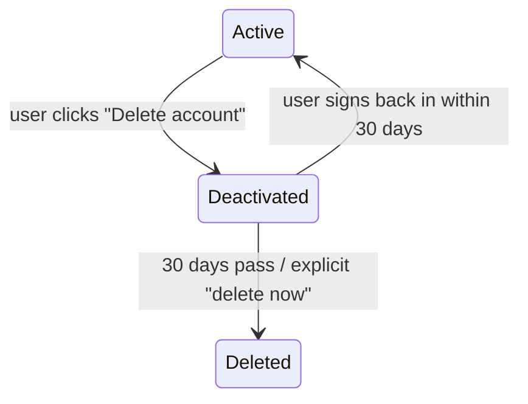
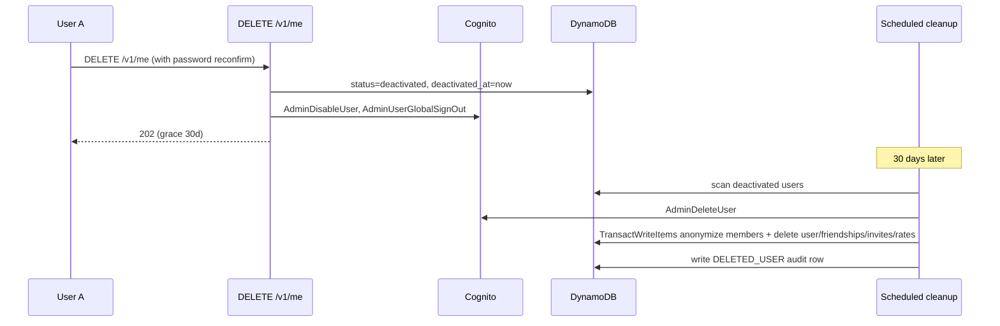

# ContriCool — Privacy, PII & Data Lifecycle Design

## Overview

ContriCool stores email, phone, and friend-graph data — all PII. This design defines how PII is handled end-to-end: encryption, lookup-without-leakage, account deletion, retention, and compliance posture across our two markets (US + India). Design level: **System + LLD**. Headlines: **KMS-CMK encryption at rest** for DDB and KMS-encrypted CloudWatch log groups, **HMAC-SHA-256 lookup hashes** for email/phone (raw PII never indexed), **two-stage account deletion** (soft → hard with 30-day grace; orphan-handling for shared transactions), **CCPA + India DPDP-Act-aligned posture** with self-service data export/delete via authenticated API, **strict logging redaction**, **internal access via least-privilege IAM only**.

## PII Inventory

| Data | Storage | Sensitivity | At-rest encryption |
|---|---|---|---|
| Email (raw) | **Cognito User Pool only** — never stored in DDB | High | Cognito-managed encryption |
| Email (hashed, HMAC-SHA-256) | **`ContriCool-Users-<env>`** projected to GSI1 `EMAIL#<hash>` from the user `META` row; also on OTP rate-limit rows | Low | DDB CMK (prod) |
| Phone (E.164 raw, **optional + unverified**) | **Cognito only** — never stored in DDB | Medium (lower than email since unverified and not used for auth) | Cognito-managed encryption |
| Phone (hashed) | **Not stored anywhere at MVP** — phone is not a search key (see Design 4 / CONSTRAINTS.md). Reintroduced as `GSI2PK=PHONE#<hash>` post-business-registration. | n/a | n/a |
| Display name | **`ContriCool-Users-<env>`** `USER#<id>#META` | Medium | DDB CMK |
| Password hash (Argon2id) | Cognito only | Highest | Cognito KMS |
| Friendship graph | **`ContriCool-Users-<env>`** | Medium (relational PII) | DDB CMK |
| Transactions | **`ContriCool-Transactions-<env>`** | Medium (financial behavior) | DDB CMK |
| OTP codes | Cognito (managed; never persisted in our app) | Ephemeral | n/a |
| OTP rate-limit attempts | **`ContriCool-Users-<env>`** by hashed identity | Low | DDB CMK |
| Audit/log records | CloudWatch Logs | Medium (request metadata) | KMS CMK |
| CloudFront access logs | S3 | Low (IP, UA, path) | SSE-S3 |
| Idempotency records | **`ContriCool-Transactions-<env>`** | Low (cached responses) | DDB CMK |

**No** payment data, **no** addresses, **no** biometrics, **no** location data are collected.

## Encryption

### At rest

- **Project KMS CMK**: `alias/contricool-prod` (single key for prod). Annual rotation enabled.
- **Encrypts**: **both** DynamoDB tables (`ContriCool-Users-Prod` and `ContriCool-Transactions-Prod`), SNS topic for alarms, CloudWatch log groups (Lambda + APIGW access logs + frontend telemetry), SSM SecureString parameters (the PII salt).
- **Key policy**: only the Lambda execution role can `Encrypt`/`Decrypt`/`GenerateDataKey`; root account is denied (best practice — root should never need direct CMK access).
- **Cognito**: User Pools encrypt PII at rest with AWS-managed keys by default. Promoting to a CMK requires Cognito Advanced Security ($0.05/MAU) — **defer**. Cognito's default encryption is sufficient for MVP compliance posture.
- **S3 buckets**: web bucket SSE-S3 (no PII); CloudFront log bucket SSE-S3.
- **Dev environment**: AWS-managed keys (no CMK cost); same redaction rules apply.

### In transit

- **TLS 1.2+** everywhere (CloudFront, API Gateway, internal AWS service calls use HTTPS).
- **HSTS** with `max-age=1y`, `includeSubDomains`, `preload`.

## Lookup without leakage

The `find friend by email/phone` flow must let A signal "I want to connect with bob@x.com" without:
- Letting a stranger enumerate "is this email a user?".
- Storing the raw email in a queryable index.

### Approach: deterministic HMAC-SHA-256 with a per-project salt

```
lookup_hash(email_or_phone, salt) = HMAC-SHA256(salt, normalize(email_or_phone))
```
- **Normalization**:
  - email → `lower(trim(email))` (lowercase, trim whitespace; no Punycode handling at MVP — defer Unicode emails).
  - phone → E.164 (normalized via `phonenumbers` lib, `+CountryCode` form; e.g. `+15551234567`).
- **Salt**: one project-wide secret stored in SSM Parameter Store as `SecureString` encrypted with the project CMK; created at deploy time and **never rotated** (rotation breaks lookups; we accept this).
- **Storage**: only the email hex hash lands in DDB (projected to `GSI1PK=EMAIL#<hex>` from the user `META` row). **Raw email and phone live exclusively in Cognito** — DDB never stores them. **Phone is not even hashed in DDB at MVP** because it is not a search key (see Design 4 / CONSTRAINTS.md). When the API needs to display the user's own email/phone (e.g., on a profile screen), the client reads it from Cognito ID token claims; no DDB row carries the raw value.

### Privacy-preserving friend-request response

`POST /v1/friends/request` returns identical 202 regardless of whether the target user exists. Server behavior:
- If `lookup_hash` matches an existing user → write a `pending` friendship row.
- If no match → write an `INVITE` row keyed by the hash so we can auto-link if the target signs up later.
- Email/SMS may be sent to the actual identifier (one external signal that the recipient was invited; this is unavoidable since we deliver the invite by email or SMS).

This blocks programmatic enumeration via the API. SMS/email delivery still confirms existence to whoever owns the inbox/phone — same as Splitwise; acceptable.

## Account Deletion (the hardest privacy operation)

### Two-stage soft → hard delete



**Stage 1 — Deactivation (immediate)**:
- `DELETE /v1/me` triggers:
  - Set `user.status = "deactivated"` and `user.deactivated_at = now`.
  - Cognito: `AdminDisableUser` (cannot sign in; sessions terminated via `AdminUserGlobalSignOut`).
  - All future `GET /v1/friends/*`, `/v1/transactions/*` from other users that *reference* this user → display name replaced with "Deleted user" in responses; raw email/phone never returned.
  - All pending friend requests involving this user are cancelled.
  - Pending invites issued by this user remain (other party can still sign up; the invite shows the user as "Deleted user" if linked).
- The 30-day grace lets the user undo by signing back in (if not yet hard-deleted).

**Stage 2 — Hard delete (after 30 days OR on user-confirmed "delete now")**:
- A daily scheduled Lambda (EventBridge → Lambda) finds users where `deactivated_at < now - 30d`.
- For each, in order:
  - **`ContriCool-Users-<env>`**:
    - Hard-delete `USER#<id>#META` (display_name, currency, status; the GSI1 EMAIL# hash projection drops with the row). No raw PII to scrub here — DDB never held it (phone is in Cognito only and is purged in the Cognito step below).
    - Hard-delete all `FRIENDSHIP` rows involving this user (rows where the user is `min(a,b)` in PK; cross-check via GSI1 query for rows where the user is `max`).
    - Hard-delete all their `RATE` rows.
  - **`ContriCool-Transactions-<env>`**:
    - **Anonymize** `TRANSACTION_MEMBER` rows (the tricky one — see below).
    - **Anonymize the embedded `payers` list inside each `TRANSACTION_META` row** that carries this user as a payer (in-place `UpdateItem` rewriting the list element with an anonymized user_id).
    - Hard-delete their `IDEMPOTENCY` rows.
  - **Cognito**: `AdminDeleteUser` removes the user pool entry (email/phone hash, password hash all gone).
- The action is recorded in a separate `DELETED_USERS` audit log retained for legal-defense compliance (90 days; configurable up to 7 years for financial-records compliance — see Open Questions).
- The cleanup Lambda has IAM permissions on **both** DDB tables and Cognito; it runs as a separate role from the API Lambda's execution role.

### What about transactions involving the deleted user?

Other users (the friends still on the platform) have legitimate interest in keeping their financial history. We can't delete their data unilaterally.

**Anonymize-but-keep**:
- For each `TRANSACTION_MEMBER` row where `user_id = deleted_user_id`:
  - Replace with `user_id = "DELETED_<random_id>"` (different per friend pair to prevent re-linking).
  - The display name in API responses becomes "Deleted user".
  - `owed_amount` is preserved so the other party's balance math still works.
- Same for the `payers` entries embedded on `TRANSACTION_META` (in-place rewrite of the matching list element).
- `Transaction.creator_id` is also anonymized if the deleted user was the creator. The transaction remains visible to other members but no one can edit/delete it (the creator's `user_id` no longer matches anyone).

This satisfies "right to be forgotten" (no PII or recoverable identity remains) while preserving other users' rights to their own financial history.



## Data Export (right of access)

`GET /v1/me/export` (authenticated, rate-limited 1/day):
- Server generates a JSON dump of:
  - Profile fields.
  - Friendships (with friend display names + states).
  - Transactions (where user is a member) — full content including amounts, dates, members.
  - Audit history (transactions they've created).
- Returned as a JSON download (no Excel; keeps the surface simple).
- Attempts logged for audit; signed S3 presigned URL with 1h expiry if size > 1MB (not expected at MVP).

Implementation: Lambda → DDB query loop → S3 → presigned URL. Cost: negligible.

## Retention

| Data | Retention |
|---|---|
| Active user profile | indefinite (until deactivation) |
| Deactivated profile | 30 days, then anonymize+delete |
| `DELETED_USERS` audit row | 90 days |
| Soft-deleted transactions | 30 days, then hard-delete |
| Transaction audit history (post-hard-delete) | 90 days |
| Pending invites | 90 days, then expire |
| OTP rate-limit rows | TTL 24h (auto) |
| Idempotency rows | TTL 24h (auto) |
| Cognito user pool | until `AdminDeleteUser` |
| CloudWatch Logs | 14d (prod), 7d (dev) |
| CloudFront access logs | 30d in S3 |
| CloudTrail logs | 90d in S3 |
| AWS Backups (DDB) | 30d on-demand backups |

## Internal access controls

- **Lambda execution role** is the only principal that touches PII at rest day-to-day. Scoped to specific table ARNs and Cognito user pool ARNs.
- **Developer console access** uses IAM Identity Center (free) with role-assumption requiring MFA. There is **no IAM user with day-to-day access keys**.
- **DDB console reads** by the developer are permitted but logged via CloudTrail. Code-style policy: don't read user data directly; use the export endpoint or query Logs Insights for diagnostic.
- **No third party** has data access (no analytics SDKs, no Sentry, no Mixpanel — defer to post-MVP, with explicit redaction agreements before adoption).

## Logging redaction

The single biggest accidental-leak risk. Belt-and-suspenders:

1. **Powertools Logger denylist** (Design 11): `email`, `phone`, `password`, `code`, `otp`, `Authorization`, `Cookie`, `set-cookie`, `secret`, `token`, `refresh_token`, `id_token`, `access_token`.
2. **Code review checklist**: any `logger.info(...)` with a user-input value must not pass raw email/phone.
3. **Pre-merge CI check**: `grep -r 'logger\.(info\|warn\|error\|exception)\(.*\\b(email\|phone\|password)\\b'` — fail if matches in non-test code.
4. **Periodic CloudWatch Logs Insights audit** query: search log groups for patterns like `[a-zA-Z0-9._%+-]+@[...]` and `\+\d{10,}`. Run monthly; investigate hits.

## Compliance posture

### Markets: US + India

| Regulation | Status | Implementation |
|---|---|---|
| **CCPA / CPRA** (California) | Likely applies if any CA users | "Do Not Sell" — N/A (we don't sell). Right to know → `/v1/me/export`. Right to delete → `DELETE /v1/me`. Privacy policy + opt-out for non-essential data sharing → privacy policy at `contricool.com/privacy`. |
| **India DPDP Act, 2023** | Applies | Consent at signup (Terms + Privacy checkbox). Right to access (export endpoint). Right to correction (PATCH /v1/me; phone/email edits deferred to post-MVP). Right to erasure (delete account). Grievance officer contact in Privacy Policy. |
| **GDPR** | Likely doesn't apply (US+IN markets); but our model is GDPR-aligned by accident — easy to extend if EU users sneak in. | Lawful basis: contract performance (Article 6(1)(b)). DSARs handled via export/delete. |

### Concrete documents to author

- **Privacy Policy** (`/privacy`): what we collect, why, retention, rights, contact. Templated from a CCPA + DPDP-aligned source; reviewed by a lawyer pre-launch (small fixed cost).
- **Terms of Service** (`/terms`).
- **Cookie Policy** — minimal. The only cookie is the session refresh-token cookie (essential, no consent needed under most regimes).
- **Grievance Officer** contact (DPDP requirement) — the dev's contact at MVP.

## Cross-border data transfer

- **All data resident in us-west-2** (USA). India users' data leaves India.
- **Notice in privacy policy**: "Data is stored in the United States."
- **DPDP Act 2023** allows cross-border transfer except to government-blacklisted jurisdictions (none affecting us). Compliant.
- If the user expands to EU later, we'd need EU SCCs and possibly multi-region — out of scope for MVP.

## Subject Rights Operations (SRO)

| Right | Endpoint | SLA |
|---|---|---|
| Access | `GET /v1/me/export` | Self-service, instant |
| Rectification | `PATCH /v1/me` (name only at MVP) | Self-service, instant |
| Deletion | `DELETE /v1/me` | Self-service deactivation; hard-delete in 30d |
| Portability | export JSON download | Self-service, instant |
| Objection | account deletion is the path | Self-service |

DPDP/CCPA SLAs (typically 30–45 days) are massively beat by self-service.

## Backup & recovery PII rules

- **DDB PITR**: covers prod 35 days **on both tables independently**. PITR snapshots are encrypted with the same CMK; access requires KMS perms.
- **On-demand backups** (weekly): same encryption; 30-day retention; both tables.
- **Backup access**: only the dedicated backup-restore IAM role (not the day-to-day Lambda role). Used only during restore drills.
- **Cross-table restore**: PITR restore of one table at a time. If both tables need point-in-time restore (rare), restore both to the same point-in-time and accept eventual consistency on the few seconds between.

## Open Questions

1. **Audit retention for DELETED_USERS** — 90 days vs longer (financial records often 7y)? ContriCool isn't a regulated financial institution; 90 days is justifiable. Confirm with privacy policy lawyer pre-launch.
2. **Should anonymization include amount truncation?** I.e., for non-deleted-side, replace exact `owed_amount` with rounded buckets ($0, $5, $10, …)? More aggressive privacy but harms the other user's records. Recommendation: keep amounts as-is; the "why" is balance math correctness.
3. **Email/phone change endpoints** — out of scope at MVP; design a re-verify flow when they arrive.
4. **EU expansion plan** — multi-region deployment + SCCs. Defer.
5. **Pinpoint vs SES choice for invitations** — Pinpoint allows per-recipient opt-out lists out of the box. SES requires us to manage suppression. Recommendation: SES + custom suppression list in DDB at MVP; revisit once volume merits Pinpoint.
6. **Cookie-banner needed?** Only essential cookies → most jurisdictions don't require a banner. Add a small "By using this site you accept the Privacy Policy" notice on first visit; no opt-in modal.

## Security Considerations

- **Insider threat**: console access requires MFA + IAM Identity Center; CloudTrail records every read. The PII salt is stored in SSM SecureString — accessing it requires both KMS Decrypt and SSM `GetParameter` permissions.
- **Data exfiltration**: Lambda execution role has no DDB `Scan` (only Get/Query/Update/TransactWrite); a compromised function couldn't easily dump the full table without auditable Query patterns.
- **Forgotten data in derived stores**: CloudWatch Logs ingested PII, even if redacted later, is permanent for the retention window. Hence the 14-day cap and the redaction-first-write policy.
- **Backups**: encrypted with the same CMK; access via separate restore role.
- **CloudFront real-time logs** could include user IPs — keep retention low (7d) and disable real-time logs unless needed for incident analysis.

## Summary

- **Two-stage account delete** (deactivate → 30-day grace → hard-delete) with **anonymize-but-keep** for shared transactions, preserving other users' balance history while erasing the deleted user's identity.
- **HMAC-SHA-256 lookup hashes** for email/phone (raw PII never indexed); **identical 202 response** to friend-request prevents enumeration.
- **KMS CMK encrypts DDB + CloudWatch Logs + SSM PII salt**; **TLS 1.2+ everywhere**; logging denylist + pre-merge CI grep block accidental PII writes.
- **CCPA + India DPDP-Act-aligned**: self-service export (`GET /v1/me/export`), correction (`PATCH /v1/me`), deletion (`DELETE /v1/me`); privacy policy + grievance officer published before launch; data resident in us-west-2.
- **Retention caps everywhere** (logs 14d, soft-deletes 30d, audits 90d, OTP rate-limit 24h via TTL) keep the blast radius of any incident contained.
