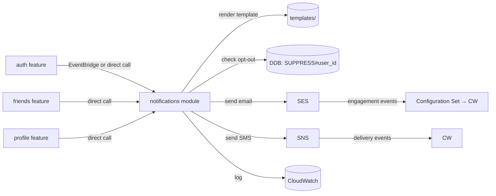

# ContriCool — Notifications Design

## Overview

ContriCool's MVP notifications are minimal — friend invites, account events, and OTP delivery. This design pins down channels, providers, templates, suppression, rate limits, and the path to push notifications when mobile lands. Design level: **HLD + LLD**. Headlines: at MVP, **email via the Cognito-managed sender** (no custom domain yet — see Designs 1, 4); **SNS direct SMS** for OTP only (Cognito-driven); **friend-invite emails are deferred until `contricool.com` is registered and SES production access is granted**; **no in-app inbox at MVP**, **no marketing channel ever** (transactional only); **opt-out via suppression list in `ContriCool-Users-<env>`** + SES account-level suppression once SES is in use; **future push via SNS Mobile Push or Pinpoint** when iOS/Android ships.

## Channels & events

### MVP event matrix

At MVP (no custom domain, simplified friendship model — Design 6), only Cognito-driven emails and SMS OTPs go out. Our app's outbound emails wait until `contricool.com` is registered and SES production access is granted.

| Event | Channel | Trigger | Sender | MVP status |
|---|---|---|---|---|
| Email verification code (signup) | Email | `POST /v1/auth/signup` | **Cognito-managed sender** (`no-reply@verificationemail.com`) | **MVP: yes** |
| Phone OTP (signup + resend) | SMS | `POST /v1/auth/signup`, `/resend-phone-code` | Cognito → SNS | **MVP: yes** |
| Forgot-password code | Email | `POST /v1/auth/forgot-password` | Cognito-managed sender | **MVP: yes** |
| Password changed | Email | Cognito password change | Cognito-managed sender | **MVP: yes** |
| Friend added you (informational) | Email | `POST /v1/friends/add` (target is the recipient) | (post-domain) Our Lambda → SES | **MVP: deferred — friendship is created bilaterally and surfaced in the recipient's friend list on next refresh; no email at MVP** |
| Account deletion confirmation | Email | `DELETE /v1/me` | (post-domain) Our Lambda → SES | **MVP: deferred (UI-only confirmation)** |
| New device sign-in (post-MVP) | Email | Cognito advanced security | Cognito → SES | Post-MVP (requires Cognito Advanced Security $) |
| Transaction created (digest) | (deferred) | — | — | Post-MVP |

Notes:
- Friend "request sent / accepted / declined" emails were dropped from this matrix when the friendship model was simplified (Design 6) — no accept/decline flow at MVP, so no notifications are needed.
- Friend "invite to non-user" emails are also gone — the API returns 404 when the target isn't on the platform; users invite externally (WhatsApp, etc.) until the post-MVP invite flow lands.

When `contricool.com` is registered, the deferred events activate without code changes — `notification_channel` config flips from `cognito_managed` to `ses_with_domain`.

### Out of scope for MVP

- In-app notification inbox.
- Push notifications (no mobile app yet).
- Marketing emails.
- Weekly summary digests.
- Webhooks to integrators.

## Channel choices

### Email — Amazon SES

| Option | Pros | Cons |
|---|---|---|
| **SES (chosen)** | AWS-native, free 62k/mo from Lambda; fine-grained sender identity (DKIM/SPF/DMARC); managed bounce/complaint handling. | Sandbox by default — must request production access; no out-of-the-box per-user "preferences center". |
| Pinpoint | Multi-channel (email/SMS/push) + campaigns. | Higher complexity; campaign-style features unused by MVP; not free per send. |
| SendGrid / Mailgun / Postmark | Strong deliverability; great DX. | Non-AWS; violates AWS Mandate. |

**Decision: SES (post-`contricool.com` registration).** At MVP, the only outbound email is Cognito's managed sender — we don't touch SES until the domain lands.

When ready, configuration:

- **Sending domain**: `mail.contricool.com` (subdomain isolation; protects apex from spam reputation).
- **From**: `noreply@mail.contricool.com`.
- **Reply-To**: `support@contricool.com` (alias forwarded to dev's inbox).
- **DKIM**: `Easy DKIM` setup via Route 53 (3 CNAMEs).
- **SPF**: TXT record `v=spf1 include:amazonses.com -all` on `mail.contricool.com`.
- **DMARC**: TXT `_dmarc.contricool.com` `v=DMARC1; p=quarantine; rua=mailto:dmarc@contricool.com; pct=100; adkim=s; aspf=s` — reject failing mail; reports to a dedicated mailbox.
- **Custom MAIL FROM domain**: enabled to align bounce-handling (`bounces.mail.contricool.com`).
- **Configuration set**: `contricool-prod` and `contricool-dev` — emits engagement events (Send/Bounce/Complaint) to CloudWatch.
- **Production access**: must request **early** (it can take 24h–7d), before launch.
- **Suppression list**:
  - Use SES account-level suppression list (auto-managed for hard bounces and complaints).
  - Plus our own DDB-backed user-level opt-out for non-essential events (see below).

### SMS — Amazon SNS (direct publish)

| Option | Pros | Cons |
|---|---|---|
| **SNS direct SMS (chosen)** | Simplest path; integrates directly with Cognito for OTP; pay-per-message; delivery dashboards. | Indian deliverability requires DLT registration (regulatory, ~1–3 weeks); expensive (~$0.04/SMS in India). |
| Pinpoint | Per-recipient opt-out lists; campaigns. | More setup; same DLT pain. |
| Twilio / MessageBird | Often better deliverability + features. | Non-AWS; violates AWS Mandate. |

**Decision: SNS direct SMS at MVP for OTP only**, driven by Cognito (Cognito has native SNS-for-SMS support).

- **Originating identity**:
  - **US**: 10DLC long code (~$1/mo + per-message fees) — register via SNS Origination Numbers console. **Required** post-Aug 2023 to send to US numbers reliably.
  - **India**: Sender ID `CONTRICOOL` registered via DLT (TRAI). Without DLT, delivery is unreliable. **Document this risk and start DLT registration in parallel with implementation.**
- **Spend cap**: SNS account-level monthly spend limit set to **$5/mo** at MVP. Above cap, deliveries are paused. Raise via Service Quotas once real volume justifies; do **not** raise pre-emptively.
- **Region**: SNS SMS is regional; we use us-west-2 for US, switch to ap-south-1 SNS endpoint for India (dual-region SMS sender) once DLT clears. Cognito's "SNS region" can only be one — pick `us-west-2` for MVP, India delivery via SNS cross-region. (Cognito's SMS via SNS in `us-west-2` does deliver globally; the choice of region affects only the sender-ID configuration.)
- **Logging**: SNS SMS delivery logs to CloudWatch (success/failure metric per send) — enable in account preferences.

### Push (deferred)

When mobile apps land:
- **Option A — SNS Mobile Push** with platform endpoints (APNs for iOS, FCM for Android). Lower-level; requires per-device endpoint management. Cheap.
- **Option B — Pinpoint** with topic/segment management built-in. More polish; ~$1/M targeted endpoints/mo.
- Decision deferred. The notification module is built so a `push` channel can be added without touching email/SMS code.

## Notifications service module

### Architecture



At MVP we keep notifications **synchronous within the request** (Lambda calls SES/SNS directly). For high-volume cases (digest emails, post-MVP) we'd move to an SQS queue + dedicated Lambda consumer for retry isolation.

### Module layout

```
apps/api/app/features/notifications/
  __init__.py
  service.py             # send_email, send_sms, send_friend_invite, etc.
  templates/
    friend_invite.txt
    friend_invite.html
    friend_accepted.txt
    friend_accepted.html
    account_deleted.txt
    account_deleted.html
  suppress.py            # DDB read/write for user-level opt-out
  ses_client.py
  sns_client.py
  models.py              # NotificationEvent dataclasses
  README.md
```

### Templates

- Plain `string.Template` (Python) or Jinja2 — lean toward `string.Template` (no extra dep) for MVP.
- Two artifacts per email: `.txt` (plain) and `.html` (rendered). MIME multipart/alternative.
- All templates reference `{{ brand_name }}`, `{{ support_email }}`, `{{ unsubscribe_link }}` (when applicable).
- Templates checked into the repo. Version controlled.

Sample (`friend_invite.html`):
```html
<p>Hi {{ recipient_name|default:'there' }},</p>
<p><strong>{{ requester_name }}</strong> invited you to connect on ContriCool — a simple way to track shared expenses with friends.</p>
<p><a href="{{ accept_url }}" style="background:#2563eb;color:#fff;padding:8px 16px;border-radius:6px;text-decoration:none;">View invite</a></p>
<p>If you don't have an account yet, you can sign up at <a href="https://contricool.com/signup">contricool.com</a>.</p>
<p>—<br/>The ContriCool team</p>
<p style="font-size:12px;color:#64748b;">You're receiving this because someone invited you to a financial-tracking workspace. To stop these emails: <a href="{{ unsubscribe_url }}">unsubscribe</a>.</p>
```

### Suppression / opt-out (activates when SES is in use)

| Layer | Mechanism |
|---|---|
| **AWS account-level (SES)** | Auto-managed: hard bounces + complaints land here permanently. We never re-send to those addresses. |
| **Per-event opt-out (our app)** | DDB row per user in **`ContriCool-Users-<env>`**: `PK=SUPPRESS#<user_id>` / `SK=EVENT#<type>` with a `disabled` flag. UI in `/settings` exposes per-event toggles (only `friend_accepted` is opt-out at MVP; security/transactional events cannot be opted out of). |
| **One-click unsubscribe** | Link in non-essential emails (`?token=<HMAC of (user_id, event_type, ts)>`); clicking writes the suppression row without requiring login. |
| **List-Unsubscribe header** | Add `List-Unsubscribe: <https://contricool.com/unsub?...>, <mailto:unsubscribe@contricool.com>` for one-click in Gmail/Apple Mail. |

### Rate limiting

| Event | Per-user limit | Scope |
|---|---|---|
| Phone OTP | 3/hour, 10/day | per identity (hashed) |
| Email OTP / verification | 5/hour, 20/day | per identity |
| Friend invites | 30/hour, 100/day | per requester user_id |
| Forgot-password | 5/hour, 20/day | per identity |

Same DDB rate-limit table from Design 4 / 7. Enforced before calling SES/SNS to control cost and abuse.

### Delivery tracking

- **SES configuration set** publishes `Send`, `Delivery`, `Bounce`, `Complaint`, `Reject`, `Open`, `Click` to CloudWatch.
- **SNS SMS** publishes `Success`/`Failure` to CloudWatch (regional).
- **Alarms** (per Design 11): bounce > 5%, complaint > 0.1%, SMS spend > $15/mo.
- **Per-event audit row** in **`ContriCool-Users-<env>`**: `PK=NOTIFICATION#<user_id>` / `SK=SENT#<ts>#<event>` for the dev to debug "did Bob get the email?" — TTL 30 days.

## Sender identities & DNS

DNS records to add to `contricool.com` Route 53 zone:
- DKIM CNAMEs (3) for `mail.contricool.com`.
- SPF TXT for `mail.contricool.com`.
- DMARC TXT for `_dmarc.contricool.com`.
- Custom MAIL FROM MX + TXT for `bounces.mail.contricool.com`.
- (post-MVP) BIMI TXT for brand logo in inboxes.

All set up in CDK; CDK pulls SES verification tokens via custom resource if needed.

## Security & abuse

- **Hash-based unsubscribe tokens** prevent guessing user IDs from URLs.
- **Friend invite throttling** prevents an abusive user from spamming third parties.
- **No PII in notification logs** — log only `event_type`, `user_id`, `recipient_hash`, `delivery_status`.
- **Anti-phishing** — emails reference user-known facts (their friend's display name) and use the verified sending domain consistently. No subdomain swapping.
- **HTML hardening** — no embedded JS, no remote tracking pixels (privacy-friendly + faster delivery).
- **Reply-To** points to a real, monitored mailbox — required by best-practice anti-spam.

## Cost projection

| Component | MVP cost |
|---|---|
| SES sends (≤5k/mo expected) | $0 (62k/mo free from Lambda) |
| SES dedicated IP | not used (free shared IPs at MVP) |
| SNS SMS to US (~50/mo at MVP) | <$0.50/mo |
| SNS SMS to India (~50/mo at MVP) | <$2/mo |
| Sender ID / 10DLC | ~$1/mo (US 10DLC) |
| **Total notifications** | **~$3–5/mo at MVP** |

Within budget; SMS is the only meaningful spend.

## Open Questions

1. **Pinpoint vs SES for invites?** Pinpoint has nicer per-recipient suppression but adds cost and complexity. Recommendation: SES + custom suppression in DDB at MVP; revisit if abuse complaints arise.
2. **Voice OTP fallback for India?** Pinpoint Voice supports voice OTP; deliverability when SMS fails. Defer; SMS via DLT should be enough.
3. **Friend-accepted notification opt-in vs opt-out?** Opt-out (default on) at MVP. Re-evaluate based on user feedback.
4. **Inbox / in-app notification feed?** Worth it once we have multi-device users and async events. Defer to post-MVP. The data model is straightforward (DDB `NOTIFICATION#<user_id>` with `read_at`).
5. **Email open tracking?** Privacy-unfriendly (tracking pixel). Default: **off**. The information value at MVP is marginal vs the user trust cost.
6. **Localization** — English-only at MVP given target audience (US + India English-comfortable). Localize when a real non-English market opens.

## Summary

- **At MVP**: only **Cognito-managed email sender** (verification, forgot-password, password-changed) and **SNS SMS** (OTP only). App-originated emails (friend invites, account-deletion confirmations) are deferred until `contricool.com` is registered and SES production access is granted.
- **Post-domain**: switch Cognito to a verified SES identity (`noreply@mail.contricool.com`) and activate the deferred event matrix; one sender domain `mail.contricool.com` with DKIM/SPF/DMARC.
- **India SMS delivery** contingent on **DLT registration** (start in parallel with implementation).
- **Transactional only**, ever — no marketing, no in-app inbox at MVP, no push until mobile lands.
- **Layered opt-out**: SES account suppression for bounces/complaints (post-domain), plus per-event DDB suppression in **`ContriCool-Users-<env>`** for non-essential events.
- **Rate limits at the API layer** keep SMS spend predictable; **SNS account-level $5 cap** is the hard ceiling at MVP.
