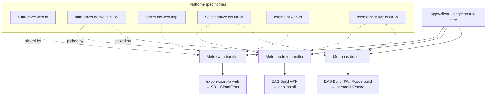
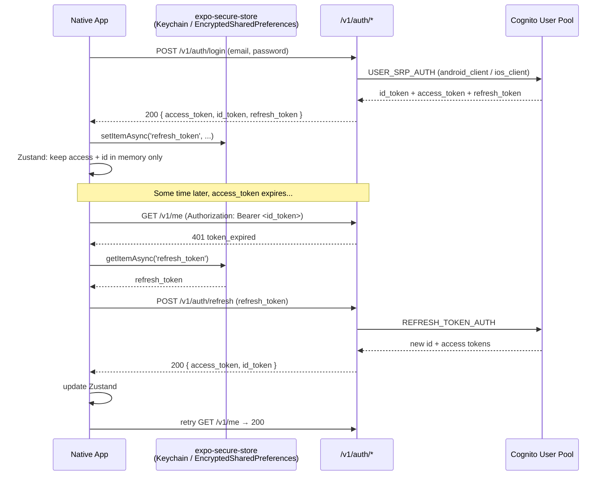
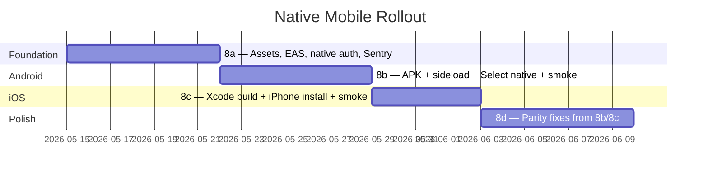

# ContriCool — Native Mobile Apps — Design

**Complexity: COMPLEX** (multiple platforms, secure storage, third-party SaaS integration, CI implications, and a hard requirement of zero web regression).

## Overview

We ship Android and iOS apps from the same `apps/client` Expo codebase that powers web today. The split point is **Metro's platform-suffix resolution** (`*.native.ts`, `*.ios.ts`, `*.android.ts`, `*.web.ts`) — exactly three modules need platform variants for v1 (auth driver, Select primitive, telemetry sink), and everything else (routes, state, SDK, components, validation) is shared verbatim. There are **no backend or infra changes**; Cognito's three App Clients (`web_client`, `ios_client`, `android_client`) are already provisioned and wired into the API Gateway JWT authorizer.

Distribution is **sideload-only at v1** — APK via `adb install` for Android, Xcode personal-team build for iOS. No store submission. Crash reporting via Sentry is in scope from day one; push notifications, universal links, and federated login are explicitly deferred.

## High Level Design

### One codebase, three outputs



**Why this works:** Metro already resolves `.web.ts` for web builds (today's `auth-driver.web.ts` proves it); `.native.ts` covers both iOS and Android, falling back to `.ios.ts` / `.android.ts` only when truly platform-specific. The `AuthDriver` interface (`apps/client/lib/auth-driver-types.ts`) was designed for exactly this — adding `auth-driver.native.ts` requires zero call-site changes anywhere in the app.

### Auth flow (native)



The web flow is identical except step 1's response sets a `Set-Cookie: refresh_token=...` HttpOnly cookie instead of returning the refresh token in the body. **The backend already supports both shapes** (Design 4); the native client opts into the body-shape by sending `X-Client-Platform: native` (or by inspecting the Cognito App Client used — the API can route on audience).

> **Design note:** verify during Phase 8a whether the existing `/v1/auth/login` returns the refresh token in the body when called from a native client, or whether a small backend tweak is needed. If the latter, that's an exception to "zero backend changes" and gets captured in `phase-8a` requirements before code is touched.

## Component Breakdown

### New client-side modules

| Module | Path | Purpose |
|---|---|---|
| `auth-driver.native.ts` | `apps/client/lib/auth-driver.native.ts` | Implements `AuthDriver` interface; uses `expo-secure-store` instead of HttpOnly cookies. Mirrors `auth-driver.web.ts` 1:1 in structure. |
| `Select.native.tsx` | `apps/client/components/ui/Select.native.tsx` | Sheet-based dropdown for native. Replaces the current `null` return. |
| `telemetry.native.ts` | `apps/client/lib/telemetry.native.ts` | Routes errors to Sentry on native; web continues to POST `/v1/telemetry/error`. |
| `sentry.ts` | `apps/client/lib/sentry.ts` | Sentry init, scrubber (PII denylist from CLAUDE.md), release/dist tagging. Imported only by `_layout.tsx`. |
| `eas.json` | `apps/client/eas.json` | EAS Build profiles: `development`, `preview`, `production` (placeholder). |

### Modified files

| File | Change |
|---|---|
| `apps/client/app.json` | Add `extra.eas.projectId`, `plugins` for sentry-expo + expo-secure-store, refine `ios.infoPlist` (none required at v1) and `android.adaptiveIcon`. |
| `apps/client/app/_layout.tsx` | Initialize Sentry at the very top of the file, before any other module imports. |
| `apps/client/components/ui/Select.tsx` | No changes; Metro picks `Select.native.tsx` when bundling for native. (The current file remains the web impl.) |
| `apps/client/package.json` | Add `expo-secure-store`, `sentry-expo` (or `@sentry/react-native`), and a Sheet library (one of `@gorhom/bottom-sheet` or `react-native-modal`). |
| `apps/client/README.md` | Sideload runbooks, env-var matrix, link to `specs/runbooks/`. |
| `CLAUDE.md` | Append a "Native builds" subsection under SECTION 5. |
| `specs/runbooks/sideload-android.md` | New runbook. |
| `specs/runbooks/sideload-ios-personal-team.md` | New runbook. |

### Reused as-is (audit confirmed)

- `apps/api/**` — API surface unchanged.
- `apps/infra/stacks/auth_stack.py` — three Cognito clients already provisioned.
- `apps/infra/stacks/api_stack.py` — JWT authorizer accepts all three audiences (`api_stack.py:412`).
- `packages/client-sdk/**` — built on `openapi-fetch`, transport-agnostic, runs in any JS environment with `globalThis.fetch`.
- `apps/client/app/**` — every expo-router route works on web and native unchanged.
- `apps/client/lib/auth-store.ts` — Zustand store driver-agnostic by design.
- All shared components (Button, Input, Card, Toast, ErrorBoundary) — RN + RN-Web means they already render on both.

## Data Model

No data model changes. The native app reads and writes the same DynamoDB tables (`ContriCool-Users-<env>`, `ContriCool-Transactions-<env>`) via the same FastAPI handlers using the same OpenAPI contract. The only new client-side stored value is the **refresh token in `expo-secure-store`** under the key `contricool.refresh_token`.

| Storage | Web | Native |
|---|---|---|
| `access_token` | Zustand memory | Zustand memory |
| `id_token` | Zustand memory | Zustand memory |
| `refresh_token` | HttpOnly cookie (CloudFront origin, SameSite=Strict) | `expo-secure-store` key `contricool.refresh_token` (Keychain / EncryptedSharedPreferences) |
| User profile cache | TanStack Query in-memory | TanStack Query in-memory |
| Anything else | — | — |

**No new DDB items, no new GSIs, no new SSM params at v1.**

## API / Interface

No new endpoints. The native client uses the existing surface verbatim:

- `POST /v1/auth/login` — returns `{ access_token, id_token }` and (on native) `refresh_token` in body. Web continues to receive `refresh_token` only via Set-Cookie.
- `POST /v1/auth/refresh` — accepts `refresh_token` in body (native) or HttpOnly cookie (web).
- `POST /v1/auth/logout` — calls Cognito `GlobalSignOut` via `X-Cognito-Access-Token` header (mechanism already in place at `apps/api/app/core/dependencies.py:92`).
- All other `/v1/*` endpoints — unchanged.

The single open question (flagged in HLD): does the existing `/v1/auth/login` return refresh token in body for native callers, or do we need a small backend tweak gated on `X-Client-Platform` / Cognito audience? Resolved during Phase 8a discovery; if backend tweak is needed, it gets its own task and tests.

## UI / UX

**Identical to web.** Same screens, same layout, same interactions, same copy, same toast patterns. NativeWind classNames render the same on RN and RN-Web. Three deltas:

1. **Select dropdowns** become bottom sheets on native (touch-friendly).
2. **SafeArea insets** wrap every screen — invisible on web, prevents content-under-notch on iOS / status-bar overlap on Android.
3. **Keyboard avoidance** — forms with text inputs gain `KeyboardAvoidingView` (or equivalent NativeWind utility) so submit buttons stay visible above the IME.

No new screens, no new flows. The only visible "native" element is the bottom sheet for Select; everything else looks like the web app dropped into a phone-shaped frame.

## Hosting / Distribution

### Android (sideload, v1)

- EAS Build cloud builds APK (not AAB — AAB requires Play Store).
- `eas.json` `preview` profile: `{ distribution: "internal", android: { buildType: "apk", gradleCommand: ":app:assembleRelease", resourceClass: "large" } }`.
- Output: signed APK downloadable from EAS dashboard.
- Install: `adb install -r app-release.apk` on a USB-connected device with USB debugging enabled.
- Signing: EAS-managed keystore (auto-generated, persisted in EAS — out of git).

### iOS (sideload, v1)

Two options, decided at execution time based on what's easier on the day:

**Option A — `eas build --local`:**
- Run on the user's Mac.
- Uses free Apple-ID-provisioned development profile (7-day expiry).
- Output: `.app` or `.ipa`, draggable into Xcode → Devices and Simulators → install on attached iPhone.

**Option B — `npx expo prebuild` + Xcode:**
- Generates `ios/` folder with native project.
- Open `ios/ContriCool.xcworkspace` in Xcode.
- Set "Signing & Capabilities → Team" to user's personal Apple ID.
- Hit Run with iPhone connected → installs and launches.

Both require the user's Mac. Both expire weekly with free provisioning; documented in `specs/runbooks/sideload-ios-personal-team.md`.

## Auth Driver Strategy

### Decision: hand-rolled REST + `expo-secure-store`

**Pros / Cons of the two paths considered:**

| Option | Pros | Cons |
|---|---|---|
| **Hand-rolled REST + expo-secure-store (chosen)** | Lean (~200 LOC). Mirrors existing `auth-driver.web.ts`. No bundle bloat. Cognito JS SDK stays out. AuthDriver interface already designed for this. Faster to ship. | Requires writing the refresh logic ourselves. No automatic federation hooks if we add Google/Apple Sign-in later (would need migration). |
| AWS Amplify Auth v6 | Battery-included: secure storage, refresh, federation, hosted UI. | ~300 KB extra in bundle. Requires retesting all web auth flows after migration. New abstraction to learn. Overkill at v1. |

**Why the hand-rolled path wins for v1:** We already have a working `AuthDriver` abstraction; the web driver is 100 lines; the native driver will look almost identical with `SecureStore.getItemAsync` / `setItemAsync` swapping the cookie path. If federation arrives in v2, migrating to Amplify is a one-PR job — the abstraction insulates the rest of the app from the swap.

### Native driver shape (sketch)

```ts
// apps/client/lib/auth-driver.native.ts
import * as SecureStore from 'expo-secure-store';
import type { AuthDriver, LoginResult } from './auth-driver-types';

const KEY = 'contricool.refresh_token';

export const authDriver: AuthDriver = {
  async login(email, password) {
    const res = await apiClient.POST('/v1/auth/login', { body: { email, password } });
    if (res.error) throw asAuthError(res.error);
    const { access_token, id_token, refresh_token } = res.data;
    await SecureStore.setItemAsync(KEY, refresh_token);
    return { access_token, id_token };
  },
  async refresh() {
    const refresh_token = await SecureStore.getItemAsync(KEY);
    if (!refresh_token) throw new Error('NO_REFRESH_TOKEN');
    const res = await apiClient.POST('/v1/auth/refresh', { body: { refresh_token } });
    if (res.error) {
      await SecureStore.deleteItemAsync(KEY);
      throw asAuthError(res.error);
    }
    return res.data;
  },
  async logout() {
    await SecureStore.deleteItemAsync(KEY).catch(() => undefined);
    await apiClient.POST('/v1/auth/logout').catch(() => undefined);
  },
  async hasSession() {
    return (await SecureStore.getItemAsync(KEY).catch(() => null)) != null;
  },
};
```

(Final code lives in the implementation phase; this sketch is for design review only.)

## Crash Reporting Strategy

### Decision: Sentry (`@sentry/react-native` via `sentry-expo` plugin)

| Option | Pros | Cons |
|---|---|---|
| **Sentry (chosen)** | One dashboard for web + native. Source-map upload built into EAS hook. Mature React Native SDK. Free tier covers our volume. Existing web telemetry can migrate later if we want a unified pipeline. | Third-party (one more vendor). Free tier has retention limits. |
| Firebase Crashlytics | Free, mobile-focused, deep Android integration. | Mobile-only — leaves web on a separate stack. Adds Firebase SDK to the app. Less polished React Native story. |
| Pure CloudWatch via `/v1/telemetry/error` | Already exists for web; one stack. | No source-map symbolication. No native crash capture (only JS errors). Useless for Java/Swift crashes. |

**Decision rationale:** Sentry's unified web+native dashboard is the deciding factor — we already think of ContriCool as one product across three surfaces, the observability story should match. Free tier is generous enough for personal-use distribution.

### PII scrubbing

Sentry init wires a `beforeSend` hook that strips request headers, URL query params, and breadcrumb payloads matching the `CLAUDE.md` denylist:

```
email, phone, password, code, otp, Authorization, Cookie, set-cookie,
secret, token, refresh_token
```

Same regex powers the `aws-lambda-powertools.Logger` denylist on the backend — single source of truth lives in `apps/client/lib/pii-denylist.ts` (new).

### Release tagging

Each EAS build sets:
- `release` = `<package_version>+<gitSha7>` (e.g., `0.1.0+a1b2c3d`)
- `dist` = `android` or `ios`
- `environment` = `dev` or `prod` based on `EXPO_PUBLIC_API_BASE_URL`

EAS post-build hook uploads source maps to Sentry; build fails if upload fails (no silent unsymbolicated releases).

## Select Native Implementation

The current `Select.tsx` returns `null` on native (Phase 2d limitation). We need a native impl.

| Library | Pros | Cons |
|---|---|---|
| **`@gorhom/bottom-sheet` (recommended)** | De-facto RN standard for sheets. Excellent gesture handling. Active maintenance. | Pulls in `react-native-reanimated` + `react-native-gesture-handler` (~100 KB). Setup involves wrapping app in `GestureHandlerRootView`. |
| `react-native-modal` | Lighter (~30 KB). Drop-in replacement for RN's built-in `Modal` with better animations. | Modal-style centered card, not a true bottom sheet. Less native-feeling. |
| `@react-native-picker/picker` | Tiny. Native pickers (UIPickerView / Spinner). | Looks dated. Not customizable to match our design system. |

**Recommendation: `@gorhom/bottom-sheet`** — the design system already plans for sheets (per Design 10), the gesture handler is needed for a proper Select UX, and the bundle cost is acceptable since native bundles aren't constrained the way the web bundle is. Final call confirmed in Phase 8b before adding the dependency.

## Test Strategy

### What runs where

| Test layer | Web | Native | Tooling |
|---|---|---|---|
| Unit (lib, utils, hooks) | ✅ | ✅ shared | Vitest with `react-native-web` aliasing |
| Component (presentational) | ✅ | shared logic only | Vitest + jsdom |
| Component (native-only — Sheet) | — | manual smoke + tiny unit | Vitest with mocked sheet ref (or skipped if too gnarly) |
| Auth driver | each platform | each platform | Vitest with mocked `expo-secure-store` (native) and mocked fetch (web) |
| E2E web | nightly Playwright | — | existing |
| E2E native | — | manual smoke per release | (Maestro deferred to v2) |

### Negative tests (RED LINE 3 mandatory)

For the native auth driver:
- Missing refresh token → `hasSession() === false` and `refresh()` throws `NO_REFRESH_TOKEN`.
- `expo-secure-store` read failure → driver clears state and surfaces clean error.
- Refresh API returns 401 → driver wipes `expo-secure-store` and propagates the error.
- Logout failure → driver still clears local state (best-effort logout).
- Two parallel refresh calls → only one network round-trip (single-flight).

For Sentry scrubbing:
- Each denylist key gets a test asserting `beforeSend` removes it from the event payload before send.

## CI / Build Pipeline

### Unchanged at v1

- The existing `ci.yml` and `deploy.yml` continue to build, test, and deploy the **web** bundle.
- No EAS Build step in CI at v1.
- No store-submit step.

### New, manual

- Developer runs `eas build --profile preview --platform android` from a workstation when they want a new APK.
- Developer runs `eas build --profile development --platform ios --local` on the Mac when they want a new iPhone build.
- Both profiles inject `EXPO_PUBLIC_API_BASE_URL`, `EXPO_PUBLIC_SENTRY_DSN` from a local `.env.preview` (gitignored — `.env*` is already in `.gitignore` per RED LINE 1).

### What gets added to repo CI

- A **lint check** that fails CI if `apps/client/eas.json` references any forbidden hardcoded value (CloudFront domain, account ID, Cognito pool ID) — extends the existing gitleaks rules.
- A **Metro web bundle smoke** that asserts none of the three `.native.ts` files leak into the web bundle (size assertion + grep on output).

## Phased Delivery (mirrors `tasks.md`)



(Dates are illustrative; actual start gated on Phase 7 merge to `main`.)

## Decisions, tradeoffs, context worth preserving

- **Sideload-only at v1** is a deliberate constraint. It removes ~3 weeks of store-submission work (privacy labels, screenshots, content rating, service-account setup) for a personal-use audience that doesn't need it. Store rollout is a v2 spec.
- **Hand-rolled auth driver** wins because the abstraction was designed for this swap. Migrating to Amplify later is a single PR if federation forces our hand.
- **Sentry over Crashlytics** chosen for the unified web+native dashboard, not for any technical superiority — both would work.
- **`@gorhom/bottom-sheet` over Picker** chosen for design-system fit, not for performance.
- **No backend changes** is the strongest design constraint. If Phase 8a discovery reveals `/v1/auth/login` doesn't return refresh tokens in body for native, that becomes a small dedicated task — but we resist any scope creep beyond the bare minimum to make native auth work.
- **Phase 7 dependency** is real. Phase 8a does not start until Phase 7 is on `main`.
- **Web bundle parity** is the most important quality gate after auth correctness. Every native change must be invisible to the web bundle. CI gates protect this.
