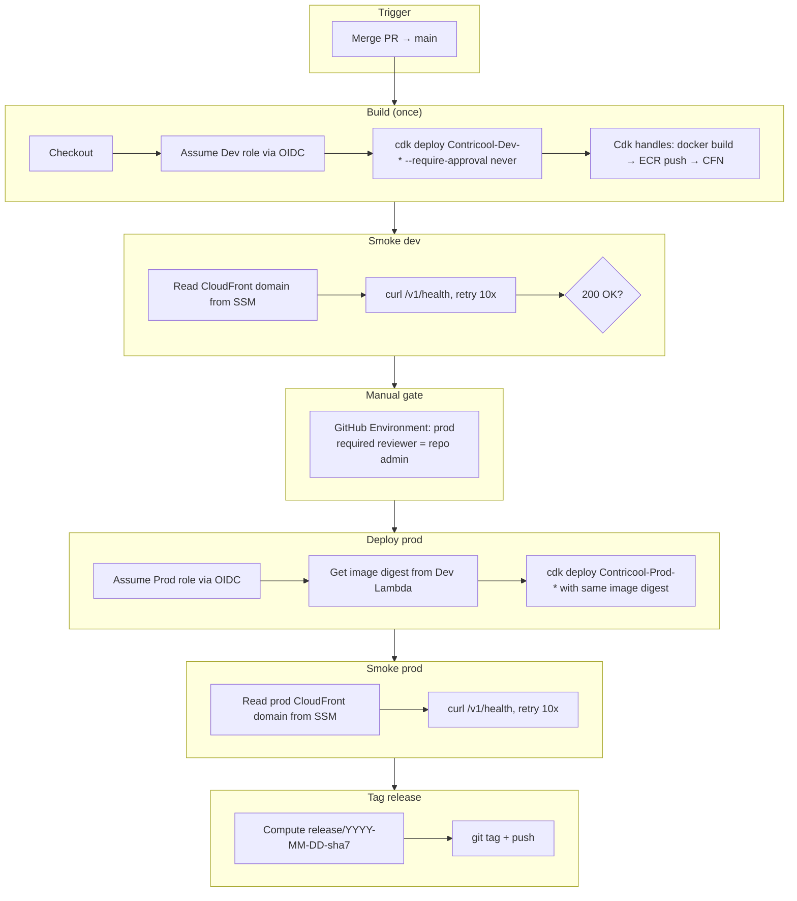

# Phase 1d — Deploy Workflow — Design

**Complexity: MEDIUM.** Two workflow files, six jobs in deploy.yml, one job in rollback.yml. No new IaC, no application code change. The hard parts are the OIDC trust shape, the dev-image-reused-by-prod contract, and the smoke retry.

## Overview

Replace the one-shot first-deploy laptop runbook with a CI-driven pipeline that owns every dev and prod deploy from this point forward. Humans never run `cdk deploy` against prod again — they merge to `main`, review the dev smoke, click "Approve" on the prod environment gate, and the rest is automatic.

## High-level design



## Jobs in `deploy.yml`

| # | Job ID         | Runs on  | Environment | OIDC role         | Depends on   | Purpose                                                |
|---|----------------|----------|-------------|-------------------|--------------|--------------------------------------------------------|
| 1 | `deploy-dev`   | ubuntu   | `dev`       | `*_DEPLOY_ROLE_DEV`  | (start)      | Build image (cdk handles), push to ECR, cdk deploy dev  |
| 2 | `smoke-dev`    | ubuntu   | `dev`       | none (public curl)| `deploy-dev` | Curl `/v1/health` on dev CF domain                     |
| 3 | `deploy-prod`  | ubuntu   | `prod` (gated) | `*_DEPLOY_ROLE_PROD` | `smoke-dev`  | Re-deploy same image digest to prod                    |
| 4 | `smoke-prod`   | ubuntu   | `prod`      | none              | `deploy-prod`| Curl `/v1/health` on prod CF domain                    |
| 5 | `tag-release`  | ubuntu   | `prod`      | none              | `smoke-prod` | Tag merged commit; push tag                            |

A separate `dev` GitHub Environment is created (no required reviewers; just used for grouping deploy logs and scoping the ProtonRoles per environment). The `prod` environment already exists from Phase 0 with required reviewer = repo owner.

### Concurrency

```yaml
concurrency:
  group: deploy-${{ github.ref }}
  cancel-in-progress: false
```

`cancel-in-progress: false` → two merges queue rather than overlap. CFN cannot run two deploys against the same stack simultaneously.

## The dev-image-reused-by-prod contract

This is the load-bearing requirement #3. Two viable approaches:

| Approach | How                                                                                        | Pros                              | Cons                                                                       |
|---|---|---|---|
| **A: same artifact via CDK context** | CDK builds image once during dev deploy → uploads to bootstrap ECR. Prod deploy passes `--context image_digest=<digest>` to skip rebuild. | True byte-identical image. No second docker build job. | CDK's DockerImageAsset always rebuilds unless we force a shortcut. Needs a custom CDK construct or a CLI flag dance. |
| **B: ECR pull-through** | Both dev and prod CDK assets land in the same bootstrap ECR repo. CDK is content-addressed (digest = image SHA), so if the source hasn't changed between dev and prod jobs, CDK reuses the same digest. | Zero CDK code change. CDK already does this. | Relies on CDK's hash-stability. Two slightly different docker builds (different layer caching) could produce a different digest. We pin the base image and Dockerfile, so this should be stable. |

**Decision: B.** CDK's DockerImageAsset hashes the build context (Dockerfile + `apps/api/`) deterministically. The dev job runs `cdk deploy Contricool-Dev-Api`, which:
1. Computes the asset hash from the source.
2. Tags as `cdk-hnb659fds-container-assets-<account>-<region>:<hash>`.
3. Skips push if the digest already exists in ECR.
4. Deploys.

The prod job runs the same `cdk deploy Contricool-Prod-Api` from the same checkout. CDK computes the same hash from the same source → finds the existing image in ECR → skips rebuild → deploys with the same image digest.

**Verification:** the smoke step on dev fetches the deployed Lambda's `CodeSha256` and writes it to `$GITHUB_OUTPUT`. The prod job reads it and asserts the prod Lambda's `CodeSha256` matches. Mismatch → fail loudly.

## Smoke step

```bash
attempt=0
max_attempts=10
backoff=10  # seconds
domain="$(aws ssm get-parameter --name /contricool/${ENV}/cloudfront-domain --query Parameter.Value --output text)"

while [ $attempt -lt $max_attempts ]; do
  http_code=$(curl -fsS -o /tmp/body.json -w '%{http_code}' "https://${domain}/v1/health" || echo "000")
  if [ "$http_code" = "200" ] && jq -e '.status == "ok" and .env == "'"${ENV}"'" and (.version | length > 0)' /tmp/body.json >/dev/null; then
    echo "Smoke passed on attempt $((attempt + 1))"
    exit 0
  fi
  echo "Attempt $((attempt + 1))/$max_attempts: status=${http_code}, body=$(cat /tmp/body.json 2>/dev/null || echo '<empty>')"
  attempt=$((attempt + 1))
  sleep "$backoff"
done

echo "Smoke failed after $max_attempts attempts"
exit 1
```

Total wait time: 10 × 10s = 100s. Tunable via env vars later. CloudFront fresh-distribution propagation is the only reason a smoke would fail-then-succeed; this covers the worst-case window.

The CloudFront domain comes from SSM (`/contricool/<env>/cloudfront-domain`), which the runbook already populated for dev. The prod entry will be populated by the deploy.yml itself on the first prod run (a small post-deploy step writes it).

## Tag scheme

Format: `release/2026-04-28-038ed11`

Job:

```yaml
- name: Compute tag
  id: compute
  run: |
    sha7="$(git rev-parse --short=7 HEAD)"
    date="$(date -u +%Y-%m-%d)"
    tag="release/${date}-${sha7}"
    echo "tag=${tag}" >> "$GITHUB_OUTPUT"
- name: Tag and push
  run: |
    git config user.name "github-actions[bot]"
    git config user.email "41898282+github-actions[bot]@users.noreply.github.com"
    git tag -a "${{ steps.compute.outputs.tag }}" -m "Prod release ${{ steps.compute.outputs.tag }}"
    git push origin "${{ steps.compute.outputs.tag }}"
```

## `rollback.yml`

Single-input `workflow_dispatch`:

```yaml
on:
  workflow_dispatch:
    inputs:
      tag:
        description: "release/YYYY-MM-DD-sha7 to roll prod back to"
        required: true
```

The job:

1. Checks out the tag.
2. Validates that the tag is on `main` ancestry (`git merge-base --is-ancestor`).
3. Assumes the prod role.
4. Runs `cdk deploy Contricool-Prod-Api` from the rolled-back source. CDK computes the previous image digest from that source, finds it in ECR (because we never delete CDK assets), updates the prod Lambda alias.

**Why CDK redeploy instead of `aws lambda update-alias --function-version N`?**

- The direct `update-alias` path needs `lambda:UpdateAlias` on the prod role, which isn't there today (it has `cloudformation:*` on prod stacks; CFN handles Lambda mutation through the bootstrap exec role). Adding that permission means redeploying `Contricool-Shared` — a separate IAM PR.
- CDK redeploy is ~3-5 min; `update-alias` is ~5s. For MVP rollback, 5 min is fine — production is broken either way; saving 4 min isn't worth the IAM widening.
- Future: if rollback frequency justifies, add `lambda:UpdateAlias` to the prod role and add a fast-rollback flag.

The rollback job runs in the `prod` environment, so it requires the same approval gate as the prod deploy. That's intentional — rolling back is a prod mutation and deserves the same friction.

## Permissions matrix

| Workflow         | Job        | OIDC role                          | Why                                                |
|------------------|------------|------------------------------------|----------------------------------------------------|
| `deploy.yml`     | `deploy-dev` | `Contricool-CI-Dev-Deploy`        | Trust: `repo:${repo}:ref:refs/heads/main`. CFN write on `Contricool-Dev-*`. ECR + bootstrap roles. |
| `deploy.yml`     | `deploy-prod`| `Contricool-CI-Prod-Deploy`       | Trust: `repo:${repo}:environment:prod`. CFN write on `Contricool-Prod-*`. ECR + bootstrap roles.    |
| `deploy.yml`     | `smoke-*`    | none                              | Public curl; no AWS calls beyond an SSM read (which uses the role from the previous deploy job's session — but jobs don't share sessions, so we'd need a new role assumption). **TBD: read SSM domain via OIDC or read it via a CFN output of the deploy step?** Decision: pass the domain across jobs via `outputs:` from the deploy step rather than re-assuming a role. |
| `deploy.yml`     | `tag-release`| none (GITHUB_TOKEN)                | Just `git tag` + `git push`; uses `GITHUB_TOKEN` with `contents: write` permission scoped to this job. |
| `rollback.yml`   | `rollback`   | `Contricool-CI-Prod-Deploy`       | Same as `deploy-prod` — workflow_dispatch counts as `repo:${repo}:environment:prod` when run with `environment: prod`. |

## Things we deliberately did NOT do

- **Build artifact promotion via OCI tags.** We rely on CDK's content-addressed image digests instead. Simpler, fewer moving parts.
- **A separate "build" job that runs first and emits the image tag.** Removed — would need an extra OIDC role for ECR-push-only access. CDK does build+push in one shot inside `deploy-dev`, and prod reuses the digest.
- **A staging environment between dev and prod.** EXECUTION_PLAN's contract is dev → prod with manual gate. Adding staging is post-MVP per `specs/CONSTRAINTS.md`.
- **Slack/email alerts on workflow failure.** GitHub already emails the actor on failure. Phase 6 adds CloudWatch alarm + SNS for live-prod issues.

## Summary

- One main workflow (`deploy.yml`) with five jobs serializing dev → smoke → prod-gated → smoke → tag.
- One rollback workflow (`rollback.yml`) that reuses the same CDK deploy path with a checked-out tag.
- One new runbook (`specs/runbooks/rollback.md`).
- No new AWS infrastructure (no new IAM permissions). The four GitHub variables + one secret from the first-deploy runbook are already populated.
- After this PR merges: every code change to `main` flows through this pipeline; `cdk deploy` from a laptop is reserved for `Contricool-Shared` changes only.
