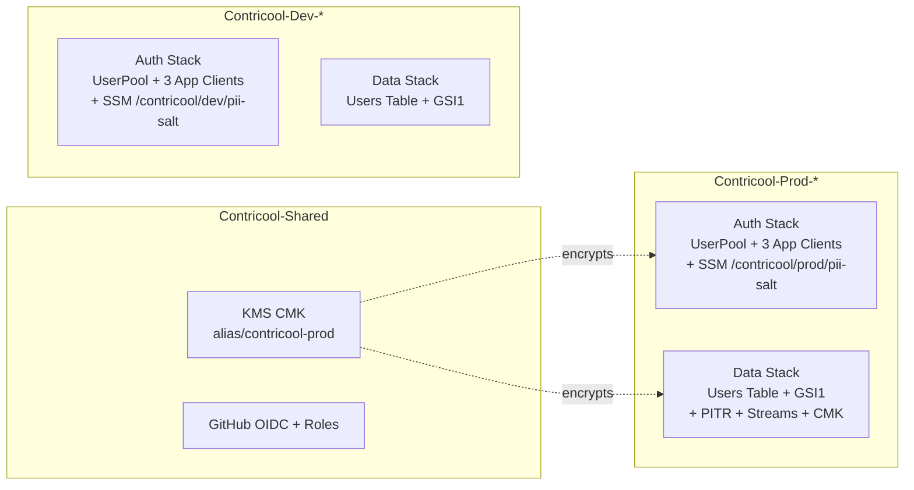

# Phase 2a — Cognito + DynamoDB + PII salt CDK foundation — Design

**Complexity: MEDIUM.** New stacks across two AWS service families (Cognito,
DynamoDB) plus a custom-resource SSM parameter. The cross-cutting designs
(`04-authentication`, `07-database-data-model`, `13-privacy-pii`) already pin
the schemas, so this design just translates them into CDK constructs and pins
operational details (PITR, KMS, removal policy, custom-resource semantics).

## Overview

We add four CDK stacks (`Contricool-{Dev,Prod}-Auth` + `Contricool-{Dev,Prod}-Data`)
and one new custom-resource construct in the Auth stack for the PII salt.



## Auth Stack

`apps/infra/stacks/auth_stack.py`

### Resources

1. **`cognito.UserPool`** with:
   - `user_pool_name=f"contricool-{env_name}"`
   - `sign_in_aliases=SignInAliases(email=True)` — only email is a sign-in alias.
   - `auto_verify=AutoVerifiedAttrs(email=True)` — Cognito sends verification
     code on signup.
   - `standard_attributes`:
     - `email`: required, mutable.
     - `phone_number`: required=False, mutable=True. NOT verified at MVP.
     - `fullname` (`name`): required, mutable.
   - `custom_attributes`: `custom:user_id` →
     `cognito.StringAttribute(min_len=26, max_len=26, mutable=False)`.
   - `password_policy`: `min_length=10, require_lowercase=True,
     require_uppercase=True, require_digits=True, require_symbols=True`.
   - `password history`: 3 (set via `Cfn` override; CDK L2 doesn't expose it).
   - `mfa=Mfa.OFF`.
   - `email`: `UserPoolEmail.with_cognito("ContriCool <no-reply@verificationemail.com>")`
     — explicitly the Cognito-managed sender at MVP. (`UserPoolEmail.with_ses`
     replaces this in Phase 7-or-later when `contricool.com` registers.)
   - `account_recovery=AccountRecovery.EMAIL_ONLY`.
   - `removal_policy=RETAIN` in prod, `DESTROY` in dev.
   - `device_tracking`: not configured (optional MVP feature; turn on later if
     we want device fingerprinting for fraud).

2. **Three `cognito.UserPoolClient`** (one per platform):
   - `auth_flows=AuthFlow(user_srp=True)`.
   - `prevent_user_existence_errors=True` — no `UserNotFoundException` leak on
     login attempts (privacy + anti-enumeration).
   - `enable_token_revocation=True` — `/v1/auth/logout` works.
   - `access_token_validity=Duration.hours(1)`,
     `id_token_validity=Duration.hours(1)`,
     `refresh_token_validity=Duration.days(30)`.
   - `generate_secret=False` (public clients).
   - **No OAuth**: `o_auth=None` (no hosted UI flows yet — federation deferred).

3. **PII salt custom resource** (see "PII Salt Custom Resource" below):
   - `aws_cdk.custom_resources.AwsCustomResource` (or, simpler, an
     `AwsCustomResource` calling `ssm:GetParameter` with a fallback `PutParameter`).

### CfnOutputs

```
UserPoolId             → /contricool/<env>/cognito/user-pool-id (post-deploy SSM write)
UserPoolArn
WebClientId            → /contricool/<env>/cognito/client-id-web
IosClientId            → /contricool/<env>/cognito/client-id-ios
AndroidClientId        → /contricool/<env>/cognito/client-id-android
```

CfnOutputs are visible in the stack console + CFN API but contain only IDs (not
URLs/account numbers); they're fine to live in CFN. Phase 2c reads these from
SSM at Lambda cold start, not from CFN. **deploy.yml** writes the four IDs to
SSM after each successful deploy via the same `aws ssm put-parameter` pattern
already used for `cloudfront-domain` (no new IAM grants needed —
`ssm:PutParameter` on `/contricool/*` was already added in Phase 1).

### PII Salt Custom Resource

CDK does not natively support "create a parameter once, never overwrite." We
build it via `AwsCustomResource`:

```python
from aws_cdk import custom_resources as cr

salt_reader = cr.AwsCustomResource(
    self,
    "PiiSaltGenerator",
    on_create=cr.AwsSdkCall(
        service="SSM",
        action="putParameter",
        parameters={
            "Name": f"/contricool/{env_name}/pii-salt",
            "Type": "SecureString",
            "Value": secrets.token_hex(32),  # 32 random bytes → 64-char hex
            "KeyId": cmk_key_arn if env_name == "prod" else "alias/aws/ssm",
            "Overwrite": False,
        },
        physical_resource_id=cr.PhysicalResourceId.of(f"pii-salt-{env_name}"),
        ignore_error_codes_matching="ParameterAlreadyExists",
    ),
    on_update=cr.AwsSdkCall(
        # No-op: we never overwrite the salt. CDK requires *some* call here;
        # GetParameter is idempotent and a safe no-op.
        service="SSM",
        action="getParameter",
        parameters={"Name": f"/contricool/{env_name}/pii-salt"},
        physical_resource_id=cr.PhysicalResourceId.of(f"pii-salt-{env_name}"),
    ),
    on_delete=None,  # do NOT delete the salt on stack destroy
    policy=cr.AwsCustomResourcePolicy.from_sdk_calls(
        resources=[
            f"arn:aws:ssm:{region}:{account}:parameter/contricool/{env_name}/pii-salt"
        ],
    ),
)
```

**Why `secrets.token_hex(32)` is safe at synth time despite running on the
deploy host**: `AwsCustomResource` ships parameters in the CFN template as the
literal value. That means **the synthesized template carries the salt
plaintext** — bad. We fix this by having the custom resource generate the salt
**inside Lambda at runtime** instead.

Replace the `AwsCustomResource` approach with a small **provider Lambda**:

- The Lambda receives `Create` / `Update` / `Delete` events from CFN.
- On `Create`: `boto3.ssm.get_parameter(Name=...)`. If `ParameterNotFound`,
  generate `secrets.token_hex(32)` **inside the Lambda** and call
  `boto3.ssm.put_parameter(Type="SecureString", Overwrite=False, KeyId=...)`.
  Return `PhysicalResourceId` = the parameter name.
- On `Update`: get_parameter; return existing value's PhysicalResourceId
  unchanged. **Never overwrite.**
- On `Delete`: do nothing. Document that operator must delete the SSM parameter
  manually if the Auth stack is destroyed and recreated for a clean slate.

The salt **never appears in CDK output, the synthesized template, CFN events,
or CloudWatch Logs** — the Lambda explicitly redacts it from its return payload
(returns `{"Status": "ok"}` only).

This is the pattern documented in CDK's "secret generation" examples:
[Generating Random Secrets in CDK](https://docs.aws.amazon.com/cdk/api/v2/docs/aws-cdk-lib.custom_resources-readme.html).

### Module path

```
apps/infra/stacks/auth_stack.py            ← new
apps/infra/constructs/pii_salt.py          ← new (the provider-Lambda construct)
apps/infra/constructs/pii_salt_handler.py  ← new (the Lambda handler code)
```

## Data Stack

`apps/infra/stacks/data_stack.py`

### Resources

1. **`dynamodb.Table`** with:
   - `table_name=f"ContriCool-Users-{env_name}"`.
   - `partition_key=Attribute(name="PK", type=STRING)`.
   - `sort_key=Attribute(name="SK", type=STRING)`.
   - `billing_mode=PAY_PER_REQUEST`.
   - `time_to_live_attribute="ttl"`.
   - `point_in_time_recovery=True` if env_name == "prod" else False.
   - `stream=NEW_AND_OLD_IMAGES` if env_name == "prod" else None.
   - `encryption=CUSTOMER_MANAGED + encryption_key=cmk` in prod;
     `AWS_MANAGED` in dev (default).
   - `removal_policy=RETAIN` in prod, `DESTROY` in dev.

2. **GSI1**:
   ```python
   table.add_global_secondary_index(
       index_name="GSI1",
       partition_key=Attribute(name="GSI1PK", type=STRING),
       sort_key=Attribute(name="GSI1SK", type=STRING),
       projection_type=ProjectionType.ALL,
   )
   ```

### CfnOutputs

```
UsersTableName  → /contricool/<env>/ddb/users-table-name (post-deploy SSM write)
UsersTableArn
```

### Cross-stack reference (CMK)

The Data stack reads `cmk` from `Contricool-Shared` via a constructor parameter
on the stack class — passed in via `app.py`:

```python
data = DataStack(app, f"Contricool-{suffix}-Data",
                 env=cdk_env, env_name=env_name,
                 prod_cmk=shared.prod_cmk if env_name == "prod" else None)
```

Same pattern Auth uses for the salt's `KeyId`.

`data.add_dependency(shared)` keeps deploy order correct.

## app.py wiring

```python
for env_name, cfg in ENV_CONFIGS.items():
    suffix = env_name.capitalize()

    auth = AuthStack(app, f"Contricool-{suffix}-Auth",
                     env=cdk_env, env_name=env_name,
                     prod_cmk=shared.prod_cmk if env_name == "prod" else None)
    auth.add_dependency(shared)

    data = DataStack(app, f"Contricool-{suffix}-Data",
                     env=cdk_env, env_name=env_name,
                     prod_cmk=shared.prod_cmk if env_name == "prod" else None)
    data.add_dependency(shared)

    api = ApiStack(...)  # unchanged
    web = WebStack(...)  # unchanged
    monitoring = MonitoringStack(...)  # unchanged

    cdk.Tags.of(auth).add("env", env_name)
    cdk.Tags.of(data).add("env", env_name)
    # existing tags unchanged
```

The deploy workflow's stack glob `'Contricool-Dev-*'` and `'Contricool-Prod-*'`
picks up the new stacks automatically with `--concurrency 3`. CFN will deploy
Auth and Data in parallel since neither depends on the other (both depend on
Shared, which is not in the glob).

## SSM-write step in deploy.yml

After `cdk deploy`, before "Capture deploy outputs," add a step:

```yaml
- name: Write Cognito + DDB IDs to SSM
  run: |
    set -euo pipefail
    user_pool_id="$(aws cloudformation describe-stacks \
      --stack-name Contricool-${{ matrix.env_titled }}-Auth \
      --query 'Stacks[0].Outputs[?OutputKey==`UserPoolId`].OutputValue' \
      --output text)"
    aws ssm put-parameter --name /contricool/${{ matrix.env }}/cognito/user-pool-id \
      --value "$user_pool_id" --type String --overwrite
    # …same for client IDs and table name…
```

Practically, since deploy.yml already has a `Capture deploy outputs` step for
`cf_domain`, we extend it to capture all six IDs and then put them all in one
batch under their canonical SSM paths. **No new IAM grants needed**:
`ssm:PutParameter` on `/contricool/*` already exists in the deploy roles
(added in Phase 1d).

This step is idempotent (`--overwrite`); subsequent deploys with unchanged IDs
re-write the same value. PII salt is **not** part of this step — it's owned
by the custom resource and never written by the workflow.

## Testing strategy

### Synth tests (`apps/infra/tests/test_synth.py` additions)

- `test_auth_stack_user_pool_email_only_no_sms_no_mfa` — assert pool has
  `MfaConfiguration=OFF`, `SmsConfiguration` absent, no `SnsCallerArn`,
  `AutoVerifiedAttributes=['email']`.
- `test_auth_stack_password_policy_meets_design_4` — ≥10, all four classes
  required.
- `test_auth_stack_custom_user_id_attribute` — `custom:user_id` schema present,
  immutable, len 26..26.
- `test_auth_stack_three_clients_no_secret` — three CfnUserPoolClient
  resources with `GenerateSecret=False` and only USER_SRP_AUTH +
  REFRESH_TOKEN_AUTH in `ExplicitAuthFlows`.
- `test_auth_stack_pii_salt_provider_uses_kms_in_prod_only` — assert the
  custom resource handler's IAM policy carries the prod CMK ARN in prod and
  not in dev. Assert salt path `/contricool/<env>/pii-salt`.
- `test_auth_stack_user_pool_retention_in_prod_destroy_in_dev`.
- `test_data_stack_table_keys_billing_ttl` — PK/SK/GSI1PK/GSI1SK = STRING,
  `BillingMode=PAY_PER_REQUEST`, `TimeToLiveSpecification.AttributeName='ttl'`.
- `test_data_stack_pitr_streams_only_in_prod`.
- `test_data_stack_kms_cmk_in_prod_default_in_dev`.
- `test_data_stack_users_table_retention_in_prod_destroy_in_dev`.
- `test_app_synth_now_renders_six_stacks_per_env`.

### Aspect tests

The existing `SecurityAspect` covers BlockPublicAccess + Lambda reserved
concurrency. The PII salt provider Lambda is a new function; it MUST either
(a) get reserved-concurrency set, or (b) be in the aspect's exemption list
(custom-resource provider Lambdas, like CDK's BucketDeployment helper, are
already exempted by construct path token). Confirm via aspect test.

### Deploy-time tests

None at this phase (no API endpoints to smoke). The existing
`smoke-dev` / `smoke-prod` jobs continue to verify `/v1/health` so we know we
didn't accidentally break Api or Web.

## Trade-offs and rejected alternatives

### Where Cognito's email policy lives

- **Chosen — Cognito-managed sender** (`no-reply@verificationemail.com`):
  Pros: zero setup, free, works at MVP scale (50 emails/day cap >> our need).
  Cons: lower deliverability, generic from-address.
- Rejected — SES with verified domain identity: requires `contricool.com`
  registered + DKIM/SPF configured, which is Phase 7. Not worth the schedule
  hit at MVP.
- Rejected — third-party (SendGrid/Resend): violates AWS Mandate.

### How the PII salt is generated

- **Chosen — provider Lambda generates `secrets.token_hex(32)` inside the
  function on first create, idempotent on subsequent updates.** Salt never
  leaves the AWS account.
- Rejected — `cr.AwsCustomResource` with synth-time random: the salt would
  appear in the synthesized CFN template (committed via `cdk.out`), which is
  exactly the leak we're trying to prevent.
- Rejected — `aws_secretsmanager.Secret` with `generate_secret_string`:
  Secrets Manager is $0.40/secret/mo and rotation-oriented. SSM
  Parameter Store SecureString is free and matches our "never rotate" posture.

### Single GSI1 polymorphic vs. two GSIs

- **Chosen — single GSI1** carrying both `EMAIL#hash` lookups (User META) and
  `USER#max → FRIEND#min` reverse-friendship rows. Matches Design 7 exactly.
  Cheaper (one GSI). No phone GSI at MVP.
- Rejected — separate GSI1 (email-only) + GSI2 (friend reverse): doubles
  index-write cost on every user-row update. No upside at MVP scale.

### DDB Streams in dev

- **Chosen — disabled in dev**: dev has no Streams consumer, and Streams cost
  ~$0.02/100k reads (free tier 25 RCU/mo barely matters but wired-up
  scaffolding can break the SecurityAspect later).
- Rejected — enabled in both: low cost but adds noise; we can flip dev on
  during Phase 6 if we want to test Stream-driven features there before prod.

## Open Questions

1. **Resource cleanup if dev Auth stack is recreated**: deleting the dev Auth
   stack (`removal_policy=DESTROY`) deletes the User Pool but the SSM
   `pii-salt` parameter persists (the custom resource has `on_delete=None`).
   On re-create, the same salt is reused — which is correct for prod-style
   deploys but may surprise dev-side teardown. **Recommendation**: document in
   `specs/runbooks/dev-cleanup.md` that nuking dev requires a manual
   `aws ssm delete-parameter --name /contricool/dev/pii-salt` first.

2. **Pool migration story**: Cognito User Pools cannot be renamed or
   re-keyed. If we ever want to rename `contricool-dev` → `contricool-staging`
   we must dual-write through a custom Lambda trigger and migrate users. Out
   of scope for v1; mention in Auth stack docstring.

## Summary

- Two new CDK stack classes (`AuthStack`, `DataStack`) wired in for both envs.
- One new construct (`PiiSalt`) using a provider Lambda to generate-once a
  64-char hex salt into SSM SecureString — never leaks into CFN templates.
- Two new SSM SecureString patterns: `/contricool/<env>/pii-salt` (owned by
  the custom resource) and the deploy-workflow-managed
  `/contricool/<env>/cognito/...` + `/contricool/<env>/ddb/...` (six IDs).
- Synth-only tests; no live deploy tests — the existing `/v1/health` smoke is
  sufficient to confirm we didn't break Api/Web.
- Zero changes to deploy.yml's job structure; one extra `aws ssm put-parameter`
  step appended to the existing "Capture deploy outputs" step in both deploy
  jobs.
