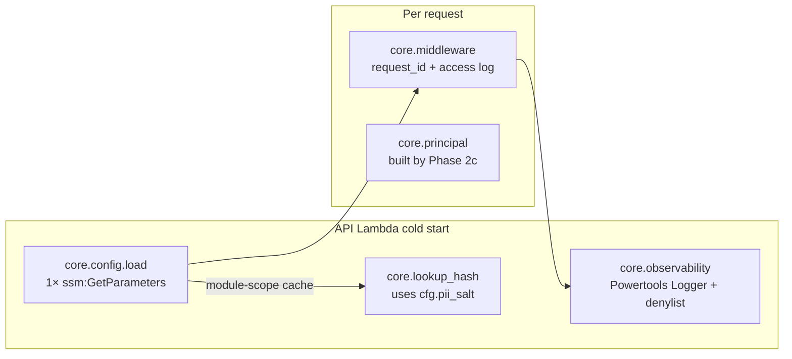

# Phase 2b — `app/core/` shared backend infrastructure — Design

**Complexity: SIMPLE.** Five small modules + one middleware, all in pure
Python with well-known libraries. Each module has a single concern and a
small surface. Most of the design effort goes into the **redaction** logic
(the only place a bug could turn into a PII leak) and the **cold-start
caching** of SSM parameters (the only place a bug could turn into a per-
request 50ms tax).

## Overview



## Module designs

### `core/config.py`

```python
@dataclass(frozen=True)
class AppConfig:
    env_name: str
    aws_region: str
    app_version: str
    cognito_user_pool_id: str
    cognito_web_client_id: str
    cognito_ios_client_id: str
    cognito_android_client_id: str
    users_table_name: str
    pii_salt: str  # SecureString value

_cache: AppConfig | None = None
_lock = threading.Lock()

def load() -> AppConfig:
    global _cache
    if _cache is not None:
        return _cache
    with _lock:
        if _cache is not None:  # double-checked
            return _cache
        _cache = _build_from_ssm()
        return _cache
```

Implementation notes:

- `_build_from_ssm()` issues **one** `boto3.client("ssm").get_parameters(
  Names=[...], WithDecryption=True)` call.
- `WithDecryption=True` covers the `pii-salt` SecureString; non-secret
  parameters ignore the flag.
- Missing parameter → response includes them in `InvalidParameters`. We
  raise `RuntimeError(f"Required SSM parameters missing: {missing}; "
  f"this is a deploy-time misconfiguration. See "
  f"specs/phase-2a-cognito-ddb-foundation/tasks.md C7-C8.")`.
- Empty value → same error class with explicit "value is empty" message.
- A `_set_for_tests(config)` helper directly assigns `_cache` for use by
  pytest fixtures; tests for `load()` itself use a `moto_server` SSM stub.

### `core/observability.py`

```python
from aws_lambda_powertools import Logger, Metrics, Tracer

DENY_KEYS = frozenset({
    "email", "phone", "phone_number", "password",
    "code", "otp", "authorization", "cookie", "set-cookie",
    "secret", "token", "access_token", "id_token", "refresh_token",
    "ssn", "credit_card", "pii_salt",
})

def _redact(obj):
    """Recursively replace any value whose key matches DENY_KEYS
    (case-insensitive) with the literal string '[REDACTED]'.
    Non-mapping values pass through unchanged."""

logger = Logger(
    service="contricool-api",
    log_record_order=["timestamp", "level", "message", "request_id"],
)
logger.register_log_record_processor(_redact_processor)

metrics = Metrics(namespace="ContriCool/API", service="contricool-api")
tracer = Tracer(service="contricool-api")
```

Redaction logic — the safety-critical bit:

- Walks dicts recursively. For lists, walks each element.
- Key match is case-insensitive — `Authorization` matches `authorization`.
- Match is **whole-word** on the key, not substring (so `customer_email`
  is also redacted because `email` is in the deny list — a substring of a
  composite key absolutely should be redacted; split-on-`_` and check each
  fragment).
- Value type doesn't matter: dict/list/str/int all redact to `[REDACTED]`.
- Powertools' Logger has a `log_record_order` and supports a custom
  `processor`; we register `_redact_processor` that runs the dict through
  `_redact` before serialisation.

This is the negative-test surface for red-line 3 — every Phase 2b PR
walks through these rules.

### `core/principal.py`

```python
from typing import Literal

from pydantic import BaseModel, EmailStr, Field

class Principal(BaseModel):
    user_id: str = Field(min_length=26, max_length=26)
    email: EmailStr
    display_name: str
    groups: list[str] = Field(default_factory=list)
    token_use: Literal["id", "access"]

    @classmethod
    def from_claims(cls, claims: dict[str, object]) -> "Principal":
        try:
            return cls(
                user_id=str(claims["custom:user_id"]).strip(),
                email=str(claims["email"]).strip(),
                display_name=str(claims["name"]).strip(),
                groups=list(claims.get("cognito:groups") or []),
                token_use=str(claims["token_use"]),
            )
        except (KeyError, ValueError, TypeError) as e:
            raise ValueError(f"Invalid JWT claims: {e}") from e
```

Notes:

- `Pydantic` validates `EmailStr` shape and `Literal["id", "access"]` —
  failure raises `ValueError` (Pydantic's `ValidationError` is a
  `ValueError`).
- The factory deliberately catches everything that could go wrong with a
  malformed claims dict and re-raises as a single `ValueError` for
  callers to translate to 401.

### `core/lookup_hash.py`

```python
import hashlib
import hmac

from app.core import config

_HASH_BYTES = 32  # → 64-char hex

def email_hash(email: str) -> str:
    if not isinstance(email, str) or not email.strip():
        raise ValueError("email must be a non-empty string")
    cfg = config.load()
    normalised = email.strip().lower().encode("utf-8")
    salt = cfg.pii_salt.encode("utf-8")
    return hmac.new(salt, normalised, hashlib.sha256).hexdigest()
```

Notes:

- `hmac.new(key=salt, msg=normalised, digestmod=sha256)` is the standard
  HMAC construction — Python's `hmac` module is a stdlib primitive.
- Salt is read from the cached `AppConfig` — first call after cold start
  triggers `config.load()` if not yet warmed.
- The function does NOT prepend `EMAIL#` — that's the caller's
  responsibility (different access patterns may use different prefixes
  per Design 7).

### `core/policy.py`

```python
from app.core.principal import Principal


def is_self(principal: Principal, target_user_id: str) -> bool:
    return principal.user_id == target_user_id


def is_friend(a_user_id: str, b_user_id: str) -> bool:
    raise NotImplementedError(
        "Phase 3 wires this to ContriCool-Users-<env>; do not call yet."
    )


def can_edit_transaction(principal: Principal, txn: object) -> bool:
    raise NotImplementedError(
        "Phase 5 wires this to ContriCool-Transactions-<env>; do not call yet."
    )
```

The `NotImplementedError` placeholders mean `from app.core import policy`
imports cleanly but using the unimplemented helpers fails at run time —
which is what we want during phases 2–4 to prevent accidental usage.

### `core/middleware.py`

```python
import time
import ulid
from fastapi import Request
from starlette.middleware.base import BaseHTTPMiddleware

from app.core.observability import logger

_ULID_REGEX = re.compile(r"^[0-9A-HJKMNP-TV-Z]{26}$")


class CoreMiddleware(BaseHTTPMiddleware):
    async def dispatch(self, request: Request, call_next):
        request_id = self._extract_or_generate_id(request)
        request.state.request_id = request_id
        logger.append_keys(
            request_id=request_id,
            path=request.url.path,
            method=request.method,
        )
        started_ns = time.monotonic_ns()
        try:
            response = await call_next(request)
        finally:
            duration_ms = (time.monotonic_ns() - started_ns) / 1_000_000
            logger.remove_keys(["request_id", "path", "method"])

        response.headers["X-Request-Id"] = request_id
        logger.info(
            "request",
            extra={
                "status_code": response.status_code,
                "duration_ms": round(duration_ms, 2),
                "request_id": request_id,
                "path": request.url.path,
                "method": request.method,
            },
        )
        return response

    @staticmethod
    def _extract_or_generate_id(request: Request) -> str:
        candidate = request.headers.get("x-request-id", "").strip()
        if candidate and _ULID_REGEX.match(candidate):
            return candidate
        return str(ulid.new())


def install_core_middleware(app):
    app.add_middleware(CoreMiddleware)
```

Notes:

- The middleware never logs query strings or bodies. If a feature needs
  audit-style logging it does so at the route handler with explicit
  redacted payloads.
- The `ulid` library: `python-ulid` (1.x) — adds 1 dependency.
- `request.state.request_id` is what feature handlers reach for to
  correlate downstream calls (DDB, Cognito, SES) using the same ID.

## `main.py` integration

```python
from fastapi import FastAPI

from app.core.middleware import install_core_middleware
from app.core import config
from app.routes import health


def create_app() -> FastAPI:
    config.load()  # cold-start: fail fast if SSM is misconfigured
    app = FastAPI(...)
    install_core_middleware(app)
    app.include_router(health.router, prefix="/v1", tags=["health"])
    return app


app = create_app()
```

Phase 1's `main.py` was a module-level `app = FastAPI(...)`; we wrap it in
`create_app()` so tests can build a fresh app per fixture. The Lambda
Web Adapter doesn't care which one ASGI it gets handed, as long as the
module exposes `app`.

## Test layout

```
apps/api/tests/
  test_health.py             # existing
  core/
    __init__.py
    test_config.py
    test_observability.py
    test_principal.py
    test_lookup_hash.py
    test_middleware.py
```

Each test file uses pytest fixtures from `tests/conftest.py`:

- `seed_config(salt="sodium")` — calls `config._set_for_tests(AppConfig(...))`
  with a fixed salt + dummy IDs.
- `caplog_json` — patches the Powertools Logger to write to a list, so
  tests can assert exact log line contents.
- `mock_ssm` — `moto.mock_aws()` SSM stub for `test_config.py`'s integration
  tests.

## Trade-offs and rejected alternatives

### Why Powertools Logger over `logging` + custom JsonFormatter

- **Chosen — Powertools Logger**: AWS-managed, integrates with X-Ray, has
  the cold-start / Lambda-context auto-fields built in, supports custom
  log-record processors (which is how we hook redaction).
- Rejected — `logging.Logger` + a custom JsonFormatter: more code, no
  X-Ray integration, no cold-start helper, would have to re-implement the
  Lambda-context decorator.

### Why redact whole-word on `_`-split fragments

- A field named `customer_email` should redact because `email` is PII.
- But a field named `secrets_count` should NOT redact (it's a count, not
  a secret).
- Splitting on `_` and matching each fragment against the deny set is the
  right default. A more aggressive substring match would over-redact.
- Tests cover both sides explicitly so a future "let me make this faster"
  refactor can't quietly weaken the rule.

### Why `python-ulid` over `uuid`

- ULIDs are sortable by time + still URL-safe + 26 chars (vs 36 for UUID
  with dashes). The data model already uses ULIDs everywhere
  (Design 7); using UUIDs for request IDs would create two ID styles in
  the same logs.
- 1 small dep (~10 KB) is worth the consistency.

### Why `_set_for_tests` over a `pytest` fixture in the source

- Tests live in `tests/`, not `app/`. Putting test hooks in `app/core/`
  violates the "no test code in production" principle, but a single
  underscore-prefixed function is the practical compromise — Python has
  no real "internal API" boundary, and asserting "this isn't called in
  production" is enforced by code review + grep at PR time.

## Open Questions

1. **Threading lock on `config.load()`**: do we actually need it? Lambda's
   default execution model is single-threaded per container. **Yes**, keep
   the lock — Powertools and FastAPI both spawn background threads
   (X-Ray's reporter, asyncio's task pool); a future change might make
   this matter. Cheap insurance.

2. **Where to put `EMAIL#` prefix**: `lookup_hash.email_hash` returns the
   bare hash; the prefix is added by the future `users` repository in
   Phase 2c. Confirmed — keeps the helper reusable for other prefixes
   (e.g., `RATE#` row keys).

3. **Should access-log line include user_id?** Phase 2b doesn't have a
   Principal yet. Phase 2c's middleware extension can append `user_id`
   into the `logger.append_keys` call when the principal is built. Open
   for now; the access-log line in Phase 2b only carries request-level
   fields.

## Summary

- Five small `app/core/` modules (`config`, `observability`, `principal`,
  `lookup_hash`, `policy`) plus one middleware (`middleware`).
- Cold-start config: single SSM `GetParameters` batch, fail-fast on
  missing keys, module-scope cache with thread-lock.
- PII redaction: Powertools Logger custom processor walks dict
  recursively, splits keys on `_`, redacts on deny-set match.
- Principal: Pydantic v2 model built from JWT claims dict; doesn't itself
  verify signatures (Phase 2c).
- Lookup-hash: HMAC-SHA-256 with salt from SSM, normalised input,
  64-char hex output.
- Middleware: request-ID injection (ULID) + access log; no JWT handling.
- Tests at 99% coverage; explicit negative tests for redaction and
  malformed claims (red-line 3).
