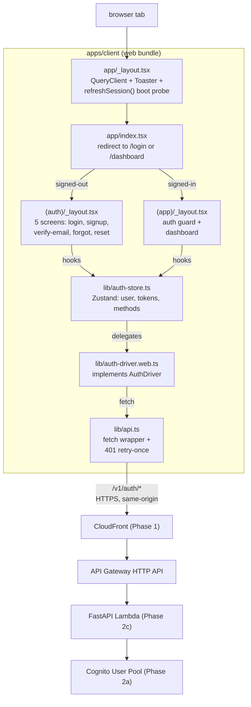
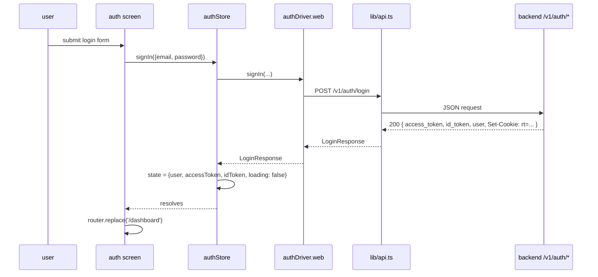
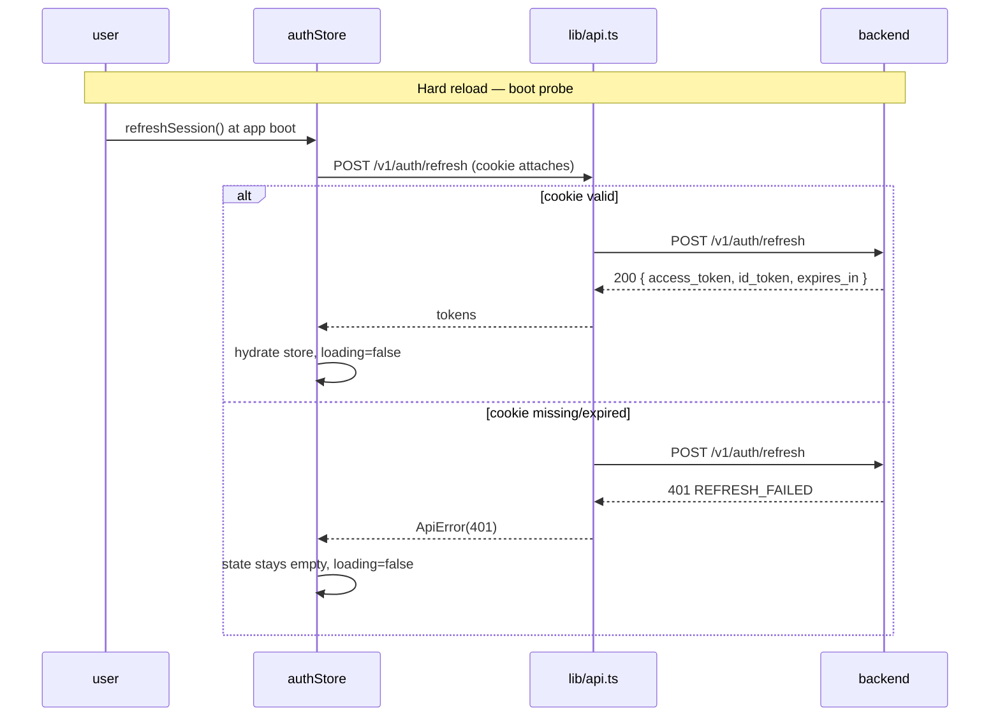

# Phase 2d — Expo Client Auth Foundation — Design

**Complexity: COMPLEX.** New language (TypeScript) + new tooling (Expo,
Metro, NativeWind, RNTL, MSW, Biome) + 5 user-facing screens + a
swappable auth-driver abstraction designed for web today and native
later.

## Overview

Phase 2d boots `apps/client/` for the first time and ships five public
auth screens + a stub authenticated dashboard, all wired to the Phase 2c
backend over `/v1/auth/*`. The codebase is **single-source** Expo SDK 52
+ React Native + React Native Web; Phase 2d builds and tests the **web
target only** but the same source will compile to iOS/Android via EAS
in a later phase with no rewrite.

Two architectural decisions worth pinning up front:

1. **Driver pattern instead of Amplify.** The auth store calls an
   `AuthDriver` interface; Metro's platform resolver picks
   `auth-driver.web.ts` on web, leaving `auth-driver.native.ts` (post-MVP)
   as a one-file drop-in. Amplify is **not** in the web bundle.
2. **Backend-only token surface.** Access + ID tokens live in Zustand
   state (memory). Refresh token lives **only** in the Phase-2c HttpOnly
   `Path=/v1/auth` cookie. Hard reload triggers a `refreshSession()`
   probe to re-hydrate. No localStorage, no sessionStorage, no IndexedDB.

## High Level Design







## Repo & file layout (final shape after this phase)

```
apps/client/
├── app/                                  # Expo Router 4
│   ├── _layout.tsx                       # root: providers + boot probe
│   ├── index.tsx                         # redirect to /login or /dashboard
│   ├── +not-found.tsx
│   ├── (auth)/
│   │   ├── _layout.tsx                   # public guard
│   │   ├── login.tsx
│   │   ├── signup.tsx
│   │   ├── verify-email.tsx
│   │   ├── forgot-password.tsx
│   │   └── reset-password.tsx
│   └── (app)/
│       ├── _layout.tsx                   # auth guard
│       └── dashboard.tsx
├── components/
│   └── ui/                               # rn-reusables primitives
│       ├── Button.tsx
│       ├── Input.tsx
│       ├── Label.tsx
│       ├── Card.tsx
│       ├── Spinner.tsx
│       ├── Select.tsx
│       ├── Toaster.tsx
│       └── form.tsx                      # RHF wrappers
├── lib/
│   ├── api.ts                            # fetch wrapper + 401 retry
│   ├── auth-driver.ts                    # interface
│   ├── auth-driver.web.ts                # web impl
│   ├── auth-store.ts                     # Zustand
│   ├── error-mapping.ts                  # ApiError → screen helpers
│   ├── query-client.ts                   # TanStack Query factory
│   ├── schemas.ts                        # Zod schemas (5 forms)
│   ├── tokens.ts                         # design tokens
│   └── types.ts                          # backend contract types
├── __tests__/
│   ├── lib/
│   │   ├── api.test.ts
│   │   ├── auth-driver.web.test.ts
│   │   ├── auth-store.test.ts
│   │   ├── error-mapping.test.ts
│   │   └── schemas.test.ts
│   ├── app/
│   │   ├── login.test.tsx
│   │   ├── signup.test.tsx
│   │   ├── verify-email.test.tsx
│   │   ├── forgot-password.test.tsx
│   │   ├── reset-password.test.tsx
│   │   └── dashboard.test.tsx
│   ├── msw-handlers.ts                   # /v1/auth/* mocks
│   └── test-utils.tsx                    # render with providers
├── static/                               # KEPT from Phase 1; deploy unchanged
│   └── index.html
├── app.json
├── babel.config.js
├── biome.json
├── global.css
├── metro.config.js
├── package.json
├── tailwind.config.ts
├── test-setup.ts
├── tsconfig.json
├── vitest.config.ts
├── README.md
├── .env.local.example
└── .gitignore                            # + apps/client/ entries
```

## Dependency choices (each justified)

### Runtime

| Package | Version | Why |
|---|---|---|
| `expo` | `~52` | Defines tooling. SDK 52 ships with React 19 / RN 0.76, supports Expo Router 4, NativeWind 4. |
| `react` | `18.3.1` | Pinned by Expo SDK 52. (SDK 52 still uses React 18; React 19 lands in SDK 53.) |
| `react-native` | `0.76.x` | Pinned by Expo SDK 52. |
| `react-native-web` | `~0.19` | Required for the web target. |
| `expo-router` | `~4` | File-based routing on web + native; one router for both. |
| `expo-status-bar` | `~2` | Required by Expo template. |
| `react-native-safe-area-context` | `4.x` (Expo-pinned) | Required by Expo Router 4. |
| `react-native-screens` | `4.x` (Expo-pinned) | Required by Expo Router 4. |
| `nativewind` | `^4.1` | Tailwind on RN+Web. v4 is the current line. |
| `tailwindcss` | `^3.4` | Required by NativeWind 4. |
| `zustand` | `^5` | Auth store. ~3 KB gz. |
| `@tanstack/react-query` | `^5` | Server-state cache; used in Phase 3+ but provider is set up now. |
| `react-hook-form` | `^7` | All five auth forms. |
| `@hookform/resolvers` | `^3` | Zod resolver. |
| `zod` | `^3.23` | Form schemas + ApiError parsing. |
| `class-variance-authority` | `^0.7` | Variant prop API for primitives. |
| `clsx` | `^2` | classNames merging. |
| `tailwind-merge` | `^2` | Resolves conflicting Tailwind classes. |

**Removed from initial draft**: `aws-amplify`, `@aws-amplify/core`,
`@aws-amplify/auth` — deferred to native phase per architectural
decision.

### Dev

| Package | Version | Why |
|---|---|---|
| `typescript` | `~5.6` | Strict mode. |
| `@types/react` | matches React 18 | Types. |
| `@biomejs/biome` | `^1.9` | Lint + format (replaces ESLint + Prettier per project policy). |
| `vitest` | `^2` | Test runner. |
| `@vitest/coverage-v8` | matches | Coverage provider. |
| `@testing-library/react-native` | `^12` | Component tests. |
| `@testing-library/jest-dom` | `^6` | DOM matchers (jsdom env). |
| `jsdom` | `^25` | Vitest test environment. |
| `msw` | `^2` | Mocks `/v1/*` in tests; same handler set per Phase 2c contract. |

### Trade-offs

| Choice | Picked | Pros | Cons |
|---|---|---|---|
| Routing | **Expo Router 4** | One router for web + native; file-based; matches Design 10. | Tied to Expo's release cadence. |
| Styling | **NativeWind 4 + tokens** | Same source on web (CSS) + native (RN StyleSheet); design tokens stay declarative. | NW4 is recent; some primitives need manual tweaks for RN-Web. |
| Forms | **RHF + Zod** | Industry standard; tiny payload; types flow from schema. | Zod schemas get duplicated (client + Pydantic) — accepted for now; SDK regen in 2e narrows the gap. |
| Server state | **TanStack Query 5** | Standard; caching free; v5 supports React 18. | Probably underused in 2d (no list views yet); set up provider so 3+ doesn't have to retro-add. |
| State store | **Zustand 5** | 3 KB; no boilerplate; simple selectors. | Manual subscription wiring vs. React Context — fine for an auth store. |
| Test runner | **Vitest 2** | Fast; ESM-native; great coverage UX. | Needs `react-native` mocking shim (well-trodden path with RNTL). |
| Mock layer | **MSW 2** | Schema-anchored; intercepts `fetch`; matches Phase 2c contract. | Requires Service Worker shim in jsdom (handled by `setupServer` API path). |
| Lint/format | **Biome** | Single binary; fast; project policy. | Smaller plugin ecosystem than ESLint. Acceptable. |
| Auth driver | **Custom interface + web impl** | Avoids Amplify weight on web; native phase drops in `auth-driver.native.ts` cleanly. | One more abstraction file. |

## Section: API client (`lib/api.ts`)

### Contract

```ts
export interface ApiError {
  code: string;
  message: string;
  request_id: string | null;
  details?: { field: string; issue: string }[];
  retry_after?: number;
  http_status: number;
}

export class ApiErrorException extends Error {
  constructor(public readonly error: ApiError) {
    super(`${error.code}: ${error.message}`);
    this.name = 'ApiErrorException';
  }
}

export async function apiFetch<T>(
  path: string,
  init: RequestInit & { auth?: 'bearer' | 'public' }
): Promise<T>;
```

### Behaviour

1. Resolve URL: `${EXPO_PUBLIC_API_BASE_URL ?? '/v1'}${path}` (path
   starts with `/auth/...`, `/me/...`, etc.).
2. Set `Content-Type: application/json` if body is a plain object.
3. If `init.auth !== 'public'` and the auth store has an
   `accessToken`, add `Authorization: Bearer <token>`.
4. Always send `credentials: 'include'` so the `rt` cookie attaches
   on `/auth/*` calls (same-origin under CloudFront in prod; CORS
   wildcard-disallowed by spec, so this only works against an
   `Allow-Credentials: true` origin — already configured Phase 1).
5. On 2xx with `204` → resolve `void`; otherwise parse JSON body.
6. On non-2xx:
   - Try parse `{error: {...}}` envelope; map fields onto `ApiError`.
   - On parse failure (e.g., raw HTML 5xx): synthesise
     `{code: 'NETWORK_ERROR', message: 'Network error',
       request_id: null, http_status: <status>}`.
   - **401 retry path**: only if `init.auth !== 'public'` and the
     path does **not** start with `/auth/`:
     - Call `apiFetch('/auth/refresh', {method: 'POST', auth: 'public', __noRetry: true})`.
     - On refresh success → put new tokens in store → retry the
       original request **once** (without `__noRetry` it would
       infinite-loop).
     - On refresh failure → call `useAuthStore.getState().signOut()`
       (best-effort, ignores its own errors) and throw the original
       `ApiErrorException(401)`.
   - For everything else, throw `ApiErrorException`.

### `__noRetry` internal flag

A symbol-keyed flag prevents the recursion: `apiFetch` accepts
`__noRetry?: true` (private) and bypasses the 401-retry block when
present. Both the inner refresh call and the retry-after-refresh call
set this flag. Single source for the recursion guard.

### Why include credentials?

The Phase 2c cookie has `Path=/v1/auth`, `SameSite=Strict`, `Secure`.
Same-origin (web served from CloudFront `/`, API at `/v1/auth/*`) →
the cookie attaches automatically. In dev, `EXPO_PUBLIC_API_BASE_URL`
typically points at the dev CloudFront domain → same-origin in browser
treatment as long as the static dev server proxies that origin (see
README dev modes).

## Section: AuthDriver interface

```ts
// lib/auth-driver.ts
export interface AuthDriver {
  signUp(input: SignupInput): Promise<{ user_id: string; status: 'PENDING_VERIFICATION' }>;
  verifyEmail(input: { email: string; code: string }): Promise<{ email_verified: true; account_active: true }>;
  resendEmailCode(input: { email: string }): Promise<{ status: 'RESENT' }>;
  signIn(input: { email: string; password: string }): Promise<LoginResponse>;
  refreshSession(): Promise<RefreshResponse>;
  signOut(accessToken: string): Promise<void>;
  forgotPassword(input: { email: string }): Promise<{ status: 'RESET_CODE_SENT' }>;
  resetPassword(input: ResetPasswordInput): Promise<{ password_reset: true }>;
}
```

```ts
// lib/auth-driver.web.ts
export const webAuthDriver: AuthDriver = {
  signUp: (input) => apiFetch('/auth/signup', {method: 'POST', body: JSON.stringify(input), auth: 'public'}),
  verifyEmail: (input) => apiFetch('/auth/verify-email', ...),
  // ...
};
export default webAuthDriver;
```

`lib/auth-store.ts` imports `./auth-driver` (no extension) — Metro
resolves to `auth-driver.web.ts` on web. The `.native.ts` variant is
absent in 2d; if a test ever runs against `react-native` env, Metro
would error — Vitest only runs jsdom + web in 2d.

## Section: Auth store (`lib/auth-store.ts`)

```ts
type AuthUser = { user_id: string; name: string; currency: 'USD' | 'INR' };

interface AuthState {
  user: AuthUser | null;
  accessToken: string | null;
  idToken: string | null;
  loading: boolean;

  signIn: (i: { email: string; password: string }) => Promise<void>;
  signOut: () => Promise<void>;
  signUp: (i: SignupInput) => Promise<void>;
  verifyEmail: (i: { email: string; code: string }) => Promise<void>;
  resendEmailCode: (i: { email: string }) => Promise<void>;
  forgotPassword: (i: { email: string }) => Promise<void>;
  resetPassword: (i: ResetPasswordInput) => Promise<void>;
  refreshSession: () => Promise<void>;
  _clear: () => void;
}

export const useAuthStore = create<AuthState>((set, get) => ({
  user: null, accessToken: null, idToken: null, loading: true,

  signIn: async (input) => {
    const r = await driver.signIn(input);
    set({
      user: r.user,
      accessToken: r.access_token,
      idToken: r.id_token,
      loading: false,
    });
  },

  signOut: async () => {
    const t = get().accessToken;
    if (t) {
      try { await driver.signOut(t); } catch { /* swallow — clear local anyway */ }
    }
    get()._clear();
  },

  refreshSession: async () => {
    set({loading: true});
    try {
      const r = await driver.refreshSession();
      // Refresh response has tokens but no user object — fetch from store
      // if we already had it (hard-reload case where store was empty,
      // /v1/me will populate; deferred to Phase 3). For 2d: if no
      // user is known, set tokens but leave user null and rely on a
      // subsequent /v1/me probe (also deferred). Workaround for 2d:
      // refresh ALSO returns a minimal user object — see backend
      // contract note below.
      set({accessToken: r.access_token, idToken: r.id_token, loading: false});
    } catch {
      set({user: null, accessToken: null, idToken: null, loading: false});
    }
  },

  // ... rest delegate similarly
  _clear: () => set({user: null, accessToken: null, idToken: null, loading: false}),
}));
```

### Open question — refresh response shape

Phase 2c's `/v1/auth/refresh` returns `{access_token, id_token,
expires_in}` — **no `user` object**. So on hard-reload the
`refreshSession()` boot probe gives us tokens but no user data, which
breaks the `(app)/_layout.tsx` guard's
`if (!user) router.replace('/login')` check.

**Resolution (decision):** decode the **id_token** client-side (no
verification — that's the backend's job) and extract `name`,
`custom:user_id`, `custom:currency` from claims. Add a tiny
`lib/id-token.ts` helper using `atob` + JSON parse. Cognito ID
tokens are signed JWTs whose payload is base64url JSON; we read
the payload only.

Trade-offs:

| Option | Pros | Cons |
|---|---|---|
| **Client-side ID-token decode** ✅ chosen | Zero extra round-trip; fits 2d's "no /v1/me yet" scope. | Client trusts the ID token; if it's tampered the user gets a fake-data screen but the next protected call 401s — defense in depth holds. |
| Add `user` to `/refresh` response on backend | One source of truth. | Backend churn outside 2d scope; also the user record requires a DDB read on every refresh. |
| Wait for `/v1/me` (Phase 3) | Cleanest. | Blocks 2d's hard-reload-with-session UX. |

The decode helper is ~15 lines, security-neutral (we don't *trust*
the claims for any authorization decision — the bearer in the
`Authorization` header is what the backend re-verifies), and lets us
ship 2d without backend changes.

## Section: Form schemas (`lib/schemas.ts`)

Each schema mirrors the Phase 2c request shape. Inline below — full
implementations in code.

```ts
export const LoginSchema = z.object({
  email: z.string().email().toLowerCase().trim(),
  password: z.string().min(1, 'Password is required'),
});

export const SignupSchema = z.object({
  email: z.string().email().toLowerCase().trim(),
  password: z.string().min(10, 'At least 10 characters'),
  confirm_password: z.string(),
  name: z.string().trim().min(1).max(128),
  currency: z.enum(['USD', 'INR']),
  phone: z.string().regex(/^\+[1-9]\d{1,14}$/, 'Use E.164 format, e.g. +14155552671').optional().or(z.literal('')),
}).refine(d => d.password === d.confirm_password, {
  path: ['confirm_password'], message: 'Passwords do not match',
});

export const VerifyEmailSchema = z.object({
  email: z.string().email().toLowerCase().trim(),
  code: z.string().regex(/^\d{6}$/, 'Enter the 6-digit code'),
});

export const ForgotPasswordSchema = z.object({
  email: z.string().email().toLowerCase().trim(),
});

export const ResetPasswordSchema = z.object({
  email: z.string().email().toLowerCase().trim(),
  code: z.string().regex(/^\d{6}$/),
  new_password: z.string().min(10),
  confirm_password: z.string(),
}).refine(d => d.new_password === d.confirm_password, {
  path: ['confirm_password'], message: 'Passwords do not match',
});
```

## Section: Error mapping (`lib/error-mapping.ts`)

```ts
export type ScreenError =
  | { kind: 'field'; field: string; message: string }[]
  | { kind: 'banner'; message: string }
  | { kind: 'toast'; message: string; retryAfter?: number };

export function mapApiError(
  err: ApiError,
  knownFieldErrors: Partial<Record<string /* code */, string /* friendly message */>>
): ScreenError {
  // 1. INVALID_CREDENTIALS / INVALID_CODE / EMAIL_EXISTS / etc. → banner
  // 2. RATE_LIMITED → toast with retry_after
  // 3. VALIDATION_ERROR / INVALID_PASSWORD with details → field array
  // 4. 5xx / NETWORK_ERROR → generic toast
}
```

Per-screen `knownFieldErrors` map provides the friendly copy. Helper
returns a tagged union the screen renders.

## Section: Component primitives (`components/ui/*`)

Copy-pasted from `react-native-reusables` (per Design 10), trimmed to
what 2d needs. Each is ≤120 lines, NativeWind className API, CVA-based
variants, RNTL-friendly with `testID` prop accepted.

- **Button** — variants `primary | secondary | ghost | destructive`,
  sizes `sm | md | lg`, `loading` prop renders inline Spinner.
- **Input** — wraps RN `<TextInput>`; supports `secureTextEntry`,
  `inputMode`, `autoComplete`. Accepts `aria-describedby` (RN-Web maps
  to `aria-describedby` DOM attr).
- **Label** — semantic `<label>` on web; `<Text>` on native.
- **Form** — RHF wrappers: `<FormField>`, `<FormItem>`, `<FormLabel>`,
  `<FormControl>`, `<FormMessage>` — match shadcn-style API.
- **Card** — surface container.
- **Spinner** — small + large; uses RN `<ActivityIndicator>` underneath.
- **Select** — currency picker for signup; RN-Web renders native
  `<select>`; native side uses a sheet — out of scope in 2d
  (web-only build).
- **Toaster** — single global mount in `_layout.tsx`; `toast.success`,
  `toast.error`, `toast.info` API. Implemented as Zustand-backed queue
  (no extra dep).

### Why not a third-party toast library?

`react-hot-toast` and `sonner` are both DOM-only. `react-native-toast-message`
exists but adds another dep. A 60-line custom toast over Zustand suffices
for 2d's needs (success + error + retry copy).

## Section: Routing & navigation flows

### Boot sequence on hard reload

```mermaid
sequenceDiagram
    participant Boot as app/_layout.tsx
    participant Store as authStore
    participant Index as app/index.tsx
    participant Auth as (auth)/login.tsx
    participant App as (app)/dashboard.tsx

    Boot->>Store: refreshSession() (effect)
    Store->>Store: loading=true
    Store-->>Boot: pending
    Boot->>Index: render
    Index->>Index: read store; loading=true → show Spinner
    Store->>Store: refresh resolves
    alt success
        Store->>Store: hydrate user + tokens, loading=false
        Index->>App: <Redirect href="/dashboard"/>
    else failure
        Store->>Store: clear, loading=false
        Index->>Auth: <Redirect href="/login"/>
    end
```

### Auth guards

- `(auth)/_layout.tsx` — if `user != null`, redirect to `/dashboard`
  (prevents signed-in users from re-entering signup/login).
- `(app)/_layout.tsx` — if `user == null`, redirect to `/login`.
  Never renders children for an unauthenticated state.

### Cross-tab sign-out

**Deferred.** Single-tab UX in 2d. Native phase or a follow-up adds
`BroadcastChannel('contricool-auth')` posting `{type: 'sign-out'}` on
sign-out and listened in `_layout.tsx` to clear the store.

## Section: Test architecture

### Vitest config

```ts
// vitest.config.ts
import {defineConfig} from 'vitest/config';
import react from '@vitejs/plugin-react';
import path from 'node:path';

export default defineConfig({
  plugins: [react()],
  test: {
    environment: 'jsdom',
    globals: true,
    setupFiles: ['./test-setup.ts'],
    coverage: {
      provider: 'v8',
      thresholds: {
        // logic
        'lib/**': {lines: 99, branches: 99, functions: 99, statements: 99},
        // UI
        'app/**': {lines: 80, branches: 70, functions: 80, statements: 80},
        'components/**': {lines: 80, branches: 70, functions: 80, statements: 80},
      },
      include: ['lib/**', 'app/**', 'components/**'],
      exclude: ['**/__tests__/**', '**/*.d.ts'],
    },
  },
  resolve: {
    alias: {
      '~': path.resolve(__dirname, '.'),
      // RN-Web shims
      'react-native': 'react-native-web',
    },
  },
});
```

### `test-setup.ts`

- Imports `@testing-library/jest-dom`.
- Configures MSW server: `setupServer(...handlers).listen({onUnhandledRequest:'error'})`.
- `afterEach`: `server.resetHandlers()` and RNTL `cleanup()`.
- `afterAll`: `server.close()`.
- Stubs `globalThis.matchMedia` (jsdom doesn't implement it; NativeWind
  may probe it).
- Sets `process.env.EXPO_PUBLIC_API_BASE_URL = '/v1'` for tests.

### MSW handlers (`__tests__/msw-handlers.ts`)

Default happy-path handlers for all 8 `/v1/auth/*` endpoints; tests
override per-test for negative paths via `server.use(...)`. Mirrors
the Phase 2c contract response shapes exactly.

### Coverage strategy

- **lib/**: 99% — every code path covered by unit tests + driver
  integration tests (driver is just a thin map onto `apiFetch`, but
  every method gets one positive + one negative).
- **app/**: 80% — five auth screens + dashboard rendered, happy path
  + ≥1 negative each. The auth-group `_layout` redirect logic gets a
  positive (signed-in user redirected) + negative (unauthenticated
  pass-through).
- **components/ui/**: 80% — primitive snapshot + interaction tests for
  Button (loading, disabled, variants), Input (controlled, error
  state), Form (RHF integration), Toaster (success + error). Select
  has a basic render test only (web-target).

## Section: Bundle & performance

### Estimate (without Amplify)

| Bucket | gz est. |
|---|---|
| React 18 + RN-Web core | 140 KB |
| Expo Router 4 + screens + safe-area | 30 KB |
| NativeWind 4 runtime + Tailwind utility CSS | 12 KB |
| TanStack Query 5 | 13 KB |
| Zustand | 3 KB |
| RHF + Zod resolver | 10 KB |
| Zod | 8 KB |
| CVA + clsx + tailwind-merge | 5 KB |
| App code (5 screens, store, api, driver) | 15 KB |
| **Total** | **~236 KB** |

**Budget**: 300 KB hard limit, 250 KB warning. CI step: post-build
`gzip -c dist/_expo/static/js/web/*.js | wc -c` against the budget.

### Source maps

- Dev (`expo start --web`): inline source maps for DX.
- Prod (`expo export -p web`): no source maps (default; verified in CI).

## Section: Security review (red-line audit)

| Red line | Phase 2d compliance |
|---|---|
| **RL1** No env-specific identifiers in source | The bundle reads only `EXPO_PUBLIC_API_BASE_URL`. No Cognito IDs, no CloudFront domains, no AWS account refs. `.env.local` is gitignored; `.env.local.example` ships with placeholder values. |
| **RL2** Cost guardrails | No new AWS resources. The bundle-size budget (300 KB gz) is the client-side analogue. CI gate added. |
| **RL3** Negative tests for auth/security paths | 25 negatives spec'd in requirements.md (N1–N25). Each is a discrete Vitest test; CI fails on any miss via coverage thresholds + explicit assertions. |
| Tokens never persisted | Access + ID in Zustand memory. No `localStorage`/`sessionStorage` writes anywhere in the codebase (grep test in N21). |
| Refresh-token surface | Owned by Phase 2c HttpOnly cookie. Phase 2d code never writes a `Set-Cookie: rt=` and never reads `document.cookie`. |
| Logging redaction | `lib/api.ts` never `console.log`s bodies. Auth screens never log form data. Spy tests N23/N24 enforce. |
| CSP / TLS | Phase 1 CloudFront response-headers policy is unchanged. Bundle loads no third-party scripts. |

## Section: CI integration

### `.github/workflows/ci.yml` — additions

New job `client` (parallel to `api`, `infra`, `gitleaks`):

```yaml
  client:
    runs-on: ubuntu-24.04
    steps:
      - uses: actions/checkout@v4
      - uses: pnpm/action-setup@v4
        with: { version: 9 }
      - uses: actions/setup-node@v4
        with: { node-version: 22, cache: pnpm }
      - run: pnpm install --frozen-lockfile
      - run: pnpm --filter @contricool/client lint
      - run: pnpm --filter @contricool/client typecheck
      - run: pnpm --filter @contricool/client test:coverage
      - run: pnpm --filter @contricool/client build:web
      - name: Bundle size check
        run: node apps/client/scripts/check-bundle-size.mjs
```

The `check-bundle-size.mjs` script gzips every JS chunk in
`apps/client/dist/_expo/static/js/web/` and asserts the largest
initial-route chunk is ≤ 300 KB; warns at > 250 KB (non-fatal).

### `deploy.yml` — unchanged

Phase 2d does **not** modify deploy. The Phase-1 `static/index.html`
remains the deployed web target until Phase 2e flips it.

## Section: Local dev workflow

Three modes documented in `apps/client/README.md`:

1. **Local UI + dev API** (default for 2d): set
   `EXPO_PUBLIC_API_BASE_URL=https://<dev-cf-domain>/v1` in
   `.env.local`; run `pnpm --filter @contricool/client dev`. Browser
   sends cross-origin requests with `credentials: 'include'`. CORS
   on dev API Gateway has `Allow-Credentials: true` + the local
   origin in the allowlist (verify Phase 1 CORS config covers
   `http://localhost:8081`; if not, add it in 2d's CDK touch-up —
   one-line change to `api_stack.py`'s CORS preflight, no synth-test
   churn).
2. **Local UI + production-shape origin** (rare): proxy `/v1` via
   a local reverse proxy (Caddy snippet in README). Same-origin
   semantics so cookie attaches without CORS faff.
3. **Storybook-style component dev**: not in scope; 2d uses RNTL
   tests + `expo start --web` for visual verification.

## Section: Open questions

1. **CORS allowlist for `localhost:8081`** — confirm the Phase 1 API
   Gateway HTTP API CORS config includes `http://localhost:8081` with
   `Allow-Credentials: true`. If not, this is a small synth-test
   addition. **Action**: check `api_stack.py` `cors_preflight` config
   during Phase 1 task; one-line addition if missing. Tracked as a
   sub-task.
2. **`Currency` in ID token claims** — Phase 2a stored `currency` only
   in DDB, not in Cognito custom attributes. The id-token decode
   strategy on hard-reload will not have `currency`. **Resolution**:
   on hard-reload after refresh, the dashboard guard tolerates
   `user.currency = null` — render "—" placeholder until Phase 3's
   `/v1/me` lands. Updated R8.2: dashboard renders
   `{user.name} {user.currency ?? '—'}` to avoid a blocking dependency
   on Phase 3.
3. **`name` in ID token claims** — Cognito does include `name` if it
   was in the SignUp `UserAttributes`. Phase 2a/2c sets it. Confirmed
   in `cognito_client.signup` — `name` flows in.
4. **Native driver SRP** — flagged for native phase. Web stays on
   `USER_PASSWORD_AUTH` per Phase 2c.

## Section: Risks

| Risk | Likelihood | Mitigation |
|---|---|---|
| RN-Web rendering quirks (e.g. focus management) | Medium | RNTL tests cover keyboard nav (N25); manual smoke during dev. |
| NativeWind 4 + Vitest ESM clash | Medium | Vitest 2 has good ESM support; if blocked, fallback to Jest with `jest-expo` preset (well-documented escape hatch). |
| Bundle drift over time | Medium | CI bundle-size gate catches regressions; warning at 250 KB. |
| Cookie not attaching in dev (cross-origin in browser) | Medium | README documents two dev modes; CORS allowlist confirmed in OQ1. |
| ID token decode helper incorrectly trusted | Low | Helper marked decoder-only; backend re-verifies on every authenticated call (Phase 2c NFR1.1). |

## Implementation phasing (matches `tasks.md`)

Six phases, each ends with green tests + coverage:

1. **Repo bootstrap** — package.json, tsconfig, biome, vitest, app.json,
   metro.config.js, tailwind.config.ts, lefthook integration,
   Makefile + CI yml. No app code yet. Deliverable: `pnpm install` works,
   `vitest run` runs zero tests green.
2. **Primitives + tokens** — `components/ui/*`, `lib/tokens.ts`,
   `global.css`, basic primitive tests. Deliverable: 80% UI coverage
   on `components/`.
3. **API client + driver + store** — `lib/api.ts`, `lib/auth-driver.ts`,
   `lib/auth-driver.web.ts`, `lib/auth-store.ts`, `lib/error-mapping.ts`,
   `lib/schemas.ts`, `lib/types.ts`, `lib/id-token.ts`, MSW handlers,
   full unit tests (N17–N24 + positives). Deliverable: 99% lib/
   coverage; auth store survives all driver scenarios.
4. **Auth screens** — `(auth)/_layout.tsx` + 5 screens, with form +
   error mapping wired. Tests N1–N12. Deliverable: 80% app/(auth)
   coverage; all five screens render + submit happy paths + ≥1
   negative each.
5. **Authenticated stub + boot** — `app/_layout.tsx`, `app/index.tsx`,
   `(app)/_layout.tsx`, `(app)/dashboard.tsx`, `+not-found.tsx`. Tests
   N13–N16, N25, N21. Deliverable: hard-reload flow works in tests.
6. **Docs + CI + final pass** — `apps/client/README.md`, root README
   touch-up, CI yml, bundle-size script, full coverage run, lint +
   typecheck clean. Deliverable: PR-ready.

## Summary

Phase 2d ships the **first end-to-end-usable** ContriCool client: a
single Expo SDK 52 codebase, web-targeted today, with five public auth
screens + a stub authenticated dashboard. Tokens stay in memory; the
HttpOnly `Path=/v1/auth` cookie from Phase 2c is the only persistent
auth surface. **Amplify is deferred to the native phase** — the auth
store talks to a swappable `AuthDriver`, and `auth-driver.web.ts`
(this phase) calls our backend directly via `lib/api.ts` with a
401-refresh-retry loop. No Cognito IDs reach the bundle. CI gates
lint, typecheck, 99%/80% coverage thresholds, and a 300 KB-gz bundle
budget. The OpenAPI emit + SDK regen and the production web deploy
swap-out are deliberately scoped to Phase 2e.
