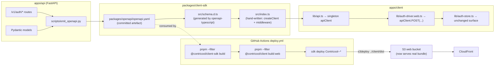

# Phase 2e — OpenAPI + Client SDK + Production Deploy — Design

**Complexity: MEDIUM.** Mostly mechanical (emit-from-FastAPI, generate-types,
swap-imports, flip-deploy), but it touches three workspaces (api, infra,
client) and one new package, and the swap has to land **without
breaking the 140 Phase 2d tests**.

## Overview

Phase 2e replaces Phase 2d's hand-rolled `lib/api.ts` + `lib/types.ts`
with a generated, schema-anchored TypeScript SDK, flips the production
web deploy from the Phase-1 placeholder to the Expo bundle, and adds
the CORS allowance that Phase 2d's local-dev test surfaced. The
end-state has FastAPI's request/response shapes as the **single source
of truth** for client types, and a `https://<dev-cf-domain>/` URL that
serves the working auth flow with no local running.

## High Level Design



## Section: OpenAPI emit

### `apps/api/scripts/emit_openapi.py`

```python
#!/usr/bin/env python
"""Emit packages/openapi/openapi.yaml from the FastAPI app.

Phase 2e: this script is the single source of truth for the client
SDK schema.  Re-run via `make openapi` whenever a route or model
changes; `make openapi-check` diffs and CI fails on drift.
"""
from __future__ import annotations
import os
import sys
from pathlib import Path

import yaml

# Skip the SSM cold-start fetch — emit doesn't need real config.
os.environ.setdefault("CONTRICOOL_SKIP_COLD_START_CONFIG", "1")

from app.main import app  # noqa: E402

OUTPUT = Path(__file__).resolve().parents[2] / "packages" / "openapi" / "openapi.yaml"


def main(check_only: bool = False) -> int:
    spec = app.openapi()
    # Strip server-list (origin-neutral spec) and add a description.
    spec.pop("servers", None)
    spec["info"]["description"] = (
        "ContriCool API — Phase 2c email-only auth backend "
        "(/v1/auth/*). Generated from FastAPI; do not hand-edit."
    )
    rendered = yaml.safe_dump(spec, sort_keys=True, indent=2, allow_unicode=True)
    if check_only:
        existing = OUTPUT.read_text() if OUTPUT.exists() else ""
        if existing != rendered:
            sys.stderr.write(
                "openapi.yaml drift detected. "
                "Run `make openapi` and commit the result.\n"
            )
            return 1
        return 0
    OUTPUT.parent.mkdir(parents=True, exist_ok=True)
    OUTPUT.write_text(rendered)
    return 0


if __name__ == "__main__":
    rc = main(check_only="--check" in sys.argv)
    sys.exit(rc)
```

### Makefile targets

```make
openapi: ## Regenerate openapi.yaml + client-sdk types
	cd apps/api && /home/oshogupta/workspace/master-venv/bin/python scripts/emit_openapi.py
	pnpm --filter @contricool/client-sdk build

openapi-check: ## Verify checked-in openapi.yaml matches API code
	cd apps/api && /home/oshogupta/workspace/master-venv/bin/python scripts/emit_openapi.py --check
```

### Drift check in CI

Replace the placeholder `openapi-check` job in `.github/workflows/ci.yml`:

```yaml
openapi-check:
  runs-on: ubuntu-latest
  steps:
    - uses: actions/checkout@v4
    - uses: actions/setup-python@v5
      with: { python-version: "3.12" }
    - name: Install API deps (for FastAPI import)
      run: pip install -e 'apps/api[dev]'
    - name: Drift check
      run: make openapi-check
```

The SDK type-regen runs in the `client` job (already present); the
drift check stays in its own job to keep the diff message clean.

### Lefthook pre-commit hook

Add to `lefthook.yml`:

```yaml
pre-commit:
  commands:
    openapi-regen:
      glob: "apps/api/app/features/**/*.py,apps/api/app/main.py"
      run: |
        make openapi
        git add packages/openapi/openapi.yaml packages/client-sdk/src/schema.d.ts
```

Backend changes auto-regenerate the spec + SDK types so the human
never has to remember.

## Section: Client SDK package

### File layout

```
packages/client-sdk/
├── package.json
├── README.md
├── tsconfig.json
└── src/
    ├── schema.d.ts        # generated by openapi-typescript (committed)
    ├── index.ts           # hand-written factory + middleware
    ├── errors.ts          # ApiError + ApiErrorException
    ├── middleware.ts      # bearer attach + envelope parse + 401 retry
    └── __tests__/
        ├── createClient.test.ts
        ├── middleware.test.ts
        └── errors.test.ts
```

### `package.json`

```json
{
  "name": "@contricool/client-sdk",
  "version": "0.0.1",
  "private": true,
  "type": "module",
  "main": "./src/index.ts",
  "types": "./src/index.ts",
  "exports": { ".": "./src/index.ts" },
  "scripts": {
    "clean": "rm -f src/schema.d.ts",
    "generate": "openapi-typescript ../openapi/openapi.yaml -o src/schema.d.ts",
    "build": "pnpm clean && pnpm generate",
    "test": "vitest run",
    "test:coverage": "vitest run --coverage"
  },
  "dependencies": {
    "openapi-fetch": "^0.13.0"
  },
  "devDependencies": {
    "@vitest/coverage-v8": "^2.1.8",
    "openapi-typescript": "^7.4.0",
    "typescript": "~5.6.3",
    "vitest": "^2.1.8"
  }
}
```

The package exports source `.ts` directly (no build step beyond
type-gen). Rationale: the consuming workspace (`apps/client`) is
already TS-aware via Metro/Vitest; building a separate `dist/` is
ceremony without benefit at MVP scale. Phase 7+ (when external
consumers exist) revisits.

### `src/errors.ts`

```ts
export type ApiErrorDetail = { field: string; issue: string };

export type ApiError = {
  code: string;
  message: string;
  request_id: string | null;
  details: ApiErrorDetail[];
  retry_after?: number;
  http_status: number;
};

export class ApiErrorException extends Error {
  readonly error: ApiError;
  constructor(error: ApiError) {
    super(`${error.code}: ${error.message}`);
    this.name = 'ApiErrorException';
    this.error = error;
  }
}
```

### `src/index.ts`

```ts
import createOpenapiClient, { type Middleware } from 'openapi-fetch';

import type { paths } from './schema';
import { authMiddleware } from './middleware';

export type { paths } from './schema';
export { ApiError, ApiErrorException } from './errors';

export type ClientOptions = {
  baseUrl: string;
  getAccessToken: () => string | null;
  onUnauthenticated: () => Promise<void> | void;
  onTokenRefreshed?: (tokens: { access_token: string; id_token: string }) => void;
};

export type ContricoolClient = ReturnType<typeof createOpenapiClient<paths>>;

export function createClient(opts: ClientOptions): ContricoolClient {
  const client = createOpenapiClient<paths>({
    baseUrl: opts.baseUrl,
    credentials: 'include',
  });
  client.use(authMiddleware(client, opts) as Middleware);
  return client;
}

// Friendly aliases for screen code (selected response/request shapes).
export type SignInResponse =
  paths['/auth/login']['post']['responses']['200']['content']['application/json'];
export type SignupResponse =
  paths['/auth/signup']['post']['responses']['202']['content']['application/json'];
export type RefreshResponse =
  paths['/auth/refresh']['post']['responses']['200']['content']['application/json'];
export type AuthUser = SignInResponse['user'];
export type Currency = AuthUser['currency'];
```

### `src/middleware.ts`

The middleware does three jobs in order:

```ts
import type { Middleware } from 'openapi-fetch';

import type { ClientOptions, ContricoolClient } from './index';
import { ApiErrorException, type ApiError } from './errors';

const RETRY_FLAG = '__contricool_no_retry__';

export function authMiddleware(
  client: ContricoolClient,
  opts: ClientOptions,
): Middleware {
  return {
    async onRequest({ request }) {
      // 1. Attach Authorization on non-/auth/ paths when we have a token.
      const url = new URL(request.url);
      const path = url.pathname.replace(/^.*\/v1/, '');
      if (!path.startsWith('/auth/')) {
        const t = opts.getAccessToken();
        if (t) request.headers.set('authorization', `Bearer ${t}`);
      }
      return request;
    },

    async onResponse({ request, response }) {
      // 2. 2xx pass-through (openapi-fetch parses JSON itself).
      if (response.ok) return response;

      // 3. 401 retry on non-/auth/ paths, when not already retrying.
      const url = new URL(request.url);
      const path = url.pathname.replace(/^.*\/v1/, '');
      const alreadyRetried = (request as Request & Record<string, unknown>)[RETRY_FLAG];
      if (
        response.status === 401 &&
        !path.startsWith('/auth/') &&
        !alreadyRetried
      ) {
        // Refresh — set the retry flag so the refresh response itself
        // doesn't trigger this branch.
        const refreshReq = new Request(`${request.url.replace(path, '/auth/refresh')}`, {
          method: 'POST',
          credentials: 'include',
        });
        Object.defineProperty(refreshReq, RETRY_FLAG, { value: true });
        const r = await fetch(refreshReq);
        if (r.ok) {
          const tokens = (await r.json()) as { access_token: string; id_token: string };
          opts.onTokenRefreshed?.(tokens);
          // Replay the original request with the new bearer.
          const replay = new Request(request, { headers: new Headers(request.headers) });
          replay.headers.set('authorization', `Bearer ${tokens.access_token}`);
          Object.defineProperty(replay, RETRY_FLAG, { value: true });
          return fetch(replay);
        }
        // Refresh failed — sign out, fall through to envelope parse.
        try { await opts.onUnauthenticated(); } catch { /* swallow */ }
      }

      // 4. Envelope parse → throw ApiErrorException.
      const apiError = await parseError(response);
      throw new ApiErrorException(apiError);
    },
  };
}

async function parseError(res: Response): Promise<ApiError> {
  let bodyText = '';
  try { bodyText = await res.clone().text(); } catch { /* */ }
  if (bodyText) {
    try {
      const parsed = JSON.parse(bodyText) as { error?: Partial<ApiError> };
      const e = parsed.error;
      if (e && typeof e.code === 'string' && typeof e.message === 'string') {
        return {
          code: e.code,
          message: e.message,
          request_id: e.request_id ?? null,
          details: e.details ?? [],
          ...(e.retry_after !== undefined ? { retry_after: e.retry_after } : {}),
          http_status: res.status,
        };
      }
    } catch { /* fall through */ }
  }
  return {
    code: 'NETWORK_ERROR',
    message: `Request failed with status ${res.status}`,
    request_id: null,
    details: [],
    http_status: res.status,
  };
}
```

### Why throw from middleware?

`openapi-fetch` returns `{data, error, response}`-style results by
default. We **throw** because:
1. Phase 2d's screens already use `try/catch` around `apiClient` calls.
2. Throwing keeps the screen's mental model: `await apiClient.POST(...)`
   returns the success body or throws — same as the prior `apiFetch`.
3. The driver layer (`auth-driver.web.ts`) wraps the result anyway.

### Trade-offs

| Choice | Picked | Pros | Cons |
|---|---|---|---|
| Generator | **`openapi-typescript` + `openapi-fetch`** | Tiny (~5 KB combined gz). Type-only generation; no runtime client code. | Less feature-rich than orval / openapi-generator. We don't need those features. |
| Output format | **`.ts` source, no build** | Simpler; no `tsup`/`tsc`-build cycle to maintain. | External consumers can't `import`; not a concern at MVP. |
| Retry semantics | **Throw on error** | Matches Phase 2d screen contract. No screen changes. | Diverges from openapi-fetch defaults — must document. |
| Refresh URL construction | **`request.url.replace(path, '/auth/refresh')`** | No second `baseUrl` plumbing. | Brittle if path-prefix logic changes — covered by N3. |

## Section: Expo client swap

### `apps/client/lib/api.ts` (new)

```ts
import { createClient } from '@contricool/client-sdk';

import { useAuthStore } from './auth-store';

export const apiClient = createClient({
  baseUrl: process.env.EXPO_PUBLIC_API_BASE_URL ?? '/v1',
  getAccessToken: () => useAuthStore.getState().accessToken,
  onUnauthenticated: async () => {
    useAuthStore.getState()._clear();
  },
  onTokenRefreshed: ({ access_token, id_token }) => {
    useAuthStore.getState()._setTokensFromRefresh(access_token, id_token);
  },
});

// Re-export for screens that previously imported from '~/lib/api'.
export { ApiError, ApiErrorException } from '@contricool/client-sdk';
```

The `setApiAuthAccessors` indirection from Phase 2d (which existed
to break the `lib/api.ts ↔ lib/auth-store.ts` import cycle) is no
longer needed: the SDK factory takes the closures as arguments at
module load.

### `apps/client/lib/types.ts` (shrunk)

```ts
import type {
  AuthUser,
  Currency,
  RefreshResponse,
  SignInResponse,
  SignupResponse,
} from '@contricool/client-sdk';

// Aliases / renames only — the SDK is the source of truth.
export type { AuthUser, Currency, RefreshResponse, SignInResponse as LoginResponse, SignupResponse };

// Local form-input shapes that the SDK doesn't expose as a single type.
export type SignupInput = {
  email: string;
  password: string;
  name: string;
  currency: Currency;
  phone?: string;
};

export type VerifyEmailInput = { email: string; code: string };
export type ResetPasswordInput = { email: string; code: string; new_password: string };
```

### `apps/client/lib/auth-driver.web.ts` (updated)

```ts
import { apiClient } from './api';
import type { AuthDriver } from './auth-driver-types';

export const webAuthDriver: AuthDriver = {
  signUp: async (input) => {
    const r = await apiClient.POST('/auth/signup', { body: input });
    return r.data!;  // middleware throws on error so data is set on success
  },
  signIn: async (input) => {
    const r = await apiClient.POST('/auth/login', { body: input });
    return r.data!;
  },
  // ... 6 more methods following the same pattern
};

export default webAuthDriver;
```

The non-null assertion is sound because the middleware throws on any
non-2xx — when we get here, `data` is always present.

### `apps/client/lib/auth-store.ts` (small change)

Add a public-by-convention `_setTokensFromRefresh` action so the SDK's
`onTokenRefreshed` callback can update the store without re-importing
`apiClient` (which would cycle):

```ts
_setTokensFromRefresh: (accessToken: string, idToken: string) => {
  const u = decodeIdToken(idToken);
  set({ accessToken, idToken, user: u });
},
```

Remove: the `setApiAuthAccessors` block at module bottom and the
`forceSignOut` / `getAccessToken` / `setTokensFromRefresh` accessor
plumbing. The SDK factory reads from / writes to the store directly.

## Section: CORS allowlist

### `api_stack.py` change

```python
# Phase 2e: cookie-based refresh requires `allow_credentials=True`,
# which the CORS spec forbids alongside `*` origin.  Strict allowlist:
cors_preflight=apigwv2.CorsPreflightOptions(
    allow_methods=[
        apigwv2.CorsHttpMethod.POST,
        apigwv2.CorsHttpMethod.GET,
        apigwv2.CorsHttpMethod.OPTIONS,
    ],
    allow_origins=[
        # Same-origin via CloudFront in production.
        f"https://{cloudfront_domain}",
        # Local Expo + Caddy-proxy ports for `pnpm dev:web`.
        "http://localhost:8081",
        "http://localhost:8082",
        "http://localhost:19006",
    ],
    allow_headers=[
        "authorization",
        "content-type",
        "idempotency-key",
        "if-match",
        "x-api-version",
    ],
    allow_credentials=True,
    expose_headers=["x-request-id", "retry-after"],
    max_age=Duration.minutes(10),
),
```

### Stack wiring

`api_stack.py` accepts a new constructor kwarg `cloudfront_domain:
str | None`. In `app.py`, after building `WebStack`, the value is
passed:

```python
api_stack = ApiStack(
    self,
    "Contricool-Dev-Api",
    ...,
    cloudfront_domain=web_stack.distribution.distribution_domain_name,
)
api_stack.add_dependency(web_stack)
```

The distribution-domain attribute is a CDK token at synth time, which
turns into a `Fn::GetAtt` in the synthesised template — CloudFormation
resolves it at deploy time. Synth tests assert the literal localhost
origins are present and that the production origin is referenced via
`Fn::Join`/`Fn::GetAtt`.

### Trade-off: stack circular dependency

WebStack depends on ApiStack (CloudFront origin → API Gateway).
ApiStack now needs the CloudFront domain. To avoid a CDK cycle:
- `WebStack.distribution_domain_name` is a `CfnOutput` already.
- `ApiStack` reads the domain via SSM at deploy time (`/contricool/<env>/cloudfront-domain`),
  written by the `deploy.yml` workflow's "Write dev CloudFront domain
  to SSM (idempotent)" step (Phase 1 already does this).

This means the CORS allowlist on the **first deploy** of a new env
won't yet have the production CloudFront origin. Mitigation:
- Phase 1's deploy.yml writes the SSM value after the first dev deploy.
- A `cdk deploy` after the SSM is populated picks up the value.
- The dev workflow already does dev → smoke → prod in a single run,
  so by the time prod deploys the dev SSM is set; prod gets its own
  SSM on its second deploy.
- For local-dev URLs we don't depend on SSM — those literals are
  always in the allowlist.

A simpler alternative: store the **prod CloudFront domain pattern**
(`d*.cloudfront.net`) as a literal in source. Rejected: tries to
match a pattern that the AWS account hasn't owned forever, and
breaks if AWS issues a new cert.

**Final decision**: API stack reads the CloudFront domain from SSM at
deploy time via `ssm.StringParameter.value_for_string_parameter`. On
the first deploy the parameter is missing — CDK falls back to a CFN
default of empty string, and the CORS list omits the origin (only
localhost dev is allowed). The deploy workflow's "Write CloudFront
domain to SSM" step (Phase 1) populates the parameter, and the next
deploy adds the prod origin. Documented in
`apps/infra/README.md`.

## Section: Production web deploy flip

### `web_stack.py` change

```python
# Phase 2e: serve the real Expo bundle, not the placeholder.
s3_deployment.BucketDeployment(
    self,
    "WebDeployment",
    sources=[s3_deployment.Source.asset("../client/dist")],
    destination_bucket=self.bucket,
    distribution=self.distribution,
    distribution_paths=["/*"],
    # SPA shell: index.html short-cache; hashed assets long-cache via
    # the per-file CacheControl block below.
    cache_control=[
        s3_deployment.CacheControl.set_public(),
        s3_deployment.CacheControl.max_age(Duration.minutes(5)),
    ],
)
```

For long-cached static assets (Expo emits content-hashed filenames in
`dist/_expo/static/*`), Phase 2e accepts the simpler "everything 5
minutes" approach. Phase 6 (observability) revisits with split
deployments per-prefix once we have real traffic data.

### `apps/client/static/` deletion

`git rm -r apps/client/static/` plus a one-line note in
`apps/client/README.md` "Phase 1 placeholder removed in 2e".

## Section: Deploy workflow update

### `.github/workflows/deploy.yml` additions

Before the existing dev `cdk deploy` step:

```yaml
- uses: pnpm/action-setup@v4
- uses: actions/setup-node@v4
  with:
    node-version: "22"
    cache: "pnpm"
- run: pnpm install --frozen-lockfile
- run: pnpm --filter @contricool/client-sdk build
- run: pnpm --filter @contricool/client build:web
- name: Verify bundle exists
  run: test -f apps/client/dist/index.html
- name: Bundle size gate
  working-directory: apps/client
  run: node scripts/check-bundle-size.mjs
```

The same block runs before the prod `cdk deploy`. Drift between dev
and prod bundle is impossible — the same `pnpm install --frozen-lockfile`
+ `build:web` runs both times.

### Smoke test upgrade

```yaml
- name: Curl SPA shell at /
  run: |
    set -euo pipefail
    body="$(curl -fsS https://${CF_DOMAIN}/)"
    echo "${body}" | grep -q '<script' || {
      echo "::error::Bundle shell missing — Phase-1 placeholder still served?"
      exit 1
    }
```

## Section: Testing strategy

### `packages/client-sdk` tests

`vitest` config at the package root, MSW-mocked server.

| Test | Asserts |
|---|---|
| `createClient.test.ts` — happy path | `client.POST('/auth/login', { body })` returns `data` shape on 200 |
| `middleware.test.ts` — bearer attach | `getAccessToken` value flows into Authorization header on non-/auth/ |
| `middleware.test.ts` — bearer skip on /auth/ | `/auth/login` request has no Authorization header |
| `middleware.test.ts` — 401 retry success | Refresh succeeds → `onTokenRefreshed` called → retry succeeds → returns data |
| `middleware.test.ts` — 401 retry then sign-out | Refresh also 401 → `onUnauthenticated` called → original 401 thrown |
| `middleware.test.ts` — no retry on /auth/* | login 401 surfaces directly, no refresh attempted |
| `middleware.test.ts` — recursion guard | Refresh response itself doesn't loop |
| `errors.test.ts` — envelope parse | Phase 2c envelope → `ApiErrorException` with all fields |
| `errors.test.ts` — raw HTML 5xx | `code='NETWORK_ERROR'` synthesised |
| `errors.test.ts` — empty body 5xx | `code='NETWORK_ERROR'` |

Coverage thresholds: 99% lines/funcs/stmts, 95% branches on `src/**`.

### `apps/client` regression strategy

The existing 140 tests must stay green. Where the SDK swap changes
call shapes:

- `__tests__/lib/api.test.ts` — **replaced** by an integration test
  that imports `apiClient` and asserts the behaviours through it
  (largely the same MSW handlers, different invocation shape).
- `__tests__/lib/auth-driver.web.test.ts` — minimal change: assertion
  bodies now check for SDK-shaped calls but the test logic is
  unchanged.
- `__tests__/lib/auth-store.test.ts` — small adjustment to the
  401-retry integration test (uses the new `_setTokensFromRefresh`
  action).
- All 5 screen tests + dashboard test + boot test — **zero diff**
  expected. The contract is preserved.

### Synth tests

`apps/infra/tests/test_synth.py` adds:

```python
def test_api_stack_phase2e_cors_credentials_with_strict_origins(...):
    """allow_credentials=true requires a strict origin list (no `*`)."""
    template = _api_stack_template("dev", cdk_env)
    apis = template.find_resources("AWS::ApiGatewayV2::Api")
    (api_props,) = apis.values()
    cors = api_props["Properties"]["CorsConfiguration"]
    assert cors.get("AllowCredentials") is True
    origins = cors["AllowOrigins"]
    assert "*" not in origins
    assert "http://localhost:8081" in origins
    assert "http://localhost:19006" in origins

def test_web_stack_phase2e_serves_dist_not_static(...):
    """Bundle deployment source path must be ../client/dist."""
    # Asset hashing makes path matching fragile — assert via the
    # construct's source asset metadata instead.
    ...
```

## Section: Risks & mitigations

| Risk | Likelihood | Mitigation |
|---|---|---|
| `openapi-typescript` produces shapes the screens choke on | Low | Manual smoke + 140 existing tests cover almost every shape used |
| `BucketDeployment` cache-control breaks long-cache for hashed assets | Medium | Default 5-min cache acceptable at MVP scale; Phase 6 revisits |
| First-deploy SSM-empty CORS list omits prod origin | Low | Documented in apps/infra/README.md; second deploy fixes it |
| `lefthook` openapi auto-regen surprises a developer mid-commit | Low | Hook only fires when staged files match the glob; the regen is fast (~1s) and the diff is small |
| openapi-fetch's middleware API changes | Low | Pin to ^0.13.x; the API has been stable since v0.10 |

## Section: Implementation phasing (matches `tasks.md`)

Five phases, each ends with green tests + lint clean:

1. **OpenAPI emit + drift check** — script, Makefile, CI job. Output:
   committed `openapi.yaml`, drift-test passes locally and in CI.
2. **SDK package skeleton** — package.json, schema gen, errors,
   index, middleware. Output: `pnpm --filter @contricool/client-sdk
   test` passes with 99% coverage.
3. **Expo client swap** — replace `lib/api.ts` and `lib/types.ts`,
   adjust `auth-store.ts` and `auth-driver.web.ts`. Output: all 140
   client tests still green.
4. **CORS + WebStack flip** — `api_stack.py` CORS, `web_stack.py`
   source path, delete `apps/client/static/`, synth tests. Output:
   `cd apps/infra && pytest` green; `cdk synth` clean.
5. **Deploy workflow + docs + final pass** — pre-build steps,
   smoke-test upgrade, READMEs, EXECUTION_PLAN. Output: PR ready.

## Summary

Phase 2e turns FastAPI's request/response shapes into the single
source of truth for the client via a generated `@contricool/client-sdk`
(types from `openapi-typescript`, runtime from `openapi-fetch`, ~5 KB
gz combined), behind a `createClient` factory whose middleware
preserves Phase 2d's 401-refresh-retry-once contract. The Expo
client's `lib/api.ts` shrinks to a singleton factory call; screens
and tests survive untouched. The production web deploy flips from
the Phase-1 placeholder to the real Expo bundle, adding
`apps/client/dist` to the existing S3 deployment; the deploy workflow
pre-builds the SDK + bundle before `cdk deploy`. CORS gains a strict
allowlist that includes the production CloudFront origin (via SSM)
plus local-dev `localhost:8081/8082/19006` with credentials. The
phase ships as a single PR; 12 negative tests cover drift, retry
recursion guards, and synth-level regressions.
