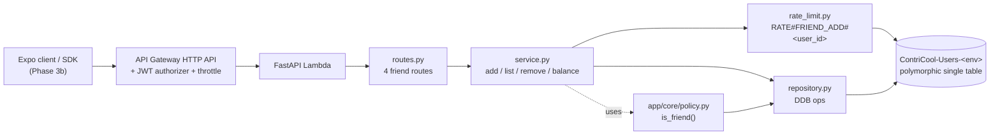
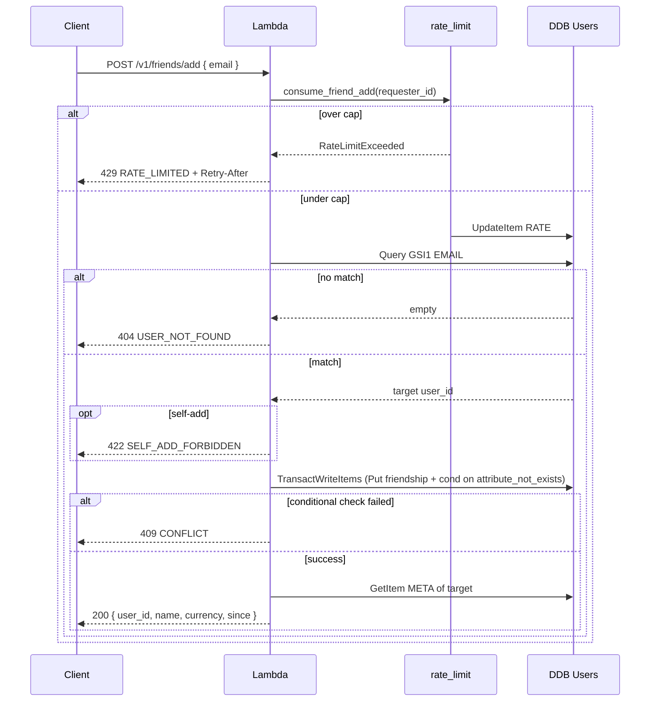

# Phase 3a — Friends Backend — Design

**Complexity: MEDIUM.** Four endpoints on top of an existing data
model. Most of the cleverness lives in (1) the merge-sort pagination
across the polymorphic GSI1, (2) the requester-bound HMAC-signed
cursor, and (3) the rate-limit row pattern that doesn't open a
zero-cost enumeration vector.

## Overview

Phase 3a delivers the friends backend: four routes, ~600 lines of
production code, ~30 tests, ~99% coverage. No new DDB table — the
canonical-pair friendship row is already reserved in Design 7. No
new package. The only CDK delta is adding `POST /v1/friends/add` to
the per-route throttle list.

## High Level Design





## File layout

```
apps/api/app/features/friends/
├── __init__.py
├── README.md
├── errors.py               # FriendError class hierarchy + handler
├── models.py               # Pydantic request/response shapes
├── repository.py           # DDB operations only (Query, BatchGet, TransactWrite, Delete, UpdateItem)
├── rate_limit.py           # consume_friend_add — mirrors auth/rate_limit.py
├── service.py              # business logic; orchestrates rate_limit + repository + policy
├── routes.py               # FastAPI router (4 routes)
└── cursor.py               # HMAC-signed cursor encode/decode

apps/api/tests/features/friends/
├── conftest.py             # seeded_user, seeded_friendship fixtures
├── test_add.py             # add-friend positive + N1–N10
├── test_list.py            # list-friends positive + N11–N16
├── test_remove.py          # remove-friend positive + N17–N20
├── test_balance.py         # balance positive + N21–N24
├── test_cross_user_privacy.py  # N25–N28
└── test_friends_security.py    # log redaction + cursor forgery
```

## Data model

All rows live on `ContriCool-Users-<env>`. Schema already documented
in Design 7; this section pins the exact attribute names used by 3a.

### Friendship row

| Field | Value | Notes |
|---|---|---|
| `PK` | `USER#<min(a,b)>` | canonical pair |
| `SK` | `FRIEND#<max(a,b)>` | |
| `GSI1PK` | `USER#<max(a,b)>` | inverse pivot for the merge query |
| `GSI1SK` | `FRIEND#<min(a,b)>` | |
| `created_by` | `<requester_id>` | who clicked Add (audit) |
| `created_at` | ISO-8601 | |

### Rate-limit row

| Field | Value | Notes |
|---|---|---|
| `PK` | `RATE#FRIEND_ADD#<requester_id>` | |
| `SK` | `COUNTER` | |
| `attempts_hour` | int | |
| `hour_window_started_at` | int (epoch seconds) | |
| `ttl` | int (epoch seconds, +24h) | DDB TTL |

The TTL on `+24h` not `+1h` so a rolling-window reset doesn't lose
the row mid-spam attack — the conditional update rolls the window
in-place.

## Section: Cursor — encoding, signing, requester binding

The list-friends cursor encodes one piece of state — the last
friend-user-id we returned — and binds it to the requester so a
cursor leaked or guessed by another user is rejected.

### Format

```
base64url( payload "." hmac_sha256(payload, pii_salt) )
```

where `payload = "<requester_id>:<last_friend_id>"`.

- The same SSM `/contricool/<env>/pii-salt` SecureString that the
  email lookup-hash uses (Phase 2c) is the cursor signing key. No
  new SSM parameter, no new IAM grant.
- A cursor is bound to **the requester's user_id at issue time**.
  Decoding for User A but presented by User B → HMAC mismatch → 422.
- A cursor is **not time-bound** at MVP. Phase 6+ revisits if user
  growth makes long-lived cursors a concern.

### `cursor.py` API

```python
def encode(*, requester_id: str, last_friend_id: str) -> str: ...
def decode(*, cursor: str, requester_id: str) -> str:
    """Returns the last_friend_id; raises InvalidCursorError on
    tamper / cross-user / malformed input."""
```

`InvalidCursorError` becomes `422 INVALID_CURSOR` at the route layer.

## Section: List-friends merge-sort pagination

Friendships are split across the base index and GSI1 by canonical
pair (a friend's user_id is on one side iff it's larger than the
requester's, on the other iff smaller). To return a single sorted
list to the client, the service merges both sides.

### Algorithm

```
last_id = cursor.last_friend_id if cursor else "00000000000000000000000000"  # ULID min
fetch_limit = limit + 1   # one-past lookahead so we can build a cursor

# Query 1 — friends with user_id > requester
base_resp = ddb.query(
    KeyConditionExpression = "PK = :pk AND SK > :sk",
    ExpressionAttributeValues = {":pk": f"USER#{requester_id}", ":sk": f"FRIEND#{last_id}"},
    Limit = fetch_limit,
)

# Query 2 — friends with user_id < requester
gsi_resp = ddb.query(
    IndexName = "GSI1",
    KeyConditionExpression = "GSI1PK = :pk AND GSI1SK > :sk",
    ExpressionAttributeValues = {":pk": f"USER#{requester_id}", ":sk": f"FRIEND#{last_id}"},
    Limit = fetch_limit,
)

# Merge sort by friend_id ascending
candidates = sorted(extract_ids(base_resp) + extract_ids(gsi_resp))

# Slice
items = candidates[:limit]
has_more = len(candidates) > limit OR base_resp.LastEvaluatedKey OR gsi_resp.LastEvaluatedKey
next_cursor = encode_cursor(requester_id, items[-1]) if has_more and items else None

# Hydrate with name + currency from the META rows
metas = batch_get_user_metas(items)

return ListFriendsResponse(
    items = [FriendItem(user_id=fid, name=meta.name, currency=meta.currency, since=...) for fid in items],
    next_cursor = next_cursor,
)
```

### Why fetch_limit = limit + 1

Without the lookahead we couldn't tell whether a `limit`-sized result
is a complete page or a truncated one — both look the same from the
caller's perspective. The +1 lets us emit a cursor only when there's
genuinely more to read.

### Edge: what about `since` (friendship-creation timestamp)?

The friendship row carries `created_at`, but the merge fetch only
keeps the `friend_id` (the SK suffix). We have two options:

| Option | How |
|---|---|
| **A. Keep the friendship row in the merge** | Carry `(friend_id, created_at)` tuples through the sort; emit `since` directly. Two queries return `Items` already, no extra cost. |
| B. Re-query `created_at` per friend | Extra DDB calls per page. |

**Picked: A.** The Query already returns full items; no extra read.
The implementation just needs to remember which side each candidate
came from to pull the `created_at` attribute from the right object.

### Edge: BatchGetItem 100-item cap

`limit` ≤ 100 → at most 100 friend ids → one `BatchGetItem` call.
No splitting needed at MVP. Phase 6+ revisits if we ever need
limit > 100.

## Section: Add-friend — the rate-limit-before-lookup invariant

The rate-limit increment **must** precede the GSI1 email lookup.
If we incremented only on success, an attacker with no account info
could spam `/add` with random emails and the bucket would never fill —
turning the endpoint into a free email-existence oracle.

```python
def add_friend(requester_id: str, email: str) -> AddFriendResponse:
    # 1. Validate (Pydantic + manual)
    if not _is_valid_email_strict(email):
        raise InvalidIdentifierError()  # also catches phone-shaped strings

    # 2. Rate-limit ALWAYS first — pre-emptive, success-blind.
    rate_limit.consume_friend_add(requester_id)

    # 3. Resolve target by email-hash GSI1 lookup
    target_user_id = repository.find_user_by_email(email)
    if target_user_id is None:
        raise UserNotFoundError()

    # 4. Self-check
    if target_user_id == requester_id:
        raise SelfAddForbiddenError()

    # 5. Bilateral write with cond=attribute_not_exists
    repository.create_friendship(requester_id, target_user_id)

    # 6. Read target's META for the response shape
    meta = repository.get_user_meta(target_user_id)
    return AddFriendResponse(...)
```

Trade-off table:

| Option | Pros | Cons |
|---|---|---|
| **Rate-limit first (chosen)** | Closes the email-enumeration oracle. 30 attempts/hour is plenty for legitimate adds — a real user will never hit the cap. | Slight inefficiency on a successful add (one extra DDB UpdateItem). |
| Rate-limit on failure only | Avoids the extra DDB write on success. | Opens the enumeration oracle. Rejected. |
| Rate-limit on success only | Same as above. Rejected. |

## Section: `is_friend` policy helper

Phase 4 transactions need to gate "you can only include friends as
members" — this is the natural call-site. Centralising the check in
`policy.py` means Phase 4 doesn't reach into the friends repository
directly.

```python
# app/core/policy.py
def is_friend(user_id: str, other_user_id: str) -> bool:
    """True iff the two users have an active friendship."""
    if user_id == other_user_id:
        return False  # never your own friend
    min_id, max_id = sorted([user_id, other_user_id])
    item = ddb.get_item(
        TableName=config.users_table_name,
        Key={"PK": f"USER#{min_id}", "SK": f"FRIEND#{max_id}"},
        ProjectionExpression="PK",
    )
    return "Item" in item
```

Phase 3a tests the helper directly. Phase 4 reuses it.

## Section: API surface

### `POST /v1/friends/add`

Request:
```json
{ "email": "alice@example.com" }
```

Response 200:
```json
{
  "user_id": "01J...",
  "name": "Alice",
  "currency": "USD",
  "since": "2026-04-29T20:01:45Z"
}
```

Errors: 400 `INVALID_IDENTIFIER`, 401 (auth), 404 `USER_NOT_FOUND`,
409 `CONFLICT`, 422 `SELF_ADD_FORBIDDEN` / `VALIDATION_ERROR`,
429 `RATE_LIMITED`, 500 `INTERNAL`.

### `GET /v1/friends`

Query: `limit` (1..100, default 50), `cursor` (opaque).

Response 200:
```json
{
  "items": [
    { "user_id": "...", "name": "...", "currency": "USD", "since": "..." }
  ],
  "next_cursor": "..." | null
}
```

Errors: 401, 422 `VALIDATION_ERROR` / `INVALID_CURSOR`.

### `DELETE /v1/friends/{user_id}`

204 on success; 401, 404 `USER_NOT_FOUND`, 422 `SELF_ACTION_FORBIDDEN`
/ `VALIDATION_ERROR`.

### `GET /v1/friends/{user_id}/balance`

Response 200:
```json
{
  "user_id": "01J...",
  "currency": "USD",
  "net": "0.00",
  "settlement_status": "settled",
  "last_transaction_at": null
}
```

Errors: 401, 404 `USER_NOT_FOUND`, 422 `SELF_ACTION_FORBIDDEN` /
`VALIDATION_ERROR`.

## Section: Error shape (reused from Phase 2c)

All errors flow through `app/core/errors.py`'s envelope handler,
producing the Phase 2c shape:

```json
{
  "error": {
    "code": "...",
    "message": "...",
    "request_id": "...",
    "details": [],
    "retry_after": 60
  }
}
```

The friend feature's `errors.py` module is intentionally tiny — it
declares the per-error classes (`InvalidIdentifierError`,
`UserNotFoundError`, `ConflictError`, `SelfAddForbiddenError`,
`SelfActionForbiddenError`, `InvalidCursorError`, `RateLimitedError`)
each subclassing the shared `AuthError` base from Phase 2c (renamed
to `ApiError` if cleaner — to be decided during implementation).

## Section: Pydantic models (`models.py`)

```python
class AddFriendRequest(BaseModel):
    model_config = ConfigDict(extra="forbid")
    email: EmailStr

class FriendItem(BaseModel):
    user_id: str
    name: str
    currency: Literal["USD", "INR"]
    since: AwareDatetime

class AddFriendResponse(FriendItem):
    pass

class ListFriendsQuery(BaseModel):
    limit: Annotated[int, Field(ge=1, le=100)] = 50
    cursor: str | None = None

class ListFriendsResponse(BaseModel):
    items: list[FriendItem]
    next_cursor: str | None

class FriendBalanceResponse(BaseModel):
    user_id: str
    currency: Literal["USD", "INR"]
    net: Decimal
    settlement_status: Literal["settled", "friend_owes", "you_owe"]
    last_transaction_at: AwareDatetime | None
```

## Section: CDK delta

Only one infra change:

```python
# api_stack.py — _ROUTE_THROTTLES
_ROUTE_THROTTLES: dict[str, dict[str, int]] = {
    "POST /v1/auth/login": {"ThrottlingRateLimit": 5, "ThrottlingBurstLimit": 10},
    "POST /v1/auth/resend-email-code": {"ThrottlingRateLimit": 1, "ThrottlingBurstLimit": 5},
    "POST /v1/auth/forgot-password": {"ThrottlingRateLimit": 1, "ThrottlingBurstLimit": 5},
    # Phase 3a:
    "POST /v1/friends/add": {"ThrottlingRateLimit": 1, "ThrottlingBurstLimit": 5},
}
```

The throttled-route DependsOn machinery from PR #16 takes care of
the deploy ordering automatically.

IAM verify (no change expected, but synth tests assert):
- `dynamodb:Query` already on Users table + `<UsersTableArn>/index/GSI1`.
- `dynamodb:GetItem`, `BatchGetItem`, `PutItem`, `UpdateItem`, `DeleteItem`,
  `TransactWriteItems` on Users table ARN.

## Section: Test strategy

Coverage floor 99% on `friends/**`. Tests use moto for DDB.

| Test file | Cases |
|---|---|
| `test_add.py` | happy + N1, N2, N3, N4, N5, N6, N9 |
| `test_list.py` | empty, 1-page, multi-page, cursor walk, base-only, GSI1-only, mixed; N11–N15 |
| `test_remove.py` | happy, N17, N18, N19 |
| `test_balance.py` | happy (returns 0), N21, N22, N23 |
| `test_cross_user_privacy.py` | N25, N26, N27, N28 (concurrent-add via mocked TransactWriteItems failure) |
| `test_friends_security.py` | N7, N8, N10 (log redaction), N16, N20, N24, cursor forgery (N14) |
| `test_cursor.py` | encode/decode round-trip, tamper detection, cross-user binding |
| `test_policy_is_friend.py` | true/false/self cases |

Synth test additions in `apps/infra/tests/test_synth.py`:
- N29: assert no `dynamodb:Scan` on Users table in api_stack policies.
- N30: assert no `dynamodb:*` on any resource.
- N31: assert `POST /v1/friends/add` is in the route-settings throttle map.

## Section: Open questions resolved

1. **Rate-limit before or after lookup?** → Before (enumeration defense).
2. **Cursor signed?** → Yes, HMAC with the existing pii-salt; binds to
   requester_id.
3. **`since` from friendship row or re-query?** → Use the row already
   in hand from the merge query. No extra DDB cost.
4. **`is_friend` lives where?** → `app/core/policy.py` (Phase 4 reuses).
5. **`USER_NOT_FOUND` for both "no such user" and "no such friendship"?**
   → Yes (uniform client mapping; semantic ambiguity is acceptable
   because the privacy story requires it — see N25).
6. **Friend lists private?** → Yes, no endpoint at any level reveals
   another user's friends.

## Implementation phasing (matches `tasks.md`)

Six phases, each ends with green tests + lint clean:

1. **Models + cursor** — `models.py`, `cursor.py`, tests for both.
2. **Repository** — DDB ops + tests against moto.
3. **Rate-limit** — `rate_limit.py` + tests.
4. **Service + policy helper** — orchestration + `app/core/policy.py`
   `is_friend()` + tests.
5. **Routes + error mapping** — FastAPI router + integration tests
   covering all 4 endpoints + N1–N28.
6. **CDK throttle + synth tests + OpenAPI regen + docs + final pass**.

## Summary

Phase 3a delivers four endpoints, ~600 lines, ~30 tests, ~99%
coverage, on top of the existing Phase 2 surface. Key invariants
worth preserving across future changes: rate-limit precedes lookup
(enumeration defense), cursor is requester-bound (privacy), friend
lists are caller-only (privacy), `is_friend` is the single source of
truth for friendship checks (Phase 4 reuse). Phase 3b consumes the
regenerated SDK to build the friends UI.
