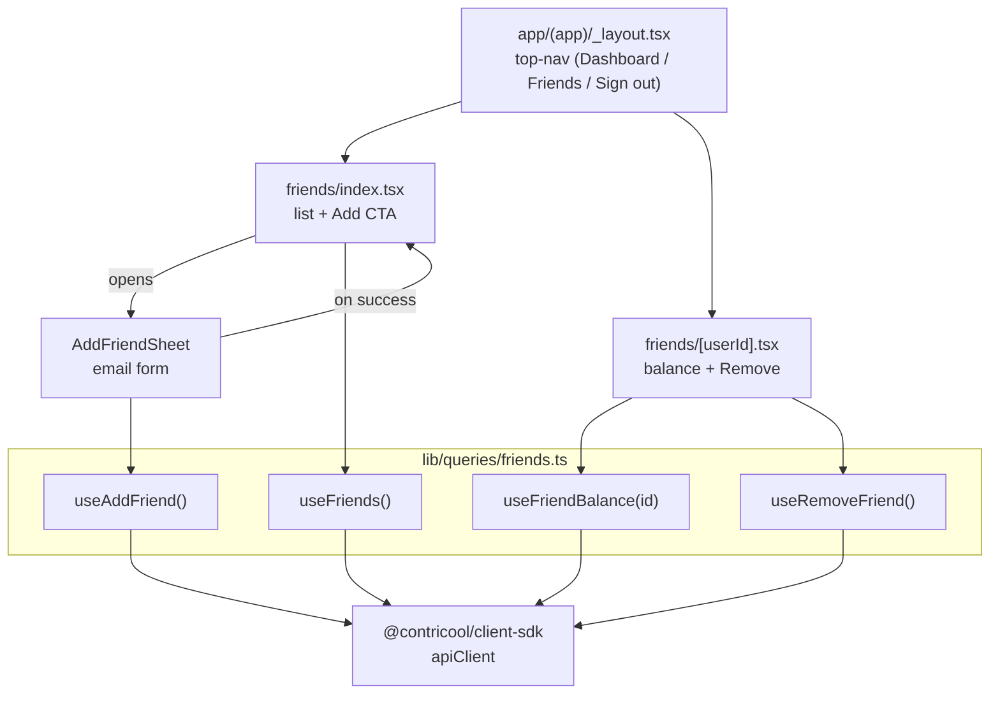
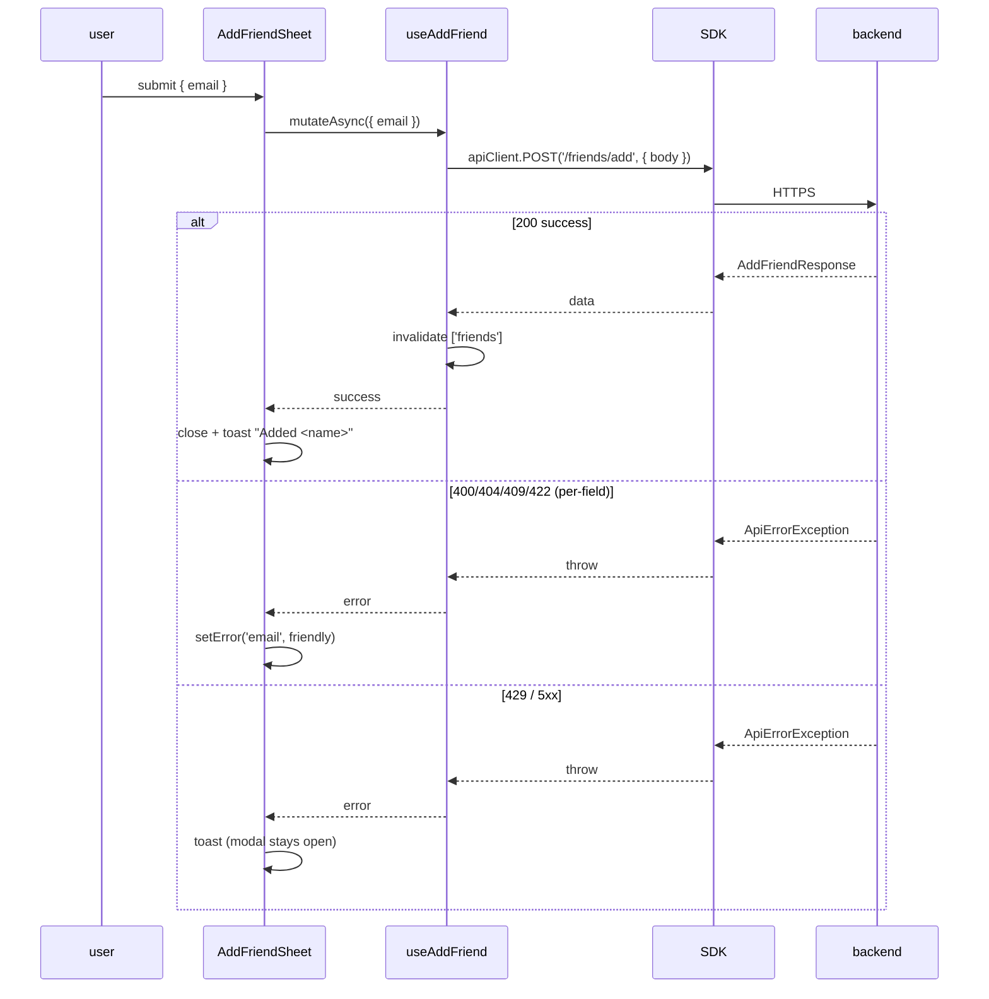

# Phase 3b — Friends Client UI — Design

**Complexity: SIMPLE-to-MEDIUM.** Four screens / one modal / four
TanStack Query hooks consuming an already-generated SDK. Mostly
mechanical glue + tests.

## Overview

Phase 3b ships the friends UX on top of the Phase 3a backend. Single
codebase compiles for web today and native tomorrow. Tokens / cookies
/ auth flow are unchanged from Phase 2d/2e — friends just becomes
another authenticated routes group.

## High Level Design



## File layout

```
apps/client/
├── app/(app)/
│   ├── _layout.tsx                       # add top-nav links
│   └── friends/
│       ├── index.tsx                     # list page
│       └── [userId].tsx                  # detail page
├── components/
│   ├── ui/Sheet.tsx                      # bottom-sheet primitive (new)
│   └── friends/
│       └── AddFriendSheet.tsx            # form
├── lib/
│   ├── queries/
│   │   └── friends.ts                    # TanStack Query hooks
│   ├── types.ts                          # add aliases
│   └── schemas.ts                        # add AddFriendSchema
└── __tests__/app/friends/
    ├── list.test.tsx
    ├── detail.test.tsx
    ├── add-friend-sheet.test.tsx
    └── nav.test.tsx
```

## Section: Friend list page (`friends/index.tsx`)

Three states only:

| State | Trigger | UI |
|---|---|---|
| Loading | `useFriends().isLoading` | full-page Spinner |
| Empty | `data.items.length === 0` | empty card with CTA |
| Populated | `data.items.length > 0` | sorted list + persistent CTA |
| Error | `useFriends().error` | banner + retry |

Sort is alphabetical by `name` (case-insensitive). The SDK already
returns items in `user_id` ascending; we re-sort client-side on
display because user_id ordering isn't human-meaningful.

Tap on a row → `router.push({ pathname: '/friends/[userId]', params: { userId } })`.

## Section: Add-friend modal (`AddFriendSheet.tsx`)

Backed by react-native-reusables' Sheet primitive. The sheet wraps a
React Hook Form bound to the `AddFriendSchema`:

```ts
const AddFriendSchema = z.object({
  email: z.string().trim().min(1, 'Required'),
});
```

Why lenient `string` and not `email()` — Phase 3a's contract returns
**400 `INVALID_IDENTIFIER`** for phone-shapes and **422
`VALIDATION_ERROR`** for malformed emails. Doing client-side
validation in Zod would coalesce both into a single client-side error
message, losing the distinction. Letting the server speak is simpler
and matches the spec.

Submit flow:



### Error → field-message map

| Error code | Action |
|---|---|
| `INVALID_IDENTIFIER` (400) | field error: "Friends are added by email only — phones aren't supported yet." |
| `VALIDATION_ERROR` (422) | field error from `details[0].issue` |
| `USER_NOT_FOUND` (404) | field error: "We couldn't find anyone with that email." |
| `CONFLICT` (409) | field error: "You're already friends." |
| `SELF_ADD_FORBIDDEN` (422) | field error: "You can't add yourself." |
| `RATE_LIMITED` (429) | toast: "Too many attempts — try again in N seconds." |
| `NETWORK_ERROR` / 5xx | toast: "Something went wrong. Please try again." |

## Section: Friend detail page (`friends/[userId].tsx`)

Reads `userId` from `useLocalSearchParams`. Two queries:

1. `useFriends()` — uses cached friend list to render `name +
   currency` instantly (no spinner). Falls back to "—" if cache is
   cold.
2. `useFriendBalance(userId)` — separate fetch for the balance card.

Layout:

```
┌────────────────────────────────────────┐
│ Welcome, Alice  [USD]                  │
│                                        │
│ ┌────────────────────────────────────┐ │
│ │            Settled                 │ │
│ │         (0.00 USD)                 │ │
│ │ last activity: —                   │ │
│ └────────────────────────────────────┘ │
│                                        │
│ [ Settle up ]  (coming soon)           │
│ [ Remove friend ]  (destructive)       │
└────────────────────────────────────────┘
```

Remove flow: confirm dialog → `useRemoveFriend()` mutation →
on success `router.back()` + toast. Cache invalidations:

- `['friends']` query.
- `['friend-balance', userId]` cleared.

## Section: TanStack Query hooks (`lib/queries/friends.ts`)

```ts
import { useMutation, useQuery, useQueryClient } from '@tanstack/react-query';

import { apiClient, ApiErrorException } from '~/lib/api';

export const friendsKeys = {
  all: ['friends'] as const,
  list: (limit: number) => ['friends', { limit }] as const,
  balance: (userId: string) => ['friend-balance', userId] as const,
};

export function useFriends() {
  return useQuery({
    queryKey: friendsKeys.list(50),
    queryFn: async () => {
      const r = await apiClient.GET('/friends', {
        params: { query: { limit: 50 } },
      });
      return r.data!;
    },
    staleTime: 30_000,
  });
}

export function useFriendBalance(userId: string) {
  return useQuery({
    queryKey: friendsKeys.balance(userId),
    queryFn: async () => {
      const r = await apiClient.GET('/friends/{user_id}/balance', {
        params: { path: { user_id: userId } },
      });
      return r.data!;
    },
    staleTime: 0,
    enabled: !!userId,
  });
}

export function useAddFriend() {
  const qc = useQueryClient();
  return useMutation({
    mutationFn: async (input: { email: string }) => {
      const r = await apiClient.POST('/friends/add', { body: input });
      return r.data!;
    },
    onSuccess: () => qc.invalidateQueries({ queryKey: friendsKeys.all }),
  });
}

export function useRemoveFriend() {
  const qc = useQueryClient();
  return useMutation({
    mutationFn: async (userId: string) => {
      await apiClient.DELETE('/friends/{user_id}', {
        params: { path: { user_id: userId } },
      });
    },
    onSuccess: (_data, userId) => {
      qc.invalidateQueries({ queryKey: friendsKeys.all });
      qc.removeQueries({ queryKey: friendsKeys.balance(userId) });
    },
  });
}
```

The `r.data!` non-null assertion is sound because Phase 2e's SDK
middleware throws `ApiErrorException` on any non-2xx response;
TanStack Query catches the throw into `error`.

## Section: Top-bar nav update (`(app)/_layout.tsx`)

The Phase 2d layout had only "Welcome, X" + Sign-out. We add a
two-link nav.

Pseudo-code (NativeWind classNames):

```tsx
<View className="flex-row items-center justify-between p-4 border-b">
  <View className="flex-row gap-4">
    <NavLink to="/dashboard">Dashboard</NavLink>
    <NavLink to="/friends">Friends</NavLink>
  </View>
  <View className="flex-row items-center gap-2">
    <Text>{user.name}</Text>
    <Button onPress={onSignOut} variant="ghost">Sign out</Button>
  </View>
</View>
```

`NavLink` is a thin Link wrapper that adds an active-styling class
based on `usePathname()`. Live as a small new primitive in
`components/ui/NavLink.tsx`.

## Section: Sheet primitive

`react-native-reusables` ships a Sheet but it's heavyweight (depends
on reanimated). For Phase 3b we ship a thin Modal-shaped fallback:
NativeWind-styled `<View>` with `position: absolute` + a backdrop +
a slide-up animation we deliberately skip until Phase 4 (no animation
is fine for an MVP modal).

```
┌───────────────────────────────────────┐
│              [X]                      │
│  Add friend                           │
│                                       │
│  Email:  [_________________________]  │
│                                       │
│         [ Cancel ]  [ Add friend ]    │
└───────────────────────────────────────┘
```

## Section: Test strategy

Same patterns as Phase 2d screen tests:

- Render with TanStack Query provider + mocked router (`_router-mock.tsx`).
- Mock the SDK calls via MSW (per-test handlers override the defaults).
- Spy on `router.push` / `router.back` for navigation assertions.
- Assert N1–N16 from requirements.md.

Coverage threshold continues to enforce 99% on `lib/**` and 80% on
`app/**` + `components/**`.

## Section: Risks

| Risk | Mitigation |
|---|---|
| The Sheet primitive grows complexity creep | Ship the simplest possible modal — overlay + close button. Animations ship later. |
| TanStack Query `useInfiniteQuery` complexity | Defer entirely; single-page works at MVP scale. Hook is shaped to upgrade later. |
| Field-error mapping diverges from backend codes | Centralise the map in `lib/error-mapping.ts` (already exists from Phase 2d) and add a test that exercises every code. |
| Bundle-size regression | Existing budget gate; incremental adds are < 10 KB gz. |

## Section: Implementation phasing (matches `tasks.md`)

Five phases, each ends green:

1. **Sheet + NavLink primitives** + tests.
2. **Schema + types** + Query hooks + tests.
3. **Friend list page** + tests (incl. N9–N11).
4. **Add-friend modal** + tests (N1–N8).
5. **Friend detail page** + nav + tests (N12–N16) + final pass + PR.

## Summary

Phase 3b is mostly mechanical glue: four screens / one modal / four
hooks / centralised query keys. The Phase 3a contract handles all
the privacy / rate-limit / enumeration concerns server-side; the
client just renders shapes and maps codes to friendly copy. Phase
3b's PR is open after a single coding sitting; Phase 4 fills in real
balance numbers and the "settle up" path without touching either
friends screen's structure.
