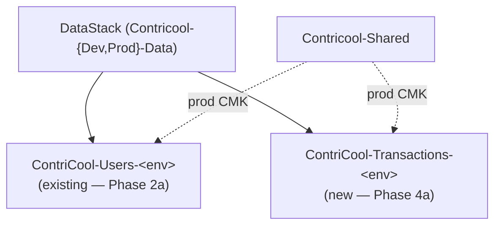
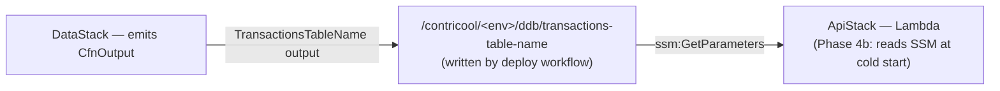

# Phase 4a — Transactions DDB Table — Design

**Complexity: SIMPLE.**

This is an additive CDK change: one more `dynamodb.Table` construct inside
the existing `DataStack`, configured to mirror the Users-table conventions
already in place. No new stacks, no new Lambdas, no new buckets, no new
KMS keys. The interesting design work — key choices, GSI projection,
access patterns — was settled in `specs/07-database-data-model/design.md`
and is referenced inline rather than re-derived here.

## Overview

Phase 4a's job is to land the second of the two DynamoDB tables defined in
Design 7. The first table (`Users`) shipped in Phase 2a; this phase is its
twin for the financial ledger.

## High-Level Design



The wiring path Phase 4b will add (greyed out for now):



## Schema (recap from Design 7)

This phase doesn't redefine the schema — it implements it. Pulled forward
here for reviewer convenience:

| Item type | PK | SK | GSI1PK | GSI1SK | Notes |
|---|---|---|---|---|---|
| Transaction META | `TXN#<txn_id>` | `META` | — | — | creator_id, name, type, amount, currency, txn_date, split_method, note, created_at, updated_at, deleted_at, **`payers: [{user_id, paid_amount}, ...]`** |
| Transaction member | `TXN#<txn_id>` | `MEMBER#<user_id>` | `USER#<user_id>` | `TXN#<sortable_date>#<txn_id>` | owed_amount, share, percent |
| Transaction audit | `TXN#<txn_id>` | `AUDIT#<version_ulid>` | — | — | action, actor_id, at, snapshot |
| Idempotency | `IDEMPOTENCY#<user_id>#<key>` | `META` | — | — | TTL 24h, written by Powertools idempotency decorator |

**One GSI (`GSI1`)** indexes only the `MEMBER` rows so Pattern #8 ("list
my transactions, by date desc") is a single `Query` against
`GSI1PK = "USER#<me>"`. `ProjectionType.ALL` so the META fields needed for
list rendering (name, amount, currency, date) come back without a follow-up
`BatchGetItem`.

**TTL attr `ttl`**: only the `IDEMPOTENCY#` rows set it. META/MEMBER/AUDIT
rows leave it unset and are not auto-expired. A 30-day soft-delete restore
window is enforced in application code, not via TTL — the row stays alive
indefinitely and `deleted_at` is the only signal.

## CDK Implementation

### `DataStack` change

Add a second `dynamodb.Table` inside `DataStack.__init__`, immediately after
the Users table is defined. Reuse the same `encryption_kwargs` block (it
chooses CMK in prod, AWS-managed in dev). Lift it out of the Users-table
call site so both tables read from one variable rather than computing it
twice.

```python
self.transactions_table = dynamodb.Table(
    self,
    "TransactionsTable",
    table_name=f"ContriCool-Transactions-{env_name}",
    partition_key=dynamodb.Attribute(name="PK", type=dynamodb.AttributeType.STRING),
    sort_key=dynamodb.Attribute(name="SK", type=dynamodb.AttributeType.STRING),
    billing_mode=dynamodb.BillingMode.PAY_PER_REQUEST,
    time_to_live_attribute="ttl",
    point_in_time_recovery_specification=dynamodb.PointInTimeRecoverySpecification(
        point_in_time_recovery_enabled=is_prod,
    ),
    stream=dynamodb.StreamViewType.NEW_AND_OLD_IMAGES if is_prod else None,
    removal_policy=RemovalPolicy.RETAIN if is_prod else RemovalPolicy.DESTROY,
    deletion_protection=is_prod,
    **encryption_kwargs,
)

self.transactions_table.add_global_secondary_index(
    index_name="GSI1",
    partition_key=dynamodb.Attribute(name="GSI1PK", type=dynamodb.AttributeType.STRING),
    sort_key=dynamodb.Attribute(name="GSI1SK", type=dynamodb.AttributeType.STRING),
    projection_type=dynamodb.ProjectionType.ALL,
)
```

### CfnOutputs

```python
cdk.CfnOutput(self, "TransactionsTableName", value=self.transactions_table.table_name, ...)
cdk.CfnOutput(self, "TransactionsTableArn",  value=self.transactions_table.table_arn,  ...)
if is_prod:
    stream_arn = self.transactions_table.table_stream_arn
    assert stream_arn is not None, (
        "Prod Transactions table has Streams enabled but table_stream_arn "
        "is None — CDK lost the StreamSpecification."
    )
    cdk.CfnOutput(self, "TransactionsTableStreamArn", value=stream_arn, ...)
```

### `app.py`

No change required for 4a — the existing `data = DataStack(...)` call
covers both tables. The `transactions_table=data.transactions_table` kwarg
on the `ApiStack` call lands in Phase 4b along with the IAM grants.

### Public attributes on `DataStack`

```
self.users_table          # Phase 2a — existing
self.transactions_table   # Phase 4a — new
```

`ApiStack` (Phase 4b) will accept `transactions_table: dynamodb.ITable` as a
required kwarg, mirroring the existing `users_table` parameter.

## Trade-offs

### One stack vs. two stacks

**Decision**: keep both tables in the same `DataStack`.

| | One stack (chosen) | Two stacks (rejected) |
|---|---|---|
| Pros | Shared `encryption_kwargs` block; one KMS-grant boundary in prod; one PITR/Stream toggle to maintain; matches Design 7 mental model ("the data stack holds DDB tables"). | Tighter blast-radius if a redeploy fails on one table — the other isn't even synthesised. |
| Cons | A botched redeploy on one table can wedge the other in the same change set. | Two stacks for two tables is over-engineered for MVP — adds a `data_users_stack.py` + `data_transactions_stack.py` split with no operational benefit at our scale. |

**Why**: at MVP volume (single-account, ~30k transactions/year per Design 7
sizing) the operational benefit of stack separation is invisible. Splitting
when the project grows is a one-PR refactor; merging two stacks back into
one later would be a multi-PR migration. Default to the simpler shape.

### TTL on META/MEMBER rows

**Decision**: no TTL on META/MEMBER/AUDIT — only `IDEMPOTENCY#` rows have
`ttl` set.

We considered using TTL to enforce the 30-day soft-delete window
automatically (set `ttl = deleted_at + 30d` when soft-deleting). Rejected
because:

- TTL deletes are eventually consistent with up to 48-hour delay — the
  application would still need to filter by `deleted_at < now - 30d` on
  reads. Doing it twice is a foot-gun.
- TTL deletes do **not** fire DDB Streams MODIFY events; they fire DELETE
  events with the old image. The audit fan-out in Phase 6 would have to
  treat TTL-driven deletes specially. Application-level deletes after the
  30-day window keeps Streams clean.
- The financial-ledger is the kind of data we'd rather over-retain. If
  Phase 6 needs hard-delete-after-30-days, that's a deliberate nightly job,
  not a passive TTL.

### `ProjectionType.ALL` vs. `KEYS_ONLY` on GSI1

**Decision**: `ALL`.

| | `ALL` (chosen) | `KEYS_ONLY` |
|---|---|---|
| Read cost | One Query returns everything the list page needs (name, amount, currency, date). | Query returns keys; per-row `BatchGetItem` to hydrate META → 2× round-trips, 2× per-RCU billing. |
| Write cost | GSI rewrites the full item on every MEMBER update. MEMBER rows are written once and rarely updated; the cost is a wash. | Cheaper writes, but at MVP volume this is ~30k/year, not material. |
| Storage | ~5× larger GSI for MEMBER rows. At ~30k items/year that's ~250 MB worst case — dollars/year. | Minimal. |

**Why**: at our read:write ratio (transactions are read on every dashboard
load, written ~1× a week per user), keeping list reads single-Query is
worth the storage tax. Same call as the Users table.

## Tests

Synth tests in `apps/infra/tests/test_synth.py` (Section 4a):

1. `test_data_stack_two_tables_synthesise` — `DataStack` now produces two
   `AWS::DynamoDB::Table` resources, both `PAY_PER_REQUEST`, both with TTL
   `ttl`.
2. `test_data_stack_transactions_keys_billing_ttl` — table name,
   `KeySchema`, `AttributeDefinitions` (incl. GSI1 attrs), `BillingMode`,
   `TimeToLiveSpecification`.
3. `test_data_stack_transactions_gsi1_keys_and_projection_all` — GSI1
   `KeySchema` and `Projection.ProjectionType=ALL`.
4. `test_data_stack_transactions_pitr_streams_only_in_prod` — dev has no
   PITR / no `StreamSpecification`; prod has PITR=true and
   `StreamViewType=NEW_AND_OLD_IMAGES`.
5. `test_data_stack_transactions_kms_cmk_in_prod_default_in_dev` — prod
   has `SSESpecification.SSEType=KMS` with a non-empty `KMSMasterKeyId`;
   dev's `SSESpecification` (if present) has empty `KMSMasterKeyId`.
6. `test_data_stack_transactions_retention_in_prod_destroy_in_dev` — prod
   has `DeletionPolicy=Retain` + `DeletionProtectionEnabled=True`; dev has
   `DeletionPolicy=Delete`.

The existing aspect tests (`test_aspects.py`) cover SecurityAspect; no new
assertions needed there.

## Deploy

Standard pipeline. After merge to `main`:

1. `deploy.yml` runs `cdk deploy 'Contricool-Dev-*'` — picks up the new
   table inside `Contricool-Dev-Data`.
2. Smoke `/v1/health` (no functional change to surface).
3. Manual prod gate.
4. `cdk deploy 'Contricool-Prod-*'`.
5. Tag `release/YYYY-MM-DD-sha7`.

Manual verification (one-shot, off-PR):

```bash
aws dynamodb describe-table --table-name ContriCool-Transactions-dev   # billing, GSI, TTL
aws dynamodb describe-table --table-name ContriCool-Transactions-prod  # + PITR, Streams, CMK
```

## Summary

A 30-line CDK addition + ~80 lines of synth tests + spec docs. No business
logic, no new IAM, no new attack surface. The minimum viable foundation for
Phase 4b's backend work.
