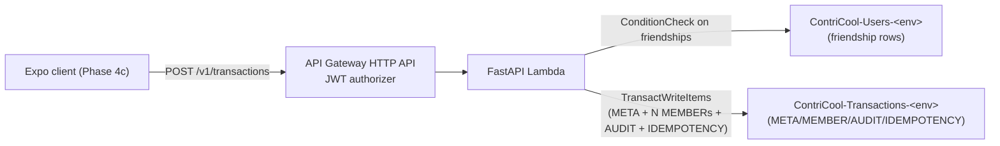
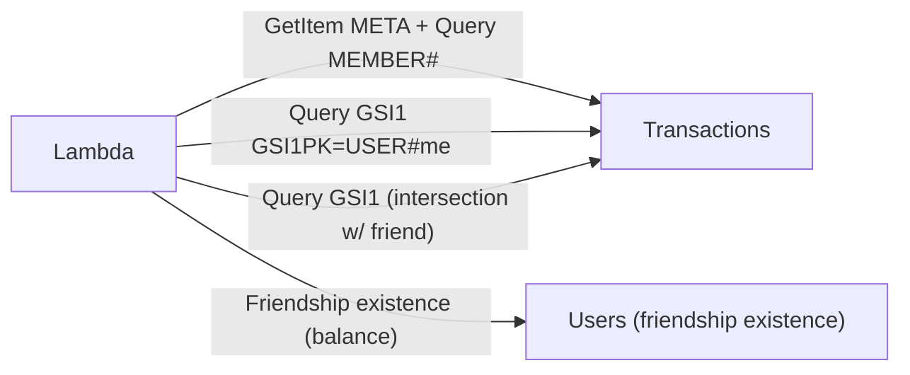

# Phase 4b — Transactions Backend Feature — Design

**Complexity: COMPLEX.**

This is the largest single phase in the build plan. It introduces the
`transactions` feature folder, adds cross-table `TransactWriteItems`,
the split-method math engine, balance computation, Powertools
idempotency, and the IAM grants those operations require. Every
component is small on its own; the interaction surface (5 routes,
4 split methods, 3 currencies-handling rules, idempotency, audit, soft-
delete reads) is what carries the weight.

## High-Level Design



### Read paths



### Component layout

```
apps/api/app/features/transactions/
  __init__.py
  cursor.py        # opaque pagination cursor (HMAC requester-bound; mirrors friends/cursor.py)
  errors.py        # NotFoundError, NotFriendError, CurrencyMismatchError, IdempotencyKeyRequiredError, ...
  idempotency.py   # Powertools wiring + custom DDB persistence layer
  models.py        # Pydantic v2: CreateTransactionRequest, Member, Payer, Transaction(Response), ListResponse
  README.md
  repository.py    # DDB ops including TransactWriteItems
  routes.py        # FastAPI router
  service.py       # business logic
  splits.py        # equal/amount/share/percent algorithms
  balance.py       # pair balance computation

apps/api/tests/features/transactions/
  __init__.py
  conftest.py
  test_create.py
  test_create_negative.py
  test_get.py
  test_list.py
  test_list_with_friend.py
  test_balance.py
  test_idempotency.py
  test_repository.py
  test_splits.py
  test_splits_property.py   # Hypothesis
  test_balance_unit.py
  test_security.py          # all auth negatives
  test_models.py
```

## Data Shapes

### Item layouts (live in `ContriCool-Transactions-<env>`)

| Item | PK | SK | GSI1PK | GSI1SK | Notable attrs |
|---|---|---|---|---|---|
| META | `TXN#<txn_id>` | `META` | — | — | creator_id, name, type, amount (`Decimal`), currency, txn_date, split_method, note, payers (List<Map>), created_at, updated_at, deleted_at, member_ids (List<String>) |
| MEMBER | `TXN#<txn_id>` | `MEMBER#<user_id>` | `USER#<user_id>` | `TXN#<YYYY-MM-DD>#<txn_id>` | owed_amount, share, percent |
| AUDIT | `TXN#<txn_id>` | `AUDIT#<version_ulid>` | — | — | action="create", actor_id, at, snapshot (JSON of META + members) |
| IDEMPOTENCY | `IDEMPOTENCY#<user_id>#<key>` | `META` | — | — | response (JSON), status_code, request_hash, ttl |

We add `member_ids` (List<String>) to META for cheap "is X a member?"
filtering on Pattern #9 — same tradeoff Design 7 flagged with the
**(b) embedded member list** option. The cost is a few extra bytes per
META; the benefit is that list-with-friend-X can early-skip METAs
without a follow-up BatchGetItem to MEMBER rows.

### Cursor

Same shape and module layout as `friends/cursor.py` (HMAC-signed,
requester-bound, includes the GSI1SK suffix `TXN#<date>#<id>` so the
next page resumes after the right point). Reuse pattern, not the
module — different sort key, different decode invariants.

## Split Methods (LLD)

Pure functions in `splits.py`. Inputs come pre-validated by Pydantic
(per-method requirements enforced in `models.py`). Outputs are a list
of `Decimal` `owed_amount` values, one per member, in the same order
as input.

| Method | Algorithm |
|---|---|
| `equal` | `q = round(amount / n, 2, ROUND_HALF_UP)`; emit `q` for the first n-1 members; the last member absorbs the remainder so `sum == amount` exactly. |
| `amount` | Pass-through: emit each member's input `owed_amount`. (Validation in `models.py` ensures `sum == amount`.) |
| `share` | `total_share = sum(shares)`; for the first n-1 members emit `round(amount * share[i] / total_share, 2, ROUND_HALF_UP)`; last member absorbs remainder. |
| `percent` | For first n-1 members emit `round(amount * percent[i] / Decimal('100'), 2, ROUND_HALF_UP)`; last absorbs remainder. (`models.py` ensures sum is `100 ± 0.01`.) |

**Why "last member absorbs the remainder"**: deterministic and
auditable; mirrors Splitwise's behaviour. The "last" member is the
last entry in the **server-sorted** member list (by `user_id`
ascending) so the absorber is reproducible across replays of the same
input.

**Settlement type** sets `split_method = amount` with exactly 2
members + 1 payer; `splits.py` short-circuits to that branch and
returns `[amount, 0]` (or `[0, amount]`) depending on which member is
the payer.

## Balance Computation (LLD)

Pure function `compute_pair_balance(my_id, friend_id, txns) ->
Decimal`. For each transaction `t` containing both users:

1. Find `my.owed_amount` and `friend.owed_amount` from the MEMBER
   rows (loaded eagerly by the caller).
2. For every payer `p` in `t.payers` with `paid_amount[p]`:
   - Total paid = sum of `paid_amount` (=`amount`).
   - **Each non-payer's debt to `p`** = `owed_amount[non_payer] *
     paid_amount[p] / total_paid`.
3. The pair's contribution is the sum over all payer/non-payer pairs
   that include both `my_id` and `friend_id`:
   - When `friend_id` paid for some of `my_id`'s share: I owe friend
     (negative contribution to my balance with friend).
   - When `my_id` paid for some of `friend_id`'s share: friend owes
     me (positive contribution).
4. Settlement transactions are a special case the same formula
   reduces to (`split_method = amount`, payer-pays-non-payer's
   owed-amount).

Final `net = sum(contributions)`. `settlement_status`:

- `abs(net) < Decimal("0.01")` → `settled` and `net` is rounded to 0.
- `net > 0` → `friend_owes`.
- `net < 0` → `you_owe`.

`Decimal` arithmetic only, with `ROUND_HALF_UP` rounding to 2 places
on the final return.

## Pattern #9 — list-with-friend

```python
def list_with_friend(my_id, friend_id, *, limit, cursor):
    # Two cheap GSI1 queries with overlapping date ranges.
    my_rows  = query_user_member_rows(my_id,  cursor=cursor, limit=limit*2)
    fr_rows  = query_user_member_rows(friend_id, cursor=cursor, limit=limit*2)
    # Intersect by txn_id, preserving my_rows' date-desc order.
    intersect = [r for r in my_rows if r.txn_id in {f.txn_id for f in fr_rows}]
    # Hydrate METAs once; filter soft-deleted; trim to limit; emit cursor.
    metas = batch_get_metas(t.txn_id for t in intersect[:limit])
    ...
```

The over-fetch factor (2×) caters for the worst case where the
requester has many transactions where the friend isn't a member. At
≤10 friends per typical user we expect the intersection to be
near-100% in practice; the over-fetch is a safety net.

## Cross-table create flow

```python
def create_transaction(creator_id, body):
    # 1. Validate body shape (Pydantic).
    # 2. Resolve member metadata in one BatchGetItem on Users
    #    (currency check + friendship existence pre-check).
    # 3. Compute owed_amounts (splits.py).
    # 4. Build TransactWriteItems:
    #    - For every other-member m: ConditionCheck on
    #      (PK=USER#min, SK=FRIEND#max) attribute_exists(PK) — proves
    #      friendship is still active at write time.
    #    - Put META (with payers + member_ids embedded).
    #    - Put N MEMBER rows.
    #    - Put AUDIT row.
    #    - Put IDEMPOTENCY row (PK=IDEMPOTENCY#user#key, SK=META,
    #      ttl=now+24h, response=serialised create response).
    # 5. Execute transact_write_items.
    # 6. On TransactionCanceledException, decode CancellationReasons:
    #    - "ConditionalCheckFailed" on the friendship slot → 422 NOT_FRIEND.
    #    - "ConditionalCheckFailed" on the IDEMPOTENCY slot → return the
    #      cached response (idempotent replay).
    #    - Anything else → re-raise as 500.
```

The IDEMPOTENCY row is written with
`ConditionExpression = attribute_not_exists(PK)`. A replay collides
on that condition, the transact aborts, and we read the existing
IDEMPOTENCY row, compare its `request_hash`, and either:

- Return the cached 201 response (same user + same key + same hash).
- Return 409 `IDEMPOTENCY_KEY_REUSED` (same user + same key + different
  hash).

Different user same key → no collision (PK is namespaced).

### Why a hand-rolled idempotency row instead of `aws-lambda-powertools.idempotency`?

We considered Powertools' `@idempotent` decorator with
`DynamoDBPersistenceLayer`. **Decision: hand-roll.**

| | Powertools (rejected) | Hand-rolled (chosen) |
|---|---|---|
| Pros | Battery-included, audit-trail of in-progress states, payload validation hash. | Single transact spans META + MEMBER + AUDIT + IDEMPOTENCY atomically — no chance of "we wrote the txn but lost the idempotency record." Smaller blast radius. Reuses the same DDB client + IAM grants. |
| Cons | Powertools writes the idempotency row in a separate `PutItem` *outside* our transact; if our transact then fails after that write, the idempotency row "claims" the key but the transaction never landed → the user retrying with the same key hits a stale "INPROGRESS" record. | Less library affordance. We re-implement payload validation hash + replay logic ourselves (~30 lines). |

Powertools' design works fine for handlers whose only side effect is
the idempotent write itself (one `PutItem`). Our create has 4+
correlated writes; embedding the idempotency row in the transact is
the only way to keep the contract honest.

We still depend on the `aws-lambda-powertools` package for `Logger`
+ `Tracer` (already a dep). The dep adds nothing new.

## Models (Pydantic v2)

```python
Currency = Literal["USD", "INR"]
SplitMethod = Literal["equal", "amount", "share", "percent"]
TxnType = Literal["expense", "settlement"]

class MemberInput(BaseModel):
    model_config = ConfigDict(extra="forbid")
    user_id: Annotated[str, Field(pattern=ULID_RE)]
    share: Decimal | None = None
    percent: Decimal | None = None
    owed_amount: Decimal | None = None  # only for split_method=amount

class PayerInput(BaseModel):
    model_config = ConfigDict(extra="forbid")
    user_id: Annotated[str, Field(pattern=ULID_RE)]
    paid_amount: Annotated[Decimal, Field(gt=0, max_digits=12, decimal_places=2)]

class CreateTransactionRequest(BaseModel):
    model_config = ConfigDict(extra="forbid")
    name: Annotated[str, StringConstraints(min_length=1, max_length=120, strip_whitespace=True)]
    type: TxnType
    amount: Annotated[Decimal, Field(gt=0, max_digits=12, decimal_places=2)]
    currency: Currency
    txn_date: date
    note: Annotated[str, StringConstraints(max_length=500)] = ""
    split_method: SplitMethod
    members: Annotated[list[MemberInput], Field(min_length=2, max_length=10)]
    payers: Annotated[list[PayerInput], Field(min_length=1, max_length=10)]

    @model_validator(mode="after")
    def _per_method_invariants(self) -> Self: ...
```

Per-method invariants (raise via `model_validator`):

- `equal` → no member has `share`/`percent`/`owed_amount`.
- `amount` → every member has `owed_amount`; `sum == amount`.
- `share` → every member has `share > 0`.
- `percent` → every member has `percent > 0`; sum 100±0.01.
- `settlement` → 2 members, 1 payer; `split_method = amount`;
  non-payer's `owed_amount = amount`; payer's `owed_amount = 0`.
- `txn_date` ≤ today + 1 day; ≥ today − 10 years.
- Member `user_id`s unique; payer `user_id`s unique; payers ⊆ members.
- Sum of payer `paid_amount` == `amount`.

Each violation becomes a distinct error code (R9 enumerates them).

## IAM (CDK)

`ApiStack` accepts `transactions_table: dynamodb.ITable`. Two grant
blocks:

```python
# Users — Phase 2c+3a set + ConditionCheckItem (Phase 4b new).
users_table.grant(
    self.lambda_function,
    "dynamodb:GetItem",
    "dynamodb:PutItem",
    "dynamodb:UpdateItem",
    "dynamodb:Query",
    "dynamodb:BatchGetItem",
    "dynamodb:DeleteItem",
    "dynamodb:ConditionCheckItem",   # <- Phase 4b
)

# Transactions — read/write set + TransactWriteItems (Phase 4b new).
transactions_table.grant(
    self.lambda_function,
    "dynamodb:GetItem",
    "dynamodb:PutItem",
    "dynamodb:UpdateItem",
    "dynamodb:Query",
    "dynamodb:BatchGetItem",
    "dynamodb:ConditionCheckItem",
    "dynamodb:TransactWriteItems",   # <- Phase 4b
)
```

`grant_read_write_data` is still rejected — too wide. The synth
`test_api_stack_lambda_iam_ddb_actions_enumerated` test evolves to
allow `TransactWriteItems` and `ConditionCheckItem` and to forbid
`Scan` / `BatchWriteItem` / wildcard.

## Routes & throttling

```python
@router.post("/transactions", status_code=201, response_model=Transaction)
def create(...): ...

@router.get("/transactions", response_model=ListTxnsResponse)
def list_mine(...): ...

@router.get("/transactions/{txn_id}", response_model=Transaction)
def get_one(...): ...
```

Stage-level throttling (5,000 RPS / 10,000 burst) covers all routes;
no per-route throttle for create at MVP (idempotency + DDB write
costs are the natural backpressure).

## Trade-offs

### Hand-rolled idempotency vs. Powertools

Covered above. Hand-rolled wins because the create path is multi-write.

### Embedded `member_ids` on META vs. always querying MEMBER rows

**Decision**: embed `member_ids: List<String>`.

| | Embed (chosen) | Query MEMBERs each time |
|---|---|---|
| Pros | One GetItem on META gives us the full member list; cheap "is X a member?" check for `GET /v1/transactions/{id}` 404-mask. | No redundancy. |
| Cons | ~10× user_ids of bytes per META (10 ULIDs ≈ 260 bytes); MEMBER rows are also stored. | Every detail fetch is `GetItem META + Query MEMBER#` — two round-trips. |

At MVP volume the storage cost is invisible; the read-latency win
(one round-trip on hot reads) is not.

### Pre-validating friendship via BatchGetItem before transact

We already do `BatchGetItem` on member METAs for the currency check;
in the same call we can probe friendship rows. **Decision**: do the
BatchGetItem to extract members' currency, but **rely on the
transact's `ConditionCheck` for the authoritative friendship gate**.
The pre-check is purely UX (returns 422 NOT_FRIEND immediately if any
non-friend is in the request, avoiding a transact-cancel round-trip).

### Cursor format

Same as `friends/cursor.py`: HMAC over `<requester_id>|<txn_id>|<exp>`,
truncated to keep the cursor short. Reuse the existing pii-salt as
the HMAC key.

## Negative-test mapping

Every entry in R9's negative list maps 1:1 to a test in
`test_create_negative.py` or `test_security.py`. The CLAUDE.md
"required negative test classes" table gets these new entries:

| New class | Test |
|---|---|
| `Non-friend transaction creation` | `test_create_negative::test_non_friend_member_rejected_422_not_friend` |
| `Stale-edit conflict` | (Phase 5) |
| `Idempotency replay` | `test_idempotency::test_same_user_same_key_same_body_returns_cached_201` |
| `Currency mismatch` | `test_create_negative::test_currency_mismatch_422` |
| `Cross-tenant data isolation` | `test_get::test_non_member_sees_404_mask`, `test_list::test_list_excludes_others_txns` |

## Tests

Coverage floor 99% (CLAUDE.md). Property-based `splits.py` tests use
`hypothesis` (already in `apps/api/pyproject.toml`? — confirm; if
not, add it as a deliberate dep with a one-line justification).

## Deploy

Standard pipeline:

1. Merge to `main`.
2. `deploy.yml` runs `cdk deploy 'Contricool-Dev-*'`.
3. **New**: deploy step writes the
   `Contricool-Dev-Data.TransactionsTableName` output to
   `/contricool/dev/ddb/transactions-table-name`. The deploy fails if
   the SSM write fails (no half-deployed Lambda).
4. Smoke `/v1/health`. New smoke: `POST /v1/transactions` with two
   seeded test users + a new test idempotency key returns 201.
5. Manual prod gate.
6. `cdk deploy 'Contricool-Prod-*'` + same SSM write + smoke.
7. Tag `release/YYYY-MM-DD-sha7`.

## Summary

The transactions feature, end-to-end on the backend: 5 routes,
4 split methods, cross-table TransactWriteItems with hand-rolled
idempotency, real friend-balance numbers, full negative-test coverage.
Phase 4c will consume the regenerated TS SDK.
