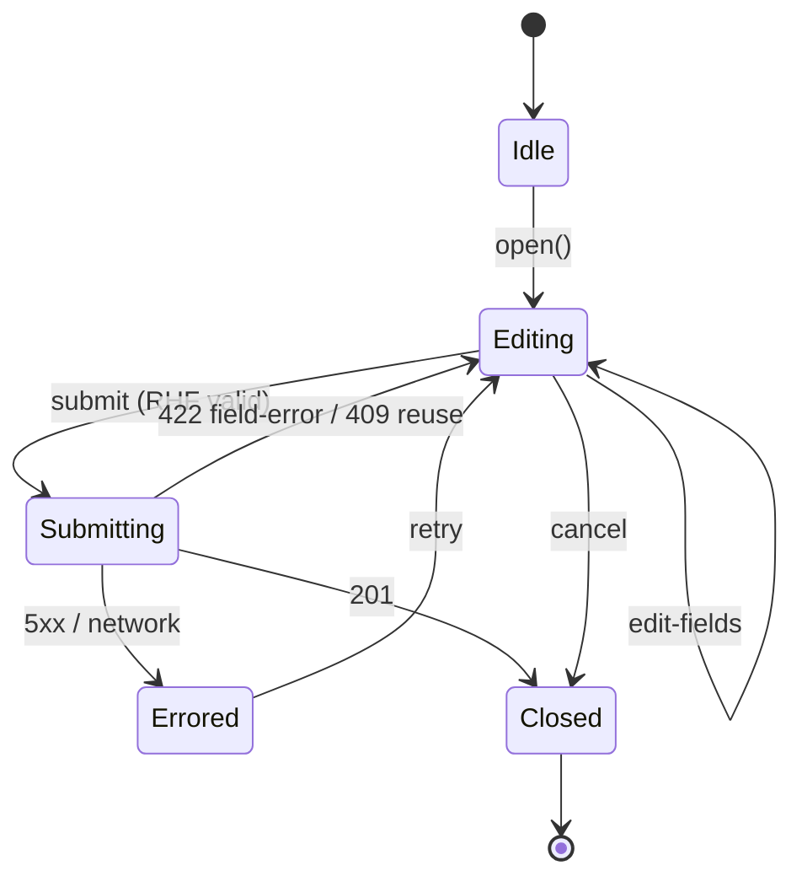

# Phase 4c — Transactions Frontend UI — Design

**Complexity: MEDIUM.**

The schema work is done (Pydantic on the server, openapi-typescript
in `packages/client-sdk`). The new code is screens, hooks, and a
single multi-section form — no new architectural primitives. The
risk concentrates in the AddTransactionSheet's per-method form
states, the idempotency-key lifecycle, and the friend-picker UX.

## Overview

Three new screen routes (`transactions/index`, `transactions/new`
implemented as a sheet, `transactions/[txnId]`), one updated screen
(`friends/[userId]`), one updated screen (`dashboard`), one new
hooks module (`lib/queries/transactions.ts`), one new schema
(`AddTransactionSchema`), and one new component
(`components/transactions/AddTransactionSheet.tsx`). MSW handlers
extended for the same surface. Component + hook tests added.

## Component Layout

```
apps/client/
  app/(app)/
    dashboard.tsx                 # ✅ updated — real summary cards + recent
    transactions/
      index.tsx                   # 🆕 list + filter chip
      [txnId].tsx                 # 🆕 detail
    friends/
      [userId].tsx                # ✅ updated — real balance + per-friend list
  components/transactions/
    AddTransactionSheet.tsx       # 🆕 RHF multi-section form
    SummaryCards.tsx              # 🆕 dashboard cards
    TransactionRow.tsx            # 🆕 row used in dashboard + list
  lib/
    schemas.ts                    # ✅ + AddTransactionSchema
    queries/
      transactions.ts             # 🆕 useTransactions / useTransaction /
                                  #    useCreateTransaction hooks
    types.ts                      # ✅ + Transaction / TransactionListItem
                                  #    aliases
    splits.ts                     # 🆕 client-side preview of equal-split
                                  #    rounding (matches server's algorithm)
  __tests__/
    app/transactions/
      list.test.tsx               # 🆕
      detail.test.tsx             # 🆕
      add-transaction-sheet.test.tsx  # 🆕
    app/dashboard.test.tsx        # ✅ updated to seed txn list
    app/friends/detail.test.tsx   # ✅ updated to assert real balance
    lib/queries-transactions.test.tsx # 🆕
```

## Add-Transaction Modal — State Diagram



The form's `useRef<idempotencyKey>` outlives `Editing → Submitting →
Errored → Editing` cycles so a transient retry sends the same key.
On `Closed`, the ref resets so the next "Add transaction" gets a
fresh key.

## Hooks (`lib/queries/transactions.ts`)

```ts
export const transactionsKeys = {
  all: ['transactions'] as const,
  list: (q: { limit: number; cursor?: string; friend_id?: string }) =>
    ['transactions', q] as const,
  one: (txnId: string) => ['transaction', txnId] as const,
};

export function useTransactions(q: ListTransactionsQuery) { … }
export function useTransaction(txnId: string) { … }
export function useCreateTransaction() {
  const qc = useQueryClient();
  return useMutation<Transaction, Error,
    { body: CreateTransactionRequest; idempotencyKey: string }>({
    mutationFn: async ({ body, idempotencyKey }) => {
      const r = await apiClient.POST('/transactions', {
        body,
        headers: { 'Idempotency-Key': idempotencyKey },
      });
      return r.data as Transaction;
    },
    onSuccess: (txn) => {
      qc.invalidateQueries({ queryKey: transactionsKeys.all });
      qc.invalidateQueries({ queryKey: ['friend-balance'] });
      // Per-friend balance staleness too:
      txn.members.forEach((m) =>
        qc.invalidateQueries({ queryKey: ['friend-balance', m.user_id] }),
      );
    },
  });
}
```

The `Idempotency-Key` header is passed via the SDK's per-call
`headers` option (openapi-fetch supports this through `init`).

## SDK alias additions

`packages/client-sdk/src/index.ts` gains:

```ts
export type CreateTransactionRequest = NonNullable<
  AuthPaths['/transactions']['post']['requestBody']
>['content']['application/json'];
export type TransactionResponse =
  AuthPaths['/transactions']['post']['responses']['201']['content']['application/json'];
export type ListTransactionsResponse =
  AuthPaths['/transactions']['get']['responses']['200']['content']['application/json'];
export type TransactionListItem = ListTransactionsResponse['items'][number];
```

The aliases keep client code readable (`Transaction` instead of
the deeply-nested `paths['/transactions']['post']['responses']…`)
and break loudly at compile time if a path is renamed upstream.

## Schemas (`lib/schemas.ts`)

```ts
export const AddTransactionSchema = z.object({
  name: z.string().trim().min(1).max(120),
  type: z.enum(['expense', 'settlement']),
  amount: z
    .string()
    .regex(/^\d+(\.\d{1,2})?$/, 'Amount must be a number')
    .refine((v) => Number(v) > 0, 'Must be positive'),
  currency: z.enum(['USD', 'INR']),
  txn_date: z.string().regex(/^\d{4}-\d{2}-\d{2}$/),
  note: z.string().max(500).default(''),
  split_method: z.enum(['equal', 'amount', 'share', 'percent']),
  members: z.array(MemberZ).min(2).max(10),
  payers: z.array(PayerZ).min(1).max(10),
});
```

The server is the authoritative validator; the client schema only
catches obvious mistakes early so the form doesn't always have to
round-trip. Cross-field invariants (paid-sum == amount, percent-
sum 100, payers ⊆ members) are enforced via `superRefine`.

## Friendly Error Mapping (`AddTransactionSheet`)

```ts
const FORM_FIELD_ERRORS: Record<string, { field: string; message: string }> = {
  OWED_SUM:        { field: 'members', message: 'Member owed amounts must sum to the total.' },
  PERCENT_SUM:     { field: 'members', message: 'Percents must sum to 100.' },
  PAID_SUM:        { field: 'payers',  message: 'Payer amounts must sum to the total.' },
  PAYER_NOT_MEMBER:{ field: 'payers',  message: 'Every payer must be a member.' },
  INVALID_AMOUNT:  { field: 'amount',  message: 'Amount must be positive.' },
  INVALID_DATE:    { field: 'txn_date',message: 'Date is out of the accepted window.' },
};

const BANNER_ERRORS: Record<string, string> = {
  NOT_FRIEND:        'One or more members aren\'t your friend anymore.',
  CURRENCY_MISMATCH: 'A selected friend uses a different currency.',
  SELF_NOT_MEMBER:   'You must be one of the members.',
  MIN_MEMBERS:       'Add at least one friend.',
  SETTLEMENT_SHAPE:  'Settlements need exactly two members.',
};

const TOAST_ERRORS: Record<string, string> = {
  IDEMPOTENCY_KEY_REUSED: 'This transaction was already created. Refresh to see it.',
  IDEMPOTENCY_KEY_REQUIRED: 'Please retry the request.',  // shouldn't happen
};
```

`VALIDATION_ERROR` falls through to the first `details[]` issue.
Anything else → generic toast.

## Trade-offs

### Single sheet vs. multi-step wizard

**Decision**: single scrollable sheet.

| | Single sheet (chosen) | Multi-step wizard |
|---|---|---|
| Pros | Faster on web; visible progress through the form; user can change earlier fields without back-navigation; simpler component tree. | More forgiving on small native screens; less overwhelming for first-time users. |
| Cons | Tall on small screens; the form can feel busy. | Hides the per-method math behind navigation transitions; harder to test. |

**Why**: web is the soak target at MVP. We can split into a
wizard post-MVP if user research shows the sheet overwhelming.

### Currency picker vs. locked-to-requester

**Decision**: locked to `auth-store.user.currency` at MVP.

The server enforces all members share the txn currency, and member
currencies are immutable post-signup. Letting the form pick a
different currency would only enable composing requests the server
will reject. Lock it; surface as a small "USD" badge next to the
amount.

### Client-side balance computation on dashboard

**Decision**: rough roll-up across the most recent 50 transactions.

A precise dashboard-level "you owe X" number per friend would
require N pair-balance API calls (one per friend) — ~30 friends →
30 GETs. Instead we sum `my_owed_amount` minus `paid_amount`
contributions across the recent-50 list. This is **not** the
true net (it ignores transactions older than 50), but at MVP
volume that's good enough for a glance card. The friend detail
page still shows the precise `friend_balance` number.

A post-MVP improvement: a dedicated `GET /v1/balance/summary`
route that returns the dashboard roll-up server-side.

## Tests

| File | Purpose |
|---|---|
| `app/transactions/list.test.tsx` | Renders list, applies filter chip, paginates. |
| `app/transactions/detail.test.tsx` | Renders full shape; 404 mask. |
| `app/transactions/add-transaction-sheet.test.tsx` | Happy path + every error class. |
| `app/dashboard.test.tsx` (updated) | Summary cards + recent activity. |
| `app/friends/detail.test.tsx` (updated) | Real balance across the three statuses. |
| `lib/queries-transactions.test.tsx` | Each hook happy + one error path. |

MSW handlers for `/transactions`, `/transactions/{id}` extended
with the SDK's typed shape so the test runtime matches production.

## Deploy

Standard pipeline:

1. Merge to `main`.
2. CI's `client` + `client-sdk` jobs build the SDK and run vitest.
3. `make openapi-check` ensures no SDK drift.
4. The Phase 2e CloudFront/S3 web deploy step picks up the new
   bundle.
5. No backend changes; no infra changes; no SSM writes.

## Summary

UI completes the user-visible Phase 4 deliverable. End-to-end after
4c: a real user can sign up, add friends, and create / view
transactions through a working web app on the dev domain.
